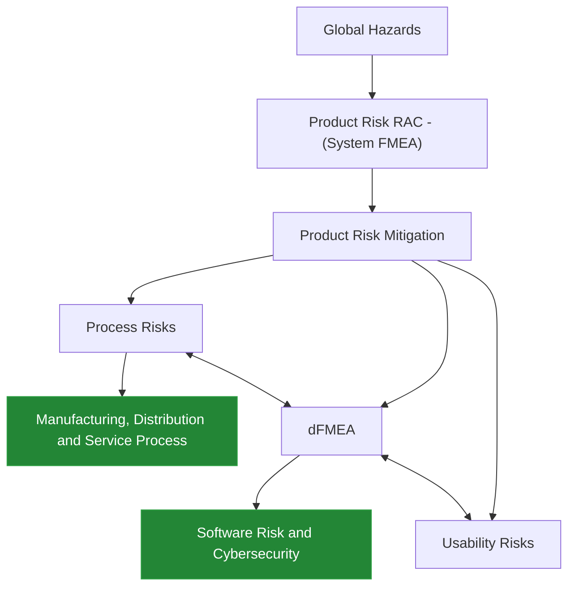

# FMEA - Failure Mode and Effects Analysis

---

- [FMEA - Failure Mode and Effects Analysis](#fmea---failure-mode-and-effects-analysis)
  - [Introduction](#introduction)
  - [Why is FMEA Important?](#why-is-fmea-important)
  - [How to implement FMEA?](#how-to-implement-fmea)

---

## Introduction

>[!IMPORTANT]
> FMEA (Failure Mode and Effects Analysis) is a step-by-step approach to figure out what might go wrong in a product, system, or process, and how bad those problems could be. It helps teams decide which risks to tackle first and what steps to take to prevent them.

- FMEA isn't a one-person job or a one-time task; it requires ongoing teamwork from people with different backgrounds and skills.
- It is usually done early when a product is being designed, but it can also be used to improve things that are already in use.
- The main goal is to spot potential issues, rank them (based on how severe they are, how often they happen, and how easily they can be caught), and take action to stop them from happening.

<b> Requirements on Design/Process Risk Management </b>

## Why is FMEA Important?

- FMEA helps organizations identify potential failure modes early in the design or process development phase, allowing for proactive risk management.
- It provides a structured approach to prioritize risks based on their severity, occurrence, and detection, enabling organizations to focus their resources on the most critical issues.
- FMEA promotes cross-functional collaboration and communication, fostering a culture of continuous improvement and risk awareness within the organization.
- By implementing corrective actions based on FMEA findings, organizations can reduce the likelihood of failures, improve product quality, enhance customer satisfaction, and ultimately increase profitability.

>[!NOTE]
> ## When & why??
> FMEA should be conducted during the feasibility, design or development phase of a product.
> A general flow of product looks like this:
> 1. Concept/Feasibility
> 2. Design/Development
> 3. Validation/Verification
> 4. Development/Manufacturing
> 5. Testing/Release
> 6. Manufacturing
> 7. Distribution/Service   
> 
>FMEA is most effective when conducted early in the design or development phase, as it allows for the identification and mitigation of potential failure modes before they become costly or difficult to address. By conducting FMEA during the early stages of product development, organizations can proactively manage risks, improve product quality, and enhance customer satisfaction. It also helps companies and organisations avoid costly recalls, warranty claims, and damage to their reputation by identifying and addressing potential failure modes before they reach the market.

- Imagine a worst case scenario, where a device has to be recalled. These recalls can be costly for companies, both in terms of financial losses and damage to their reputation. By conducting FMEA during the design or development phase, companies can identify potential failure modes and implement corrective actions to mitigate them, reducing the likelihood of recalls and associated costs. Additionally, FMEA can help companies improve product quality and customer satisfaction by proactively managing risks and addressing potential issues before they reach the market.

- FMEAs must be revisited timely often to avoid any costly mistakes.

## How to implement FMEA?

- The FMEA process typically can be covered in 3 big buckets:
    1. `Planning`
    2. `FMEA Analysis`
    3. `Post-work/Action`

 

- The `planning` phase involves:
  - `Setting the boundaries` — decide what the FMEA will cover, set clear criteria for what counts as an acceptable risk, and bring together people from different teams who understand the system.
  - `Mapping out the work` — list the key functions, steps, and workflows involved, then brainstorm what could go wrong at each step. For every potential failure, figure out what the impact would be, what might cause it, and calculate a Risk Priority Number (RPN) using three scores: how serious it is (severity), how likely it is to happen (occurrence), and how easy it is to catch (detection).
  - `Learning from the past` — gather and review data from similar products or processes to understand what has gone wrong before.

- The `FMEA analysis` phase involves:
  - `Walking through the system` — use a flowchart to map out how the system, features, or process works step by step.
  - `Spotting problems` — for each step, ask: what could fail? What would happen if it did? What might cause it? What safeguards already exist?
  - `Scoring the risk` — rate each failure on severity (how bad the impact is), occurrence (how often it is likely to happen), and detection (how likely it is to be caught before reaching the end user). Together, these scores help prioritize which failures need the most attention.

- The `post-work / action planning` phase involves:
  - `Taking action` — put fixes in place to reduce or eliminate the highest-priority failure modes identified during the analysis.
  - `Checking the results` — revisit the changes made to confirm they actually lowered the risk and that no new issues were introduced.

---