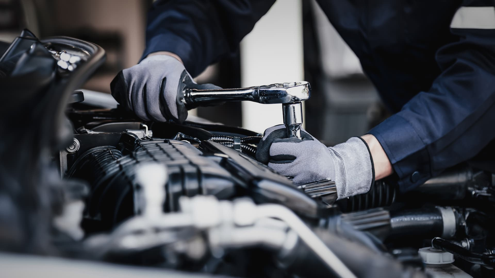

# FMEA - Failure Modes

---
- [FMEA - Failure Modes](#fmea---failure-modes)
  - [Understading Context of Failure Modes](#understading-context-of-failure-modes)
  - [Questions to ask to help identify design failure modes](#questions-to-ask-to-help-identify-design-failure-modes)

---


## Understading Context of Failure Modes

>[!IMPORTANT]
>Failure Modes are the ways in which a product, process, or system can fail to meet its intended function or performance requirements. 

- They can occur at any stage of the product lifecycle, from design and development to manufacturing and use. Failure modes can be caused by a variety of factors, including design flaws, manufacturing defects, material failures, human error, and environmental conditions.

- Most common scenarios humans think in terms of cause and than it's effect, and that's how the world operates. But, we need to analyze and, identify what these failure modes are, because that will help us understand it's impact, and it's consquent effect.

- So, if we start with a cause it leads to failure mode. That results in an effect.

    ```mermaid
    %%{init: {"look": "dark"}}%%
    graph LR
        C("Cause") --- FM("Failure Mode") --- E("Effect")

        style C fill:#3182ce,color:#ffffff,stroke:#2b6cb0,stroke-width:2px
        style FM fill:#e53e3e,color:#ffffff,stroke:#c53030,stroke-width:2px
        style E fill:#38a169,color:#ffffff,stroke:#2f855a,stroke-width:2px
    ```

- In FMEA, we start with the `Failure Mode` and analyze its `Effect` and `Cause`. This helps us understand the potential impact of the failure mode and identify ways to mitigate it.

    ```mermaid
    %%{init: {"look": "dark"}}%%
    graph LR
        FM("Failure Mode") --- E("Effect") --- C("Cause")

        style C fill:#3182ce,color:#ffffff,stroke:#2b6cb0,stroke-width:2px
        style FM fill:#e53e3e,color:#ffffff,stroke:#c53030,stroke-width:2px
        style E fill:#38a169,color:#ffffff,stroke:#2f855a,stroke-width:2px
    ```

- One of the big challanges in FMEA is confusing the `Failure Mode` with the `Cause`. People tend to put causes in the failure mode column, and that leads to a lot of confusion. It's important to clearly differentiate between the two to ensure that the analysis is accurate and effective.

- Let's take an example of a car. A failure mode could be "engine failure". The effect of this failure mode could be "car won't start". The cause of this failure mode could be "battery is dead". In this case, the failure mode is the "engine failure", the effect is "car won't start", and the cause is "battery is dead".

    

## Questions to ask to help identify design failure modes

- What happens if ___ fails to do XYZ at prescribed time???
- What happens if ___ fails to stop doing XYZ at prescribed time???
- What happens if ___ fails if XYZ is not working properly???
- What happens if ___ doesnot complete all its steps???
- What happens if ___ doesnot give correct output???
- What happens if ___ steps occur out of order???
- What happens if ___ performance fails to meet expectations???
- What happens if ___ invalid input is provided???