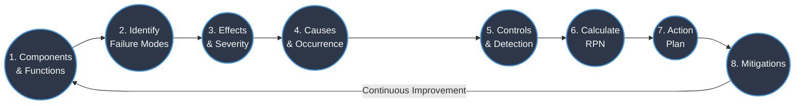
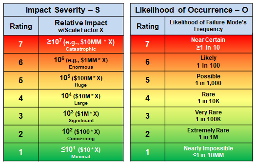
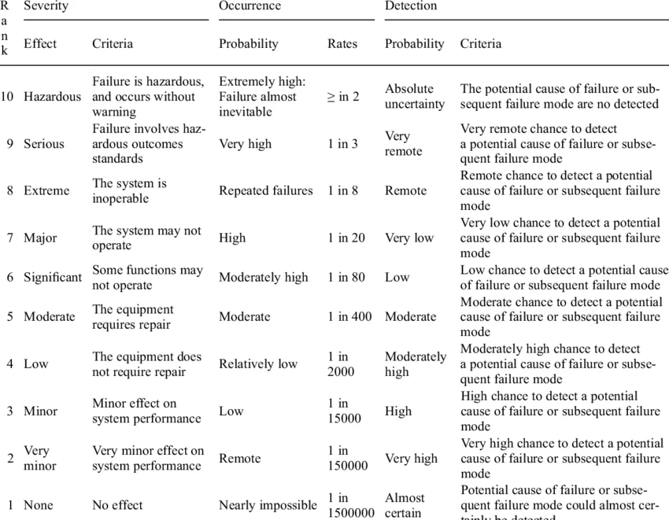
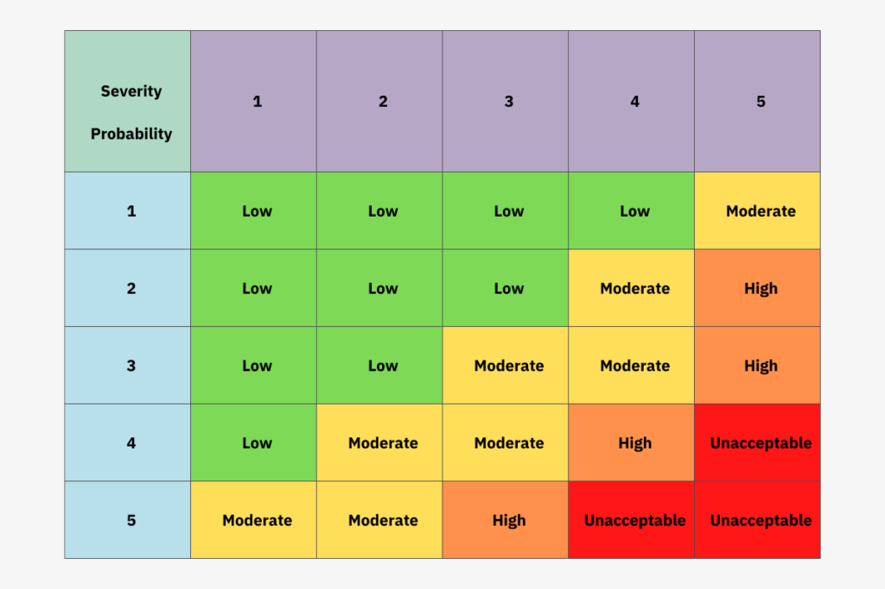

# FMEA: Effects & Severity

---
- [FMEA: Effects \& Severity](#fmea-effects--severity)
  - [Failure Mode Effect](#failure-mode-effect)
    - [Identification of Failure Mode Effects](#identification-of-failure-mode-effects)
  - [Severity](#severity)
    - [Assigning Severity Ratings](#assigning-severity-ratings)
  - [Failure Causes](#failure-causes)
  - [Probability of Occurrence of Failure Mode](#probability-of-occurrence-of-failure-mode)

---

## Failure Mode Effect

>[!IMPORTANT]
>`Failure Mode Effect` is a immediate consequence of a component or process failure.

- When thinking about `Failure Mode Effects`, it's important to look at both internal users (such as teams working on the system) and external users (such as customers or end users). A single failure can produce different effects depending on who is impacted.

- For example, if the braking system in a car fails, it could damage internal parts like brake pads or calipers, but it could also put the driver and passengers at serious risk — these are two very different kinds of effects from the same failure.

### Identification of Failure Mode Effects

- When listing failure mode effects, think beyond just safety — also consider how the failure affects the reliability and overall functionality of the system or product.
- Effects are assessed independently of whether the failure can be detected — even an undetectable failure can have serious consequences.
- Effects are also assessed independently of how often a failure occurs — a rare failure can still have a severe effect when it does happen.
- We have no control over which effect occurs or how bad it turns out to be. What we *can* control is the failure mode itself — by designing safeguards and mitigations to prevent it.
- The effect of a failure is what drives its severity score, which in turn is one of the key inputs to the Risk Priority Number (RPN).
- Some effects show up immediately and are easy to observe; others may only become apparent later or after further investigation. Both types need to be accounted for.

## Severity

>[!IMPORTANT]
> `Severity` is a measure of the impact of a failure mode effect on the system, product, or process, and it's user.

- Always start by evaluating the worst-case effect a failure could have — this ensures the most critical risks are not underestimated.
- A severity score reflects the impact of the effect itself, not how often the failure happens or whether it can be caught — those are separate scores.
- Of the three FMEA scores (severity, occurrence, detection), severity carries the most weight when deciding what actions to prioritize.

### Assigning Severity Ratings

- If something makes the system/product unusable, that is a severity rating of 10.
- If it causes minor inconvenience and the system/product is still usable, that is a severity rating of 1.
- If it causes a safety issue, that is a severity rating of 10.
- If it causes a reliability issue, that is a severity rating of 9.
- If it causes a performance issue, that is a severity rating of 8.
- If it causes a cosmetic issue, that is a severity rating of 2.
- If it causes a minor inconvenience, that is a severity rating of 1.
- If it causes a major inconvenience, that is a severity rating of 5.

## Failure Causes

>[!IMPORTANT]
> `Failure Causes` are the underlying reasons or factors that lead to the occurrence of a failure mode.

- A failure cause is the underlying "why" behind a failure — not the symptom or the consequence that follows from it.
- A single failure mode can have more than one cause. Listing all of them is important, because missing a cause means missing an opportunity to prevent the failure.
- A failure cause and a failure mode are always two distinct things — they cannot be the same entry.
- Causes must be specific enough to act on. "Human error" is too vague; "incorrect torque applied during assembly" gives the team something concrete to address.
- A failure mode in one component or sub-system can itself be the cause of a failure mode in another part of the overall system — so connections between levels of the system matter.

## Probability of Occurrence of Failure Mode

>[!IMPORTANT]
> `Probability of Occurrence` is a measure of how likely it is for a failure mode to occur, based on historical data, expert judgment, or other relevant information.

- If direct data isn't available, look to comparable products, processes, or systems for reference — and take into account any existing controls that are already in place to reduce the chance of the failure occurring.
- Each failure cause gets its own occurrence rating in FMEA — they are scored separately, not grouped together under the failure mode.
- This scoring helps reveal how well the current design or process is set up to prevent failures, and points to where improvements are most needed.