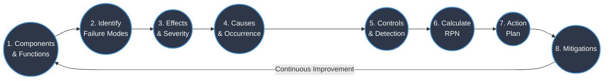

# FMEA: Effects & Severity

---
- [FMEA: Effects \& Severity](#fmea-effects--severity)
  - [Failure Mode Effect](#failure-mode-effect)
    - [Identification of Failure Mode Effects](#identification-of-failure-mode-effects)
  - [Severity](#severity)
    - [Assigning Severity Ratings](#assigning-severity-ratings)
  - [Failure Causes](#failure-causes)
  - [Probability of Occurrence of Failure Mode](#probability-of-occurrence-of-failure-mode)

---

## Failure Mode Effect

>[!IMPORTANT]
>`Failure Mode Effect` is a immediate consequence of a component or process failure.

- When considering `Failure Mode Effects`, one must conside both internal and external users. And each of these can have multiple effects on the system, product, or process.

- For example, a failure mode in a car's braking system could have effects on the internal components of the braking system, as well as external effects on the safety of the driver and passengers.

### Identification of Failure Mode Effects

- When identifying failure mode effects, it's important to not only consider the safety, but the system/product reliability itself.
- They are independednt of the factor of our ability/inability to detect them.
- They are independent of the probability of it's occurence or how frequently a user faces it.
- Absolutely no control of which effect occurs, and how severe it is. We can only control the failure mode itself, and try to mitigate it.
- Effects decide the severity of the failure mode, and that is a critical factor in determining the risk priority number (RPN) for each failure mode.
- The resulting consequences may or may not be immediately apparent, and may require further analysis to fully understand the impact of the failure mode on the system, product, or process.

## Severity

>[!IMPORTANT]
> `Severity` is a measure of the impact of a failure mode effect on the system, product, or process, and it's user.

- When assessing severity, consider the most severe effect of the failure mode effect first.
- Severity of a failure mode effect is independent of its probability of occurrence or our ability to detect it.
- Severity ranking is the biggest X factor in determining the action plan.

### Assigning Severity Ratings

- If something makes the system/product unusable, that is a severity rating of 10.
- If it causes minor inconvenience and the system/product is still usable, that is a severity rating of 1.
- If it causes a safety issue, that is a severity rating of 10.
- If it causes a reliability issue, that is a severity rating of 9.
- If it causes a performance issue, that is a severity rating of 8.
- If it causes a cosmetic issue, that is a severity rating of 2.
- If it causes a minor inconvenience, that is a severity rating of 1.
- If it causes a major inconvenience, that is a severity rating of 5.

## Failure Causes

>[!IMPORTANT]
> `Failure Causes` are the underlying reasons or factors that lead to the occurrence of a failure mode.

- Failure Causes are the root causes of a failure mode, and not the subsequent symptoms or effects of the failure mode.
- Failure Modes can have multiple causes, and it's important to identify all of them to effectively mitigate the risk associated with the failure mode.
- Failure Causes and Failure Modes can't be same.
- Failure Causes cannot be ambiguous, and should be specific and actionable. For example, "improper installation" is a more specific and actionable failure cause than "human error".
- A Failure Mode is a component or sub system or dependency can be a Failure Cause for another Failure Mode in the overall system.

## Probability of Occurrence of Failure Mode

>[!IMPORTANT]
> `Probability of Occurrence` is a measure of how likely it is for a failure mode to occur, based on historical data, expert judgment, or other relevant information.

- When data is not available, consider data fronm similar products, processes, or systems to estimate the probability of occurrence, and preventive controls that are in place to reduce the likelihood of occurrence.
- Failure Mode Causes are ranked seprately, and have their own probability of occurrence ratings in FMEA.
- This helps us assess the systems/processes/components capacity to prevent the failure mode from occurring, and identify areas for improvement in the design or process to reduce the likelihood of occurrence.