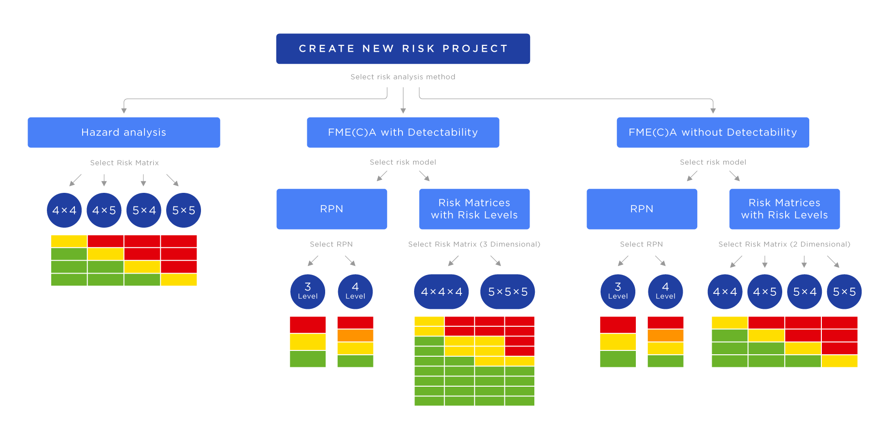
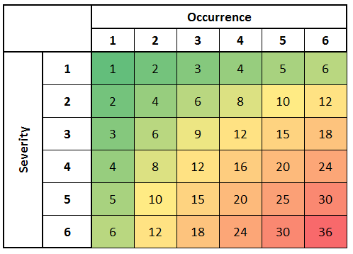

# FMEA - Action & Acceptable Criteria

---
- [FMEA - Action \& Acceptable Criteria](#fmea---action--acceptable-criteria)
  - [RPN (Risk Priority Number)](#rpn-risk-priority-number)
  - [Defining Acceptable Criteria](#defining-acceptable-criteria)
  - [Priortizing Actions](#priortizing-actions)
  - [Action Purpose](#action-purpose)

---

## RPN (Risk Priority Number)

>[!IMPORTANT]
> FMEA uses a 3 parameter calculation to determine the risk priority number (RPN) for each failure mode, which is a measure of the overall risk associated with that failure mode. The three parameters are:
> 1. `Severity` (S): A measure of the impact of the failure mode on the system, product, or process, and its user. It is typically rated on a scale from 1 to 10, with 10 being the most severe.
> 2. `Occurrence` (O): A measure of the likelihood that the failure mode will occur. It is typically rated on a scale from 1 to 10, with 10 being the most likely to occur.
> 3. `Detection` (D): A measure of the likelihood that the failure mode will be detected before it causes harm. It is typically rated on a scale from 1 to 10, with 10 being the least likely to be detected.
> The RPN is calculated by multiplying these three parameters together: RPN = S x O x D
> The RPN is used to prioritize failure modes for corrective action, with higher RPNs indicating higher risk and a greater need for mitigation.

- The RPN is a critical factor in determining the action plan for each failure mode, as it helps organizations prioritize their efforts and resources to address the most critical issues first. By focusing on failure modes with high RPNs, organizations can effectively reduce the overall risk associated with their products, processes, or systems, and improve safety, reliability, and customer satisfaction.

- Example of a Risk Matrix:

    

>[!WARNING]
> DONOT RELY SOLELY ON RPN FOR PRIORITIZATION.
> RPN is a good indicator of risk, but it needs to be based on Severity, and Probability of Occurrance of Failure Mode & Failure Mode Cause.

## Defining Acceptable Criteria

- There are various methods of defining acceptable criteria:

  - Risk Matrices
  - RPN Thresholds

>[!NOTE]
>Donot rely on RPN Thresolds for Acceptable Criteria, as let's say certain things below a certain line is acceptable but we as humans try to push these limits, and that can lead to a lot of issues.

>[!IMPORTANT]
> Failure modes involving safety or security must be trated seprately as you might be dealing with some sensitive information or potentially life threatening situations, and that is a whole different ball game. In such cases, such failure modes need seprate handling, and they should be treated with the highest priority, and should have a higher priority to whatever is on the Risk Matrix, and RPN Thresholds. Because, safety and security should always be the top priority, and should not be compromised for any reason. It's important to have a clear understanding of the potential risks associated with safety and security failure modes, and to implement appropriate measures to mitigate those risks effectively.

## Priortizing Actions

- Do not use the RPN alone to decide what to fix first. Always factor in `S × O` (Severity × Occurrence) — this pairing gives a clearer picture of the actual risk than the full RPN number.
- Look for straightforward design or process changes that can bring down the severity score — even a small reduction in severity can make a significant difference to the overall RPN.
- Identify causes that can be addressed using well-established, easy-to-implement methods — these are often the quickest wins.
- Consider how each failure mode affects the end user and the broader business before deciding what to tackle first — not everything high on the RPN scale will have the same real-world impact.

## Action Purpose

- The goal of the action plan is to address the identified failure modes through targeted fixes that bring down the overall risk. A successful action should result in a lower RPN for the failure mode cause being addressed.

- Every action taken must be tracked, reviewed, and followed up on by the team to confirm it actually worked — and that the risk has genuinely been reduced, not just documented.

- FMEA's job is to surface and prioritize problems, not to fix them. The actual corrective actions happen outside the FMEA itself, and any changes made must be backed by solid evidence that they are effective.

- Any future updates to the action plan should come with a clear reason for the change. These updates must be documented and shared with everyone involved, so the team stays aligned and the integrity of the FMEA is preserved.

- Not everything can be treated as the highest priority. Actions should be scheduled based on what is realistically achievable given the time and resources available.