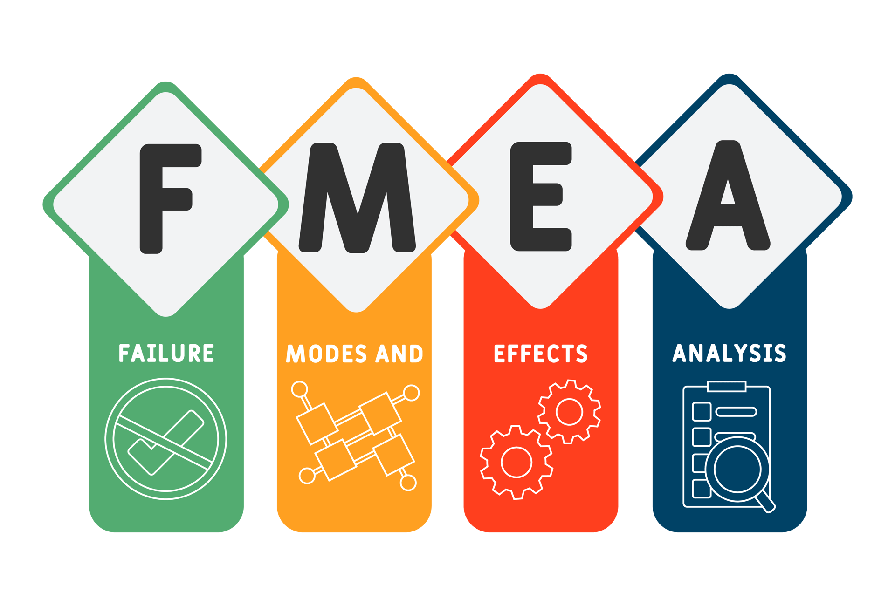
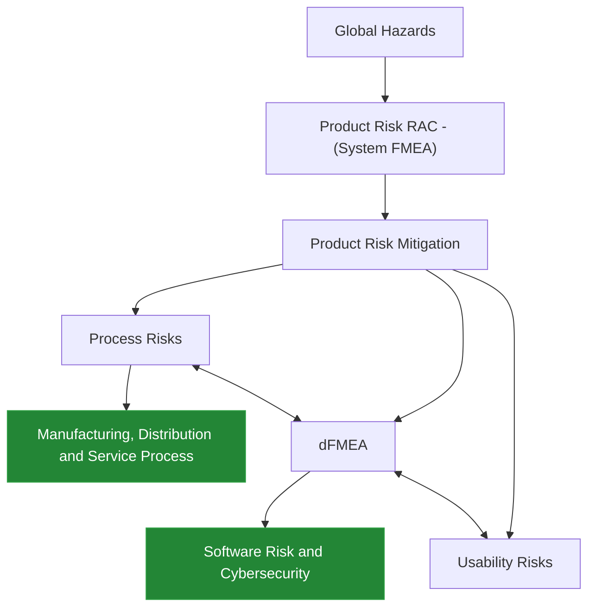

# FMEA - Failure Mode and Effects Analysis

---

- [FMEA - Failure Mode and Effects Analysis](#fmea---failure-mode-and-effects-analysis)
  - [Introduction](#introduction)
  - [Why is FMEA Important?](#why-is-fmea-important)
  - [How to Conduct FMEA?](#how-to-conduct-fmea)

---

## Introduction

>[!IMPORTANT] 
> FMEA (Failure Mode and Effects Analysis) is a systematic method for identifying potential failure modes in a system, product, or process, and assessing their impact on performance. It helps organizations prioritize risks and implement corrective actions to mitigate them.

- FMEA is not a individual one time activity, but rather a team effort that involves cross-functional collaboration.
- It is typically performed during the design phase of a product or process, but can also be applied to existing products or processes for continuous improvement.
- The main goal of FMEA is to identify and prioritize potential failure modes based on their severity, occurrence, and detection, and to implement corrective actions to reduce the risk of failure.

<b> Requirements on Design/Process Risk Management </b>

## Why is FMEA Important?

- FMEA helps organizations identify potential failure modes early in the design or process development phase, allowing for proactive risk management.
- It provides a structured approach to prioritize risks based on their severity, occurrence, and detection, enabling organizations to focus their resources on the most critical issues.
- FMEA promotes cross-functional collaboration and communication, fostering a culture of continuous improvement and risk awareness within the organization.
- By implementing corrective actions based on FMEA findings, organizations can reduce the likelihood of failures, improve product quality, enhance customer satisfaction, and ultimately increase profitability.

>[!NOTE]
> ## When to conduct FMEA & why??
> FMEA should be conducted during the feasibility, design or development phase of a product.
> A general flow of product looks like this:
> 1. Concept/Feasibility
> 2. Design/Development
> 3. Validation/Verification
> 4. Development/Manufacturing
> 5. Testing/Release
> 6. Manufacturing
> 7. Distribution/Service  
> FMEA is most effective when conducted early in the design or development phase, as it allows for the identification and mitigation of potential failure modes before they become costly or difficult to address. By conducting FMEA during the early stages of product development, organizations can proactively manage risks, improve product quality, and enhance customer satisfaction. It also helps companies and organisations avoid costly recalls, warranty claims, and damage to their reputation by identifying and addressing potential failure modes before they reach the market.

- Imagine a worst case scenario, where a device has to be recalled. These recalls can be costly for companies, both in terms of financial losses and damage to their reputation. By conducting FMEA during the design or development phase, companies can identify potential failure modes and implement corrective actions to mitigate them, reducing the likelihood of recalls and associated costs. Additionally, FMEA can help companies improve product quality and customer satisfaction by proactively managing risks and addressing potential issues before they reach the market.

- FMEAs must be revisited timely often to avoid any costly mistakes.

## How to Conduct FMEA?

- The FMEA process typically can be covered in 3 big buckets:
    1. `Pre-work/Planning`
    2. `FMEA Analysis`
    3. `Post-work/Action Plan/Follow-up`

 

- The `pre-work/planning` phase involves:
  - `defining` scope of the FMEA, acceptance criteria for risk prioritization, and assembling a cross-functional team with relevant expertise.
  - `Identifying` strategies, divisions, functions, processes, sequences & iterations, and potential failure modes, analyzing the effects and causes of each failure mode, and assigning risk priority numbers (RPNs) based on severity, occurrence, and detection ratings. And, based on that suggesting mitigations and corrective actions to reduce the risk of failure.
  - `Data` collection and review of historical data of failure data from similar devices.

- `FMEA analysis` phase involves:
  - `analyzing` flowchart for System/Features/Functions/Process.
  - `identify` potential failures, effects, causes and controls.
  - `Asses & Evaluate` the severity & risk caused by each failure mod. It's occurence to know how frequently the failure mode is likely to occur, and detection to know how likely it is that the failure mode will be detected before it reaches the customer.

- `Post-work/action plan/follow-up` phase involves:
  - `Mitigation` of the identified failure modes by implementing corrective actions to reduce the risk of failure.
  - `Follow-up` to ensure that the corrective actions are effective and that the risks have been mitigated.

---