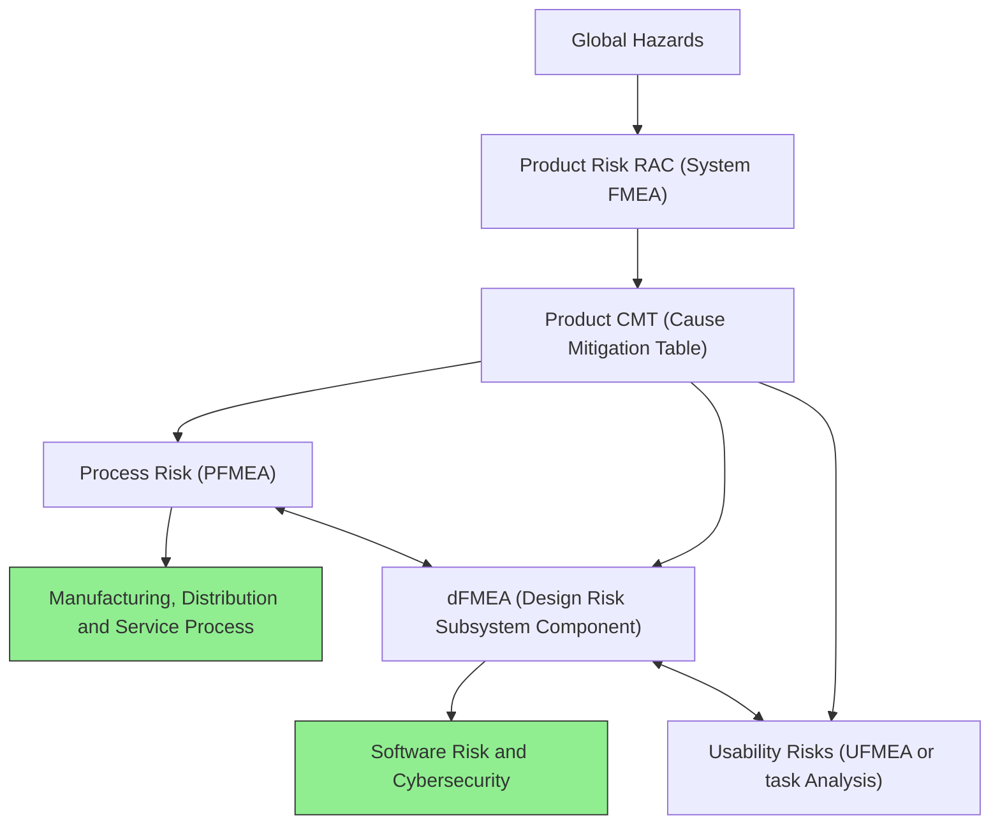

# FMEA - Failure Mode and Effects Analysis

- [FMEA - Failure Mode and Effects Analysis](#fmea---failure-mode-and-effects-analysis)
  - [Introduction](#introduction)
  - [Why is FMEA Important?](#why-is-fmea-important)

## Introduction

>[!IMPORTANT] FMEA (Failure Mode and Effects Analysis) is a systematic method for identifying potential failure modes in a system, product, or process, and assessing their impact on performance. It helps organizations prioritize risks and implement corrective actions to mitigate them.

- FMEA is not a individual one time activity, but rather a team effort that involves cross-functional collaboration.
- It is typically performed during the design phase of a product or process, but can also be applied to existing products or processes for continuous improvement.
- The main goal of FMEA is to identify and prioritize potential failure modes based on their severity, occurrence, and detection, and to implement corrective actions to reduce the risk of failure.

<b> Requirements on Design/Process Risk Management </b>

## Why is FMEA Important?

- FMEA helps organizations identify potential failure modes early in the design or process development phase, allowing for proactive risk management.
- It provides a structured approach to prioritize risks based on their severity, occurrence, and detection, enabling organizations to focus their resources on the most critical issues.
- FMEA promotes cross-functional collaboration and communication, fostering a culture of continuous improvement and risk awareness within the organization.
- By implementing corrective actions based on FMEA findings, organizations can reduce the likelihood of failures, improve product quality, enhance customer satisfaction, and ultimately increase profitability.

