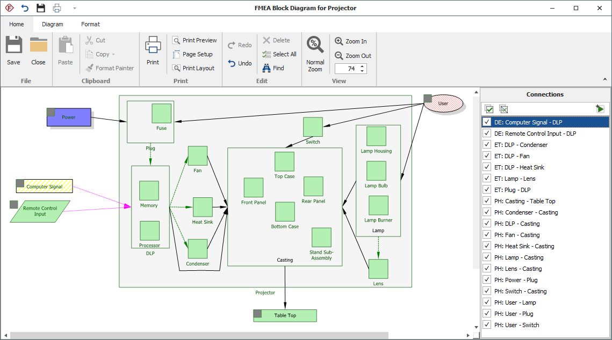
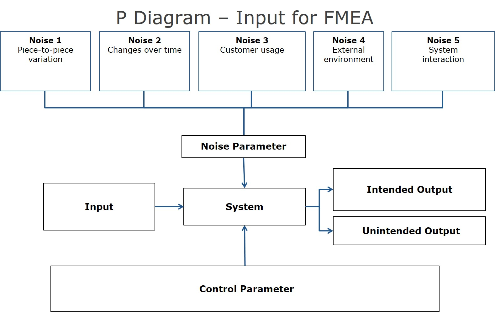
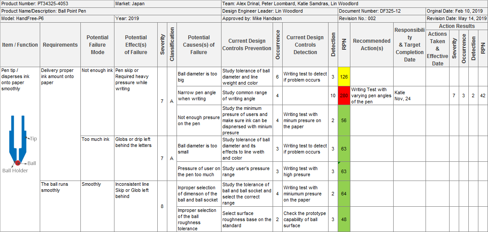

# FMEA Planning Overview

---
- [FMEA Planning Overview](#fmea-planning-overview)
  - [FBD (Functional Block Diagram)](#fbd-functional-block-diagram)
  - [P Diagram (Process Flow Diagram)](#p-diagram-process-flow-diagram)
  - [dFMEA (Design Failure Mode and Effects Analysis)](#dfmea-design-failure-mode-and-effects-analysis)
    - [Gathering Information](#gathering-information)

---

There are 3 main contexts in a FMEA:

- FBD (Functional Block Diagram)
- dFMEA (Design Failure Mode and Effects Analysis)
- P-Diagram (Process Flow Diagram)

## FBD (Functional Block Diagram)

- Sets up the scope and boundaries of the feature/process/system under analysis.
- Identify functions, tasks, dependencies, and interactions between components.
- Analyze the feature/process/system from a functional perspective, examining which functions or elements are subject to failure and how they affect the overall performance and reliability of the system.
- A very important part of this is having the Flowchart for the product/process/feature/function.
  - Be specific in identifying sub-processes, tasks, dependencies, and interactions between components.
  - Talk to the people involved in the development process, and gather as much information as possible about the product/process/feature/function.
  - Also, consider the sub systems and underlying components and processes.

## P Diagram (Process Flow Diagram)

- Identifies the inputs, outputs, controls, and noise factors that can affect the performance of the system.
- Sets the standard  for failure effects, while also specifying the expected performance and reliability of the system under normal operating conditions.
- Identifies the control parameters that control the performance of the system, and the noise factors that can cause variability in the system's performance.

>[!NOTE]
> Based on the FBD, the P-Diagram is than created to identify the inputs, outputs, controls, and noise factors that can affect the performance of the system. 
> The P-Diagram helps to set the standard for failure effects, while also specifying the expected performance and reliability of the system under normal operating conditions. It also identifies the control parameters that control the performance of the system, and the noise factors that can cause variability in the system's performance. 
> The data after the P-Diagram is than gathered and analyzed to identify how the system/process/feature can fail, and what the effects of those failures would be. This information ensures completeness of evaluation, and numbers out the probability of those failures happening.

## dFMEA (Design Failure Mode and Effects Analysis)

- Identifies potential failure modes in the design phase.
- Analyzes the effects of these failures on the overall system performance.
- Prioritizes the failure modes based on their severity, occurrence, and detectability.

### Gathering Information

- Failure Modes can be identified, if you collect enough data about the product/process/feature/function, and analyze it to identify potential failure modes.
- This is mainly done by:
  - External Evaluations
  - Technical Reviews
  - Service/Field Engineers
  - Customer Complaints
  - Internal Defect
  - Customer Feedback

---