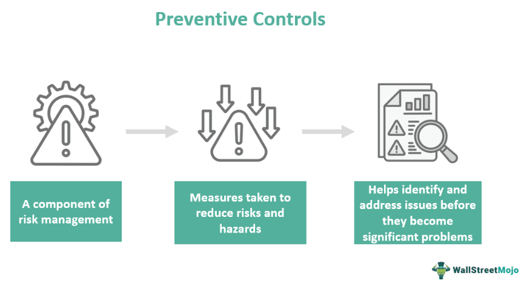

# FMEA - Control & Detectibility

---
- [FMEA - Control \& Detectibility](#fmea---control--detectibility)
  - [Preventive \& Detection Controls](#preventive--detection-controls)
  - [Preventive vs Detective Controls](#preventive-vs-detective-controls)
  - [Failure Mode Detection Ranking](#failure-mode-detection-ranking)

---

## Preventive & Detection Controls

>[!IMPORTANT]
> `Preventive` Controls are put in place to prevent the failure mode from occurring. These controls can include design changes, process improvements, or quality control measures.
>  
> `Detective` Controls are put in place to detect the failure mode if it does occur. These controls can include testing, inspections, or monitoring systems.

  

## Preventive vs Detective Controls

<table>
    <tr>
        <th>Preventive Controls</th>
        <th>Detective Controls</th>
    </tr>
    <tr>
        <td>Preventive Controls are done before the failure cause occurs.\, to avoid it from happening in the first place.</td>
        <td>Detective Controls are done after the failure cause occurs.\, to identify and mitigate its effects.</td>
    </tr>
    <tr>
        <td>In preventive controls, we look at fixtures or design changes to prevent the failure mode from occurring. Like configuring the software to avoid certain errors.</td>
        <td>In detective controls, we look at testing, inspections, or monitoring systems to detect the failure mode if it does occur. Like logs and alerts analysis using Grafana to identify issues in real-time.</td>
    </tr>
    <tr>
        <td>Preventive controls involve shear human practice to operate the software or device, and have clear understanding of User Manual, and following the instructions to avoid failure modes.</td>
        <td>Detective controls involve monitoring and analyzing data to identify potential issues, with Monitoring methods deployed to detect failure modes and alert users or operators to take corrective actions.</td>
    </tr>
</table>

## Failure Mode Detection Ranking

