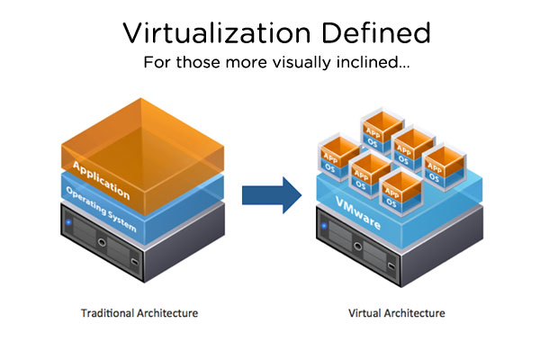

# Environment Setup - Building Your Hacking Lab



## Overview

To practice ethical hacking safely and legally, you need a controlled environment. This lesson will guide you through setting up a complete hacking lab using virtual machines.

## Lab Components

Your hacking lab will consist of three main components:

### 1. 🖥️ Host Machine
- **What**: Your physical computer (PC or Laptop)
- **OS**: Windows, macOS, or Linux
- **Purpose**: Runs the virtualization software
- **Requirements**: 
  - 8GB+ RAM (16GB recommended)
  - 50GB+ free disk space
  - Modern processor with virtualization support

### 2.  Hacking Machine (Kali Linux)
- **What**: Virtual machine for conducting attacks
- **OS**: Kali Linux
- **Purpose**: Your primary tool for ethical hacking
- **Features**:
  - Pre-installed hacking tools
  - Regular security updates
  - Optimized for penetration testing

### 3. 🎯 Target Machines
- **What**: Virtual machines to practice attacks on
- **Options**:
  -  Windows 10 VM
  - Metasploitable (intentionally vulnerable Linux)
  - Other vulnerable VMs
- **Purpose**: Safe, legal targets for practice

## Understanding Virtualization

### What is Virtualization?

**Virtualization** allows you to run multiple operating systems on a single physical machine. Each virtual machine (VM) operates independently with its own:

- Operating system
- Applications
- Network configuration
- Storage
- Resources (CPU, RAM)

### Virtualization vs Containerization

| Feature | Virtualization | Containerization |
|---------|---------------|------------------|
| **Isolation** | Complete OS isolation | Shared OS kernel |
| **Resources** | Dedicated resources | Shared resources |
| **Size** | Large (GBs) | Small (MBs) |
| **Boot Time** | Minutes | Seconds |
| **Use Case** | Full OS testing | Application deployment |
| **Example** | VMware, VirtualBox | Docker, Kubernetes |

### Benefits for Ethical Hacking

✅ **Safety**: Isolated from your host system  
✅ **Snapshots**: Save and restore states easily  
✅ **Multiple Systems**: Run several OSes simultaneously  
✅ **No Risk**: Mistakes won't affect your main computer  
✅ **Easy Reset**: Restore to clean state anytime  
✅ **Networking**: Create isolated networks for testing  

## Step-by-Step Setup Guide

### Step 1: Install Virtualization Software

#### Option A: VMware Workstation (Recommended)

**Pros**:
- Better performance
- Advanced networking features
- Professional-grade
- Excellent snapshot management

**Download**:
- [VMware Workstation](https://ln5.sync.com/dl/a524d0280/view/default/23995984090004?sync_id=0#fgbzw355-bzuq9n6t-yypf24kv-7rfsi8xu)

**Installation**:
1. Download the installer
2. Run as administrator
3. Follow installation wizard
4. Restart your computer
5. Launch VMware Workstation

#### Option B: VirtualBox (Free Alternative)

**Pros**:
- Completely free
- Open source
- Cross-platform
- Good for beginners

**Download**:
- [VirtualBox Official Site](https://www.virtualbox.org/)

**Installation**:
1. Download for your OS
2. Install with default settings
3. Install Extension Pack
4. Restart if prompted

### Step 2: Download Kali Linux VM

#### Pre-built VM (Easiest)

**Download**:
- [Custom Kali Linux VM](https://zsecurity.org/download-custom-kali/)

**Advantages**:
- Pre-configured
- Ready to use
- Optimized settings
- Saves time

**Steps**:
1. Download the VM file (.ova or .vmx)
2. Extract if compressed
3. Import into VMware/VirtualBox
4. Allocate resources (4GB RAM minimum)
5. Start the VM

#### ISO Installation (Advanced)

If you prefer to install from scratch:

1. Download Kali Linux ISO
2. Create new VM
3. Allocate resources
4. Mount ISO
5. Follow installation wizard

### Step 3: Download Target Machines

#### Windows 10 VM

**Download Options**:
- [Google Drive](https://drive.google.com/file/d/1-TIp1Jnj5avio3v_hpLiWrZgKXIDAZIU/view)
- [Sync.com](https://ln5.sync.com/dl/69a8cb2b0/view/default/11829848200004?sync_id=0#k2xyv9ke-qevy6hgz-tavwxu3c-78858267)

**Setup**:
1. Download the VM
2. Extract files
3. Import into virtualization software
4. Configure network settings
5. Take initial snapshot

#### Metasploitable

**Download**:
- [Metasploitable 2](https://sourceforge.net/projects/metasploitable/)

**Purpose**:
- Intentionally vulnerable Linux system
- Perfect for practicing exploits
- Safe and legal target

### Step 4: Configure Network Settings

#### Network Modes Explained

**1. NAT (Network Address Translation)**
- VM can access internet
- VM can't be accessed from outside
- Good for: General use, updates

**2. Bridged**
- VM appears as separate device on network
- Gets own IP from router
- Good for: Network attacks, realistic scenarios

**3. Host-Only**
- VM can only communicate with host
- Completely isolated from internet
- Good for: Safe testing, malware analysis

**4. Internal Network**
- VMs can communicate with each other
- No internet access
- Good for: Creating isolated lab networks

#### Recommended Setup

```
┌─────────────────────────────────────┐
│         Host Machine                │
│                                     │
│  ┌──────────────┐  ┌─────────────┐ │
│  │  Kali Linux  │  │  Windows 10 │ │
│  │  (Attacker)  │  │  (Target)   │ │
│  │              │  │             │ │
│  │  NAT Mode    │  │  NAT Mode   │ │
│  └──────────────┘  └─────────────┘ │
│         │                 │         │
│         └────────┬────────┘         │
│                  │                  │
│         Internal Network            │
└─────────────────────────────────────┘
```

**Configuration**:
1. Set Kali to NAT for internet access
2. Add second adapter as Internal Network
3. Set Windows to Internal Network
4. Configure static IPs on internal network

### Step 5: Take Snapshots

**Why Snapshots?**
- Save current state
- Restore if something breaks
- Test dangerous operations safely
- Quick recovery

**When to Take Snapshots**:
- ✅ After initial setup
- ✅ Before major changes
- ✅ After installing tools
- ✅ Before risky operations
- ✅ After successful exploits

**How to Take Snapshots**:

**VMware**:
1. VM → Snapshot → Take Snapshot
2. Name it descriptively
3. Add description

**VirtualBox**:
1. Machine → Take Snapshot
2. Name and describe
3. Click OK

## Resource Allocation Guide

### Minimum Requirements

**Kali Linux**:
- CPU: 2 cores
- RAM: 2GB
- Disk: 20GB
- Network: 1 adapter

**Windows 10**:
- CPU: 2 cores
- RAM: 4GB
- Disk: 40GB
- Network: 1 adapter

### Recommended Settings

**Kali Linux**:
- CPU: 4 cores
- RAM: 4-8GB
- Disk: 40GB
- Network: 2 adapters

**Windows 10**:
- CPU: 2-4 cores
- RAM: 4-8GB
- Disk: 60GB
- Network: 1-2 adapters

### Performance Tips

1. **Enable Virtualization in BIOS**
   - Intel: VT-x
   - AMD: AMD-V

2. **Allocate Resources Wisely**
   - Don't over-allocate RAM
   - Leave resources for host OS
   - Use dynamic disk allocation

3. **Install Guest Additions/Tools**
   - Better performance
   - Shared clipboard
   - Drag and drop files
   - Better graphics

## Verification Checklist

After setup, verify everything works:

- [ ] VMware/VirtualBox installed and running
- [ ] Kali Linux VM boots successfully
- [ ] Can login to Kali (default: kali/kali)
- [ ] Kali has internet access
- [ ] Target VM(s) installed
- [ ] Network connectivity between VMs
- [ ] Snapshots created
- [ ] Guest tools installed
- [ ] Shared folders configured (optional)

## Common Issues and Solutions

### Issue: VM Won't Start

**Solutions**:
- Enable virtualization in BIOS
- Check resource allocation
- Update virtualization software
- Disable Hyper-V (Windows)

### Issue: No Internet in VM

**Solutions**:
- Check network adapter settings
- Try different network mode
- Restart network service
- Check host firewall

### Issue: Slow Performance

**Solutions**:
- Allocate more RAM
- Enable 3D acceleration
- Install guest additions
- Close unnecessary applications
- Use SSD for VM storage

### Issue: Can't Connect VMs

**Solutions**:
- Verify network mode
- Check firewall settings
- Ping test between VMs
- Restart network adapters

## Security Best Practices

### Isolate Your Lab

1. **Use Internal Networks**: Keep lab traffic isolated
2. **Disable Internet When Not Needed**: Prevent accidental exposure
3. **Don't Use Personal Data**: Keep lab separate from personal work
4. **Regular Snapshots**: Always have a clean state to restore

### Protect Your Host

1. **Keep Host Updated**: Security patches
2. **Use Antivirus**: Protect against malware
3. **Backup Important Data**: Before experimenting
4. **Monitor Resources**: Don't overload your system

## Next Steps

Now that your lab is set up, you're ready to start learning!

**Continue to**: [Wireless Setup →](./wireless-setup.md)

---

## Quick Reference

### Default Credentials

**Kali Linux**:
- Username: `kali`
- Password: `kali`

**Metasploitable**:
- Username: `msfadmin`
- Password: `msfadmin`

### Useful Commands

```bash
# Check network interfaces
ifconfig

# Test internet connectivity
ping google.com

# Update Kali
sudo apt update && sudo apt upgrade

# Check VM resources
htop
```

---

**Pro Tip**: Always work in snapshots. Take one before trying anything new, and you can always roll back if something goes wrong! ��
