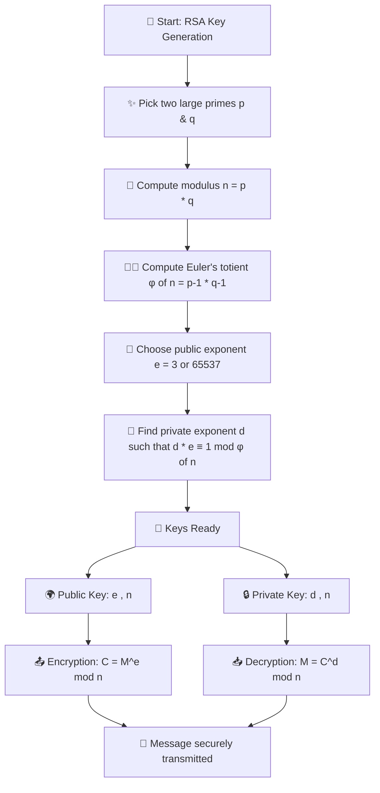

# Getting Started with Ethical Hacking


<!-- TOC -->
- [Getting Started with Ethical Hacking](#getting-started-with-ethical-hacking)
  - [Setup for learning](#setup-for-learning)
    - [Virtualization](#virtualization)
- [Introduction to Penetration Testing](#introduction-to-penetration-testing)
  - [Connecting Wireless adapter to Kali ](#connecting-wireless-adapter-to-kali-)
  - [Wireless Modes](#wireless-modes)
    - [Enabling Monitor Mode on Wireless Adapter](#enabling-monitor-mode-on-wireless-adapter)
- [Extras - Learning Section -🔐 RSA Encryption](#extras---learning-section---rsa-encryption)
    - [📌 What is RSA?](#-what-is-rsa)
  - [🧮 The Math Behind RSA (Step by Step)](#-the-math-behind-rsa-step-by-step)
      - [Step 1: Pick Two Large Primes ✨](#step-1-pick-two-large-primes-)
      - [Step 2: Build the Modulus 🔲](#step-2-build-the-modulus-)
      - [Step 3: Euler Joins the Party 🧑‍🏫](#step-3-euler-joins-the-party-)
      - [Step 4: Pick the Public Exponent 🔑](#step-4-pick-the-public-exponent-)
      - [Step 5: Find the Secret Ingredient 🧙](#step-5-find-the-secret-ingredient-)
      - [Step 6: Keys Ready 🎉](#step-6-keys-ready-)
      - [Step 7: Encryption \& Decryption 🔐](#step-7-encryption--decryption-)
    - [Toy Example (Small Numbers)](#toy-example-small-numbers)
    - [🚨 When Does RSA Fail?](#-when-does-rsa-fail)
    - [📚 Further Reading](#-further-reading)
    - [🎯 Key Takeaways](#-key-takeaways)
  - [Path](#path)
<!-- /TOC -->
---


- Hacking is getting unauthorized access to a system.
- Hackers generally are of three types:

  - Black Hat: Such hackers generally tend to cause some damage, steal information
  - White Hat: These hakers utilise the hacking knowledge for security/educational purposes
  - Grey Hat: These hackers intrude into systems but don't cause any damage to the sytem, nor steal information.

- Hacking actually do have a really big industry, due to large need of organizations to secure there data, and systems.

## Setup for learning

- For, this purpose we will utilise the concept of Virtual Machines, to replicate various systems.
- Let's discuss each component for this course:

  - Host Machine: This is your main PC or Laptop with it's current OS
    - 
  - Hacking Machine: [Kali Linux VM] This is the VM from where attack will be executed.
  - Target Machine: The Machines which we will be trying to hack into.

    - We will be using 2 target machines for this course.

      - 
      - Metasploitable

<br/>

### Virtualization

  

- What we are utilising here to have these VMs is called Virtualization. Virtualization allows you to Run Guest OS on top of Hypervisor over Host OS. This is different from concept of Containerizartion, where we run apps over the Docker Engine, and all apps sharing a common Host OS. This is not the case with Virtualization.

- Virtualization allows us to install a number of operating system inside your current OS.
- Each machine has it's own resources and fucntions like a real machine.

  - This mahchine is completely isolated from the Host OS, and hence maikes task of testing much easier.
  - It makes the issues caused due to any issues, easier to fix using th concept of snapshots.

---

# Introduction to Penetration Testing

- In this section, we will maily cover three topics:

  - Pre-Connection Attacks
  - Gaining Access
  - Post Connection Attacks

- Before, diving deep let's revise the basics of the networks.
- Let's try to understand a scenario where there are multiple, client systems, now these client systems actually wnat to have reach to the resources over the internet for which there needs to be a `server`. Let's say for now this resource is internet in our case. So, the router will act as `server` for the clients to reach to the internet. You can also refer to this router as an `access point`
  
- This router or server is the only device, that havse access to the resource or the internet, so none of these clients has direct access to the resource, even after connecting to the network.

- Let's say so all the client are connected to this router, and you search `google.com`. The Client will send a request to the `access point` searching for `google.com`. The router will take this request, and look for `google.com` over the internet.

- It will recieve `google.com` from the internet, and will forward that response to our computer, and as a result we will see the website loading on our browser.

    


## Connecting Wireless adapter to Kali 

- Why we need `wireless adapter`:

  - Network Hacking > Gaining Access > WEP Cracking
  - Network Hacking > Gaining Access > WPA/WPA2 Cracking

- The Wireless Adapter must support:

  - Monitor Mode
  - Packet Injection
  - Monitor Mode
  - AP Mode

- The Brand of the Adapter doesn't matter, but it should have either of the chipset:

  - Realtek RTL8812AU
  - Atheros AR9271

- To connect the Wireless Adapter to Kali, follow these steps:

  1. Plug in the Wireless Adapter to your Host Machine.
  2. Open VirtualBox and select your Kali VM.
  3. Go to `Settings` > `USB`.
  4. Enable USB Controller and add a new USB filter for your Wireless Adapter.
  5. Start your Kali VM and check if the adapter is recognized using the command:

     ```bash
     ifconfig
     ```

- For mac, thie USB Controller is automatically enabled, so you don't need to do anything. Just plug in the Wireless Adapter and it will be recognized by Kali.

- Now, we run the python script to change the MAC address of the Wireless Adapter:

  ```bash
  /root/PycharmProjects/hacking-tutorial/.venv/bin/python /root/PycharmProjects/hacking-tutorial/mac-address-change.py 
  Enter the interface name (e.g., eth0, wlan0): wlan0
  Enter the new MAC address (format: xx:xx:xx:xx:xx:xx): 00:11:22:33:44:55
  [+] Changing MAC address of wlan0 to 00:11:22:33:44:55
  [+] MAC address changed successfully
  New MAC address for wlan0 is 00:11:22:33:44:55
  wlan0: flags=4099<UP,BROADCAST,MULTICAST>  mtu 2312
          ether 00:11:22:33:44:55  txqueuelen 1000  (Ethernet)
          RX packets 0  bytes 0 (0.0 B)
          RX errors 0  dropped 0  overruns 0  frame 0
          TX packets 0  bytes 0 (0.0 B)
          TX errors 0  dropped 0 overruns 0  carrier 0  collisions 0

  [+] Verification complete for wlan0.

  Process finished with exit code 0
  ```

- As, you can see now the MAC address of the Wireless Adapter has been changed to `00:11:22:33:44:55`.

## Wireless Modes

- So, we now know that a machine will only recieve the packets if the Destination MAC address of the packet matches with the MAC address of the machine. But, what if we want to capture all the packets that are being sent over the network, even if they are not meant for our machine? This is where Wireless Modes come into play.

- Run the following command to check the current mode of your Wireless Adapter, and wireless interfaces only:

  ```bash
  root@kali:~# iwconfig
  lo        no wireless extensions.

  eth0      no wireless extensions.

  wlan0     unassociated  ESSID:""  Nickname:"<WIFI@REALTEK>"
            Mode:Managed  Frequency=2.412 GHz  Access Point: Not-Associated   
            Sensitivity:0/0  
            Retry:off   RTS thr:off   Fragment thr:off
            Encryption key:off
            Power Management:off
            Link Quality:0  Signal level:0  Noise level:0
            Rx invalid nwid:0  Rx invalid crypt:0  Rx invalid frag:0
            Tx excessive retries:0  Invalid misc:0   Missed beacon:0
  ```

- We can see out Wireless adapter `wlan0`, which is set to `Mode:Managed`. This means that the Wireless Adapter is currently in Managed Mode, which is the default mode for most wireless adapters. In this mode, the adapter can only communicate with the access point it is connected to.

- This also means this device will only capture packets that has the Destination MAC as MAC Address of this device. What we want is to be able to capture all the packets that are within our range, even if they are sent to the router, and even if there Destination MAC Address is set to other device. For this we need to change the mode of our Wireless Adapter to `Monitor Mode`.

### Enabling Monitor Mode on Wireless Adapter

- To enable Monitor Mode on your Wireless Adapter, run the following command:

  ```bash
  root@kali:~# ifconfig wlan0 down
  root@kali:~# airmon-ng check kill

  Killing these processes:

      PID Name
    3171 wpa_supplicant

  root@kali:~# iwconfig wlan0 mode monitor
  root@kali:~# ifconfig wlan0 up
  root@kali:~# iwconfig
  lo        no wireless extensions.

  eth0      no wireless extensions.

  wlan0     IEEE 802.11b  ESSID:""  Nickname:"<WIFI@REALTEK>"
            Mode:Monitor  Frequency:2.412 GHz  Access Point: Not-Associated   
            Sensitivity:0/0  
            Retry:off   RTS thr:off   Fragment thr:off
            Encryption key:off
            Power Management:off
            Link Quality:0  Signal level:0  Noise level:0
            Rx invalid nwid:0  Rx invalid crypt:0  Rx invalid frag:0
            Tx excessive retries:0  Invalid misc:0   Missed beacon:0
  ```

- First, we disable the Wireless Adapter using `ifconfig wlan0 down`.
- Then, we run `airmon-ng check kill` to kill any processes that might interfere with the Wireless Adapter.
- After that, we change the mode of the Wireless Adapter to `Monitor Mode` using:

  ```bash
  iwconfig wlan0 mode monitor
  ```

- Finally, we enable the Wireless Adapter again using `ifconfig wlan0 up`.
- Now, if we run `iwconfig` again, we can see that the mode of the Wireless Adapter has been changed to `Monitor Mode`.

---

# Extras - Learning Section -🔐 RSA Encryption

### 📌 What is RSA?

RSA (named after its inventors: **Rivest, Shamir, and Adleman**) is one of the most famous **public-key cryptosystems** in the world.  

It is used for:
* 📨 **Encryption:** Send secret messages that only the right person can read.  
* ✍️ **Digital Signatures:** Prove a message really came from you.  
* 🔑 **Key Exchange:** Share keys safely for other ciphers (like AES).  

👉 Unlike **symmetric encryption** (same key for both sides), RSA uses **two keys**:
* **Public key:** (share with the world 🌍). Used to encrypt.  
* **Private key:** (keep locked away 🔒). Used to decrypt.  

---

## 🧮 The Math Behind RSA (Step by Step)

RSA’s strength comes from the fact that it’s **easy to multiply big primes** but **hard to factor them back**. Let’s see how the keys are built:

#### Step 1: Pick Two Large Primes ✨
Choose two secret primes:  
\[
p, \ q
\]  
> In the real world, these are HUGE (hundreds of digits long).

---

#### Step 2: Build the Modulus 🔲
\[
n = p \times q
\]  
This number \( n \) is part of both the public and private keys.

---

#### Step 3: Euler Joins the Party 🧑‍🏫
Compute **Euler’s totient**:
\[
\varphi(n) = (p-1)(q-1)
\]  
This is how many numbers less than \( n \) are “coprime” with it.

---

#### Step 4: Pick the Public Exponent 🔑
Choose \( e \), such that:
\[
gcd(e, \varphi(n)) = 1
\]  
In other words, \( e \) and \( \varphi(n) \) don’t share factors.  
Popular choices: \( e = 3 \) or \( e = 65537 \) (fast and secure).

---

#### Step 5: Find the Secret Ingredient 🧙
Compute the **private exponent** \( d \) by solving:
\[
d \times e \equiv 1 \ (\text{mod } \varphi(n))
\]  
This means \( d \) is the **modular inverse** of \( e \).  
Finding \( d \) is easy if you know \( \varphi(n) \), but impossible without factoring \( n \)!

---

#### Step 6: Keys Ready 🎉
* **Public Key:** \((e, n)\) → “lock” (anyone can use it).  
* **Private Key:** \((d, n)\) → “key” (only you can unlock).  

---

#### Step 7: Encryption & Decryption 🔐
* **Encryption (lock it):**
\[
C = M^e \ \text{mod } n
\]  

* **Decryption (unlock it):**
\[
M = C^d \ \text{mod } n
\]  

Magic: thanks to modular arithmetic, this always works!

---



### Toy Example (Small Numbers)

⚠️ Don’t try this at home with real secrets — small numbers are too easy to crack. This is just a classroom demo.  

1. Pick primes:  
   \( p = 5, q = 11 \)  

2. Compute modulus:  
   \( n = 5 \times 11 = 55 \)  

3. Compute totient:  
   \( \varphi(55) = (5-1)(11-1) = 4 \times 10 = 40 \)  

4. Choose \( e = 3 \) (coprime with 40).  

5. Find \( d \): solve \( 3 \times d \equiv 1 \ (\text{mod } 40) \).  
   ✨ \( d = 27 \) works because \( 3 \times 27 = 81 \equiv 1 \ (\text{mod } 40) \).  

**Keys:**
* Public = \((3, 55)\)  
* Private = \((27, 55)\)  

---

**Let’s Encrypt a Message!**  
Say our message is \( M = 9 \).  

- **Encrypt:**  
  \[
  C = 9^3 \ \text{mod } 55 = 729 \ \text{mod } 55 = 14
  \]  
  🔒 Ciphertext = **14**

- **Decrypt:**  
  \[
  M = 14^{27} \ \text{mod } 55 = 9
  \]  
  ✅ Original message recovered!  

---

### 🚨 When Does RSA Fail?

RSA is strong in theory, but weak in practice if misused:

* ⚡ **Small Primes:** Easy to factor → instant break.  
* 🤝 **Shared Primes:** If two people accidentally share a prime, both are broken.  
* 🔢 **Small Exponent Attack:** If \( e = 3 \) and no padding, small messages leak.  
* 🎲 **No Random Padding:** Textbook RSA is predictable. Modern fix = **OAEP**.  
* 🎰 **Weak Randomness:** Bad RNG → predictable primes.  
* 🕵️ **Side-Channel Attacks:** Timing/power leaks can reveal secrets.  

---

### 📚 Further Reading
* 🎥 [RSA Explained – Khan Academy](https://www.khanacademy.org/computing/computer-science/cryptography/modern-crypt/v/rsa-encryption-part-1)  
* 📝 [RSA in Practice – Practical Cryptography](http://practicalcryptography.com/asymmetric-key-cryptography/rsa/)  
* 📖 [Wikipedia: RSA Cryptosystem](https://en.wikipedia.org/wiki/RSA_(cryptosystem))  

---

### 🎯 Key Takeaways
* RSA = multiplication is easy, factoring is hard.  
* Public key = open lock, Private key = secret unlock.  
* Used for secure messages and signatures.  
* Needs **padding + randomness** to be safe in the real world.  

---

### Path

[Next Lesson: Network Hacking - Pre Connection Attacks](./lesson-02.md) ->