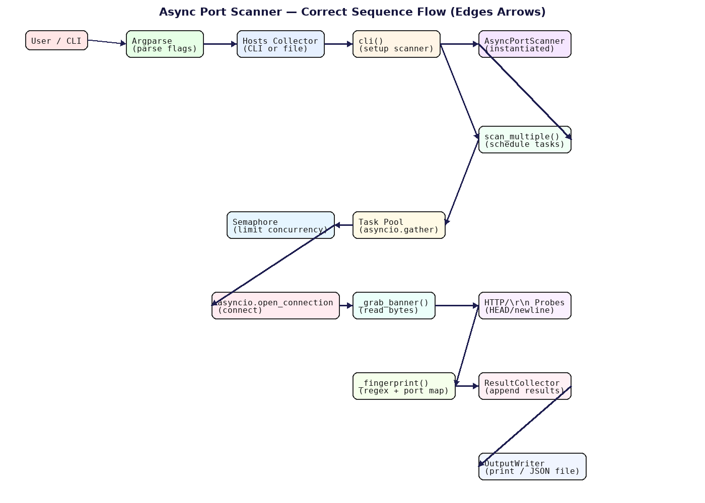
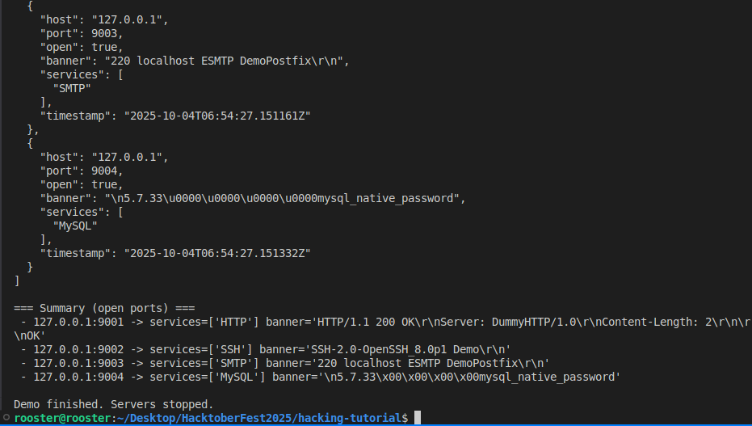
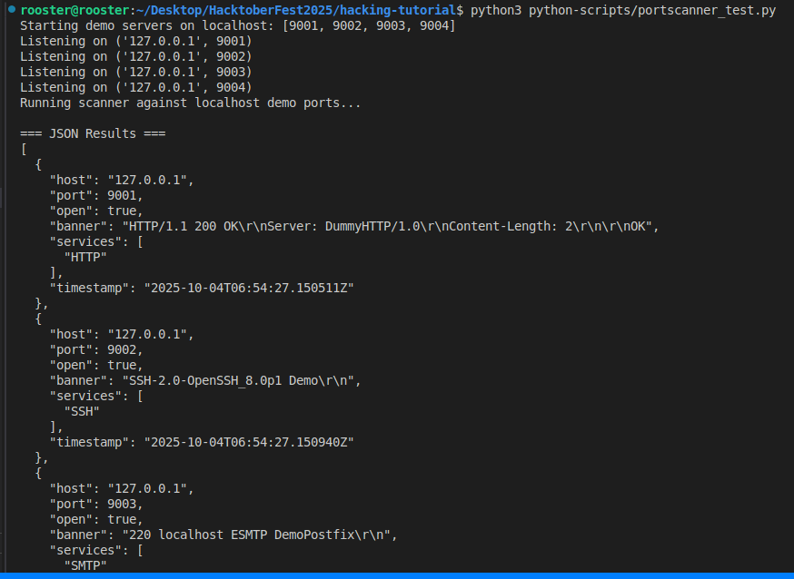

# Asynchronous Port Scanner (Simple)

A small, educational port scanner written in Python that demonstrates:

- Asynchronous networking using `asyncio` (no external dependencies).
- Banner grabbing: reading the short messages services often send when you connect.
- Basic service fingerprinting: using simple pattern matches to guess common services (HTTP, SSH, SMTP, MySQL, etc.).

> **Warning:** Only scan hosts/networks that are owned or explicitly authorized for testing.

---

## What it does

The scanner connects to one or more hosts and ports concurrently, attempts to read service banners, and applies simple rules to identify likely services. It prints open ports with any banners and guessed service names.

---

## Architecture and flow

The diagram below shows the end-to-end sequence: CLI parsing, host collection, async scheduling with a semaphore, banner grabbing, fingerprinting, and result collection/output.



Key steps:

- User/CLI input parses flags and config.
- Hosts collector reads targets from CLI or file.
- Scanner setup instantiates the scanner.
- Task scheduling distributes scan tasks.
- Concurrency control limits simultaneous scans with a semaphore.
- Async connections use `asyncio.open_connection`.
- Banner grabbing reads available banners and may send lightweight probes.
- Service fingerprinting matches banners or uses port heuristics.
- Result collection aggregates and prints or writes JSON.

---

## Usage

Basic example:

```bash
python port_scanner.py --hosts 127.0.0.1 --ports 22,80,443
```

This scans the listed ports on 127.0.0.1, printing open ports, banners, and the guessed service name.

---

## Example test run

Below are screenshots from a real demo session: one shows the JSON results, the other the console summary.





Representative raw JSON:

```json
[
  {
    "host": "127.0.0.1",
    "port": 9001,
    "open": true,
    "banner": "HTTP/1.1 200 OK\\r\\nServer: DummyHTTP/1.0\\r\\nContent-Length: 2\\r\\n\\r\\nOK",
    "services": ["HTTP"],
    "timestamp": "2025-10-04T06:54:27.150511Z"
  },
  {
    "host": "127.0.0.1",
    "port": 9002,
    "open": true,
    "banner": "SSH-2.0-OpenSSH_8.0p1 Demo\\r\\n",
    "services": ["SSH"],
    "timestamp": "2025-10-04T06:54:27.150940Z"
  },
  {
    "host": "127.0.0.1",
    "port": 9003,
    "open": true,
    "banner": "220 localhost ESMTP DemoPostfix\\r\\n",
    "services": ["SMTP"],
    "timestamp": "2025-10-04T06:54:27.151161Z"
  },
  {
    "host": "127.0.0.1",
    "port": 9004,
    "open": true,
    "banner": "\\n5.7.33\\u0000\\u0000\\u0000\\u0000mysql_native_password",
    "services": ["MySQL"],
    "timestamp": "2025-10-04T06:54:27.151332Z"
  }
]
```

Summary output:

```
=== Summary (open ports) ===
- 127.0.0.1:9001 -> services=['HTTP'] banner='HTTP/1.1 200 OK\r\nServer: DummyHTTP/1.0\r\nContent-Length: 2\r\n\r\nOK'
- 127.0.0.1:9002 -> services=['SSH'] banner='SSH-2.0-OpenSSH_8.0p1 Demo\r\n'
- 127.0.0.1:9003 -> services=['SMTP'] banner='220 localhost ESMTP DemoPostfix\r\n'
- 127.0.0.1:9004 -> services=['MySQL'] banner='\n5.7.33\x00\x00\x00\x00mysql_native_password'
```

---

## How it works

### asyncio

- Uses `async`/`await` and an event loop to run many connections concurrently without threads.
- `asyncio.Semaphore` limits concurrent tasks to avoid exhausting system resources.
- `asyncio.gather` schedules many scan tasks together.

### Banner grabbing

- After connect, reads up to N bytes with a timeout.
- For HTTP, sends a `HEAD /` probe and reads response.
- Some text protocols respond to a newline; the scanner may send one line to elicit a banner.

### Service fingerprinting

- Matches banners against simple regexes for common services (e.g., HTTP, SSH, SMTP, MySQL).
- Falls back to a port-to-service map if no banner match is found.

---

## Notes

- Educational tool; not a production-grade scanner.
- Encrypted services (HTTPS/IMAPS) require TLS handshakes to inspect certificates.
- Fingerprinting can be improved by adding protocol-specific probes and regex patterns.

---

## When to use

- Lab and classroom demos.
- Authorized internal inventory discovery.
- CI checks for unintended open ports.
- Debugging local services.

Do not use on unauthorized networks.

---

