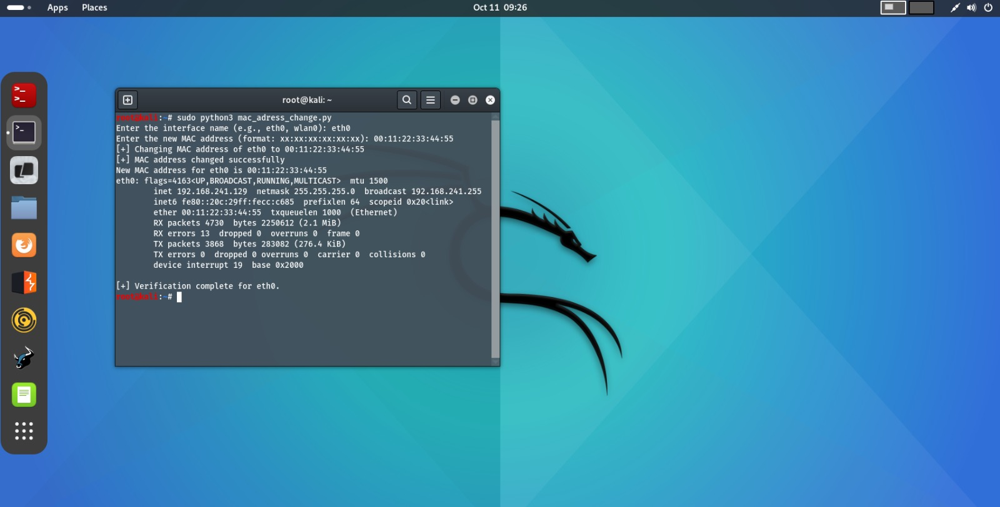

## mac-address-change.py

### Usage Scenario
This script is a fundamental utility in **Ethical Hacking** and **Network Administration**.

**What problem does it solve?**
It allows a user to programmatically and temporarily **change (spoof) the Media Access Control (MAC) address** of a specified network interface (e.g., `eth0`, `wlan0`). MAC addresses are unique hardware identifiers used for local network communication. Spoofing them is a technique used to bypass simple network filters (like MAC-based access control lists), hide one's identity on a network, or assume the identity of another device for testing purposes.

**Who would benefit from using it?**
* **Ethical Hackers / Penetration Testers:** To simulate various attack vectors, evade simple network monitoring, or test network security controls.
* **Network Engineers / Administrators:** For troubleshooting network-level issues, isolating performance problems, or testing new network configurations.
* **Security Researchers:** To maintain a degree of anonymity during network analysis and data collection.

---

### What the Script Does

This Python script is a simple yet powerful tool for modifying the MAC address of a network interface on Unix-like operating systems (which support the `ifconfig` command and `sudo` for elevated privileges).

**High-Level Functionality:**
The script takes two inputs from the user—the target network **interface name** and the **new desired MAC address**—and then executes a sequence of privileged commands to perform the MAC address change. It verifies the change afterward.

| Aspect | Description |
| :--- | :--- |
| **Inputs** | **1. Interface Name:** The network adapter to modify (e.g., `eth0`, `wlan0`). **2. New MAC Address:** A valid 12-digit hexadecimal address (format: `xx:xx:xx:xx:xx:xx`). |
| **Outputs / Side Effects** | **System Modification:** The script temporarily changes the operating system's configuration to update the specified network interface's MAC address. **Console Output:** Prints status messages (`[+] Changing MAC...`) and the final `ifconfig` output for verification. |

---

### Code Explanation

#### Imported Libraries

| Library | Purpose |
| :--- | :--- |
| `subprocess` | This module is crucial for executing external commands from within the Python script. It is used to call the powerful system utility **`ifconfig`** to control and configure the network interface parameters, specifically to set the MAC address. |

#### Main Functions

| Function | Parameters | Returns | Purpose |
| :--- | :--- | :--- | :--- |
| `change_mac` | `interface` (str), `new_mac` (str) | None | Executes a sequence of three `sudo ifconfig` commands to: 1) take the interface down, 2) set the new MAC address (`hw ether`), and 3) bring the interface back up. |

#### Execution Logic

The script follows a standard Python entry point structure to ensure the main logic only runs when the script is executed directly.

1.  **Input Collection:** The script prompts the user twice using `input()` to get the **interface name** and the **new MAC address**.
2.  **Function Call:** It calls the main procedure, `change_mac(interface, new_mac)`, passing the user-provided values, thus executing the MAC address spoofing sequence.
3.  **Verification (1):** It prints a summary message confirming the intended change.
4.  **Verification (2):** It executes a final system command: `subprocess.call(["ifconfig", interface])`. This command displays the current configuration details of the interface, allowing the user to visually confirm that the `ether` or `HWaddr` value (the MAC address) has been successfully updated.
          
---

### Screenshots



---

### Sequence Diagram

```mermaid
sequenceDiagram
    participant User
    participant Script as mac-address-change.py
    participant OS as Operating System
    
    User->>Script: Execute Script
    Script->>User: Request Interface Name
    User->>Script: Provide "eth0"
    Script->>User: Request New MAC Address
    User->>Script: Provide "00:11:22:33:44:55"
    
    Note over Script: Call change_mac("eth0", "00:11:22:33:44:55")
    
    Script->>OS: subprocess.call(["sudo", "ifconfig", "eth0", "down"])
    OS-->>Script: Interface is disabled
    
    Script->>OS: subprocess.call(["sudo", "ifconfig", "eth0", "hw", "ether", "00:11:22:33:44:55"])
    OS-->>Script: MAC address updated in system memory
    
    Script->>OS: subprocess.call(["sudo", "ifconfig", "eth0", "up"])
    OS-->>Script: Interface is re-enabled
    
    Script->>Script: Print Success Message
    
    Script->>OS: subprocess.call(["ifconfig", "eth0"])
    OS-->>Script: Display current interface config
    Script->>User: Print Verification Output