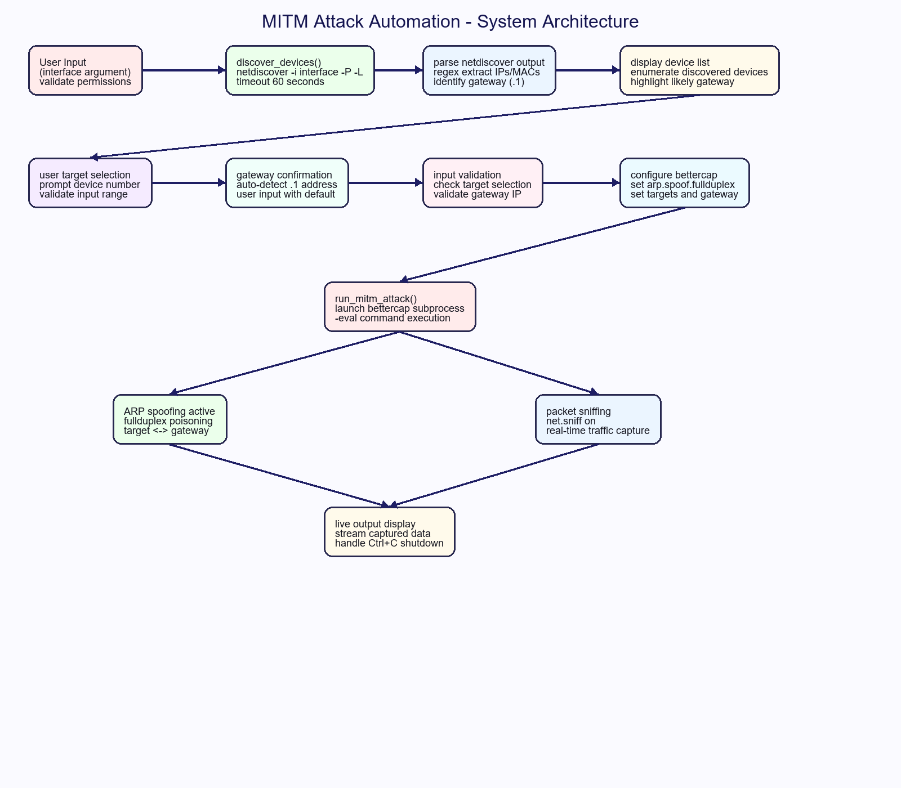
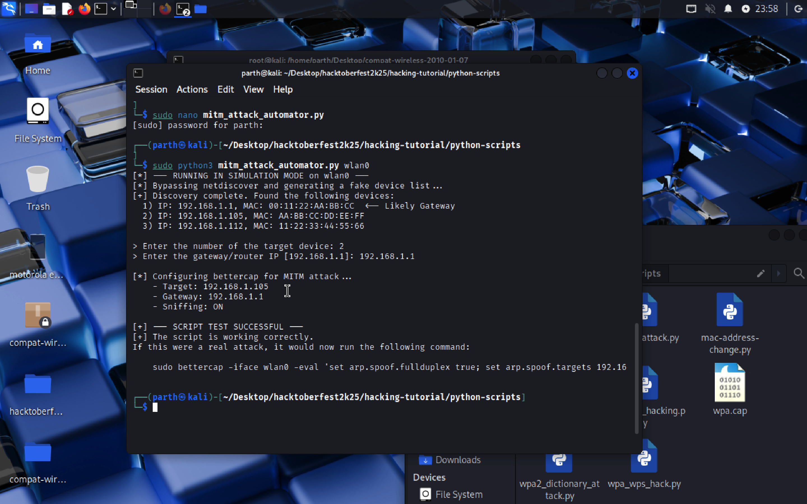

# MITM Attack Automation

A streamlined Python automation tool that combines **netdiscover** network enumeration with **bettercap** man-in-the-middle capabilities for authorized security testing and educational demonstrations.

> **⚠️ Critical Warning:** This tool performs intrusive network operations including ARP spoofing and traffic interception. Use ONLY on networks you own or have explicit written authorization to test.

---

## System Architecture

The diagram illustrates the complete automation workflow from network discovery through active MITM operations.



### Execution Flow

1. **Input Validation** → Interface argument and permission checks
2. **Network Discovery** → Automated netdiscover enumeration with timeout
3. **Device Processing** → Regex parsing and gateway identification  
4. **User Interface** → Interactive device selection and gateway configuration
5. **Attack Configuration** → Bettercap parameter setup and validation
6. **MITM Execution** → Coordinated ARP spoofing and packet sniffing
7. **Live Monitoring** → Real-time traffic display with graceful shutdown

---

## Live Demonstration

Below is a screenshot from an actual test session showing the complete workflow in action:



The demonstration shows:
- **Automated Discovery**: netdiscover finding 3 devices with gateway identification
- **Interactive Selection**: User-friendly device selection (device #2 chosen)
- **Gateway Auto-detection**: Automatic .1 address recognition with user confirmation
- **Attack Configuration**: Bettercap setup with fullduplex ARP spoofing
- **Command Generation**: `bettercap -iface wlan0 -eval` with constructed parameters

---

## Features

- **Automated Network Discovery**: Uses `netdiscover -P -L` with 60-second timeout
- **Intelligent Gateway Detection**: Auto-identifies .1 addresses as likely gateways
- **Interactive Target Selection**: User-friendly enumerated device selection
- **Input Validation**: Comprehensive error handling and range checking
- **Bettercap Integration**: Seamless integration with professional MITM capabilities
- **Fullduplex ARP Spoofing**: Bidirectional traffic interception
- **Real-time Packet Sniffing**: Live network traffic analysis
- **Graceful Shutdown**: Proper Ctrl+C handling and process cleanup

---

## System Requirements

### Essential Dependencies
- **Linux environment** with network interface access
- **Python 3.x** with standard libraries
- **netdiscover** for network enumeration
- **bettercap** for man-in-the-middle operations  
- **Administrative privileges** (sudo access required)

### Installation Commands

```
# Debian/Ubuntu
sudo apt update
sudo apt install netdiscover python3

# Install bettercap (visit bettercap.org for latest instructions)
# Example for Debian-based systems:
sudo apt install bettercap
```

---

## Usage

### Basic Execution

```
sudo python3 mitm_attack_automator.py <interface>
```

### Example Session

```
# Launch with wireless interface
sudo python3 mitm_attack_automator.py wlan0

# Follow interactive prompts:
# 1. Review discovered devices
# 2. Select target device number
# 3. Confirm/modify gateway IP
# 4. Monitor live MITM operations
```

### Generated Bettercap Command

The script constructs and executes:
```
bettercap -iface wlan0 -eval "set arp.spoof.fullduplex true; set arp.spoof.targets 192.168.1.105; arp.spoof on; net.sniff on;"
```

---

## Technical Implementation

### Network Discovery Module
```
def discover_devices(interface):
    # Uses netdiscover with regex parsing
    # Implements 60-second timeout
    # Auto-detects gateway candidates
```

### Attack Configuration Engine  
```
def run_mitm_attack(interface, target_ip, gateway_ip):
    # Constructs bettercap command strings
    # Manages subprocess execution
    # Handles graceful interruption
```

### Key Technical Features
- **Regex Pattern Matching**: Extracts IPs/MACs from netdiscover output
- **Subprocess Management**: Proper timeout and error handling
- **Permission Validation**: Detects and reports privilege issues
- **Input Sanitization**: Validates device selections and IP addresses

---

## Security Considerations & Detection

### Attack Characteristics
- **ARP Table Poisoning**: Modifies target's ARP cache entries
- **Traffic Redirection**: Routes victim traffic through attacker machine
- **Packet Interception**: Captures and analyzes network communications
- **Gateway Impersonation**: Poses as legitimate network gateway

### Detection Methods
- **ARP Table Monitoring**: `arp -a` shows duplicate/changing entries
- **Network Monitoring**: Tools like `arpwatch` detect ARP anomalies  
- **Switch Features**: Dynamic ARP Inspection (DAI) prevents poisoning
- **Static ARP Entries**: Manual configuration resists spoofing attempts

---

## Legal & Ethical Framework

### Authorized Use Only
- ✅ **Penetration Testing**: With signed contracts and defined scope
- ✅ **Security Training**: In isolated lab environments  
- ✅ **Research & Education**: Academic institutions with proper oversight
- ✅ **Network Administration**: Testing your own infrastructure

### Prohibited Activities
- ❌ **Unauthorized Networks**: Any network without explicit permission
- ❌ **Public WiFi**: Coffee shops, airports, hotels, etc.
- ❌ **Corporate Networks**: Without IT department authorization
- ❌ **Neighbor Networks**: Personal networks belonging to others

### Documentation Requirements
- Maintain written authorization for all testing
- Log all activities with timestamps and scope
- Report findings through proper channels
- Follow applicable local and federal laws

---

## Educational Value

This project demonstrates:

1. **Network Enumeration**: Automated device discovery techniques
2. **ARP Protocol Vulnerabilities**: How ARP lacks authentication
3. **Man-in-the-Middle Mechanics**: Traffic interception methods
4. **Defense Awareness**: Detection and mitigation strategies
5. **Tool Integration**: Combining multiple security tools effectively

Ideal for cybersecurity courses, authorized red team exercises, and network security awareness training.

---

## Troubleshooting

### Common Issues

**"netdiscover not found"**
```
sudo apt install netdiscover
```

**"Permission denied"**
```
# Always run with sudo
sudo python3 mitm_attack_automator.py wlan0
```

**"No devices discovered"**
- Verify interface is up and connected
- Check network has active devices
- Ensure proper network range

**"bettercap not found"**
- Install from official sources
- Verify PATH includes bettercap location

---

## Contributing

Contributions are welcome! Please ensure all contributions:

- Maintain educational focus and ethical guidelines
- Include comprehensive error handling
- Follow security best practices
- Provide clear documentation and examples

---

## License

MIT License - Educational and authorized testing purposes only

---

**Disclaimer**: This tool is designed for educational purposes and authorized security testing only. Users are solely responsible for complying with applicable laws and obtaining proper authorization before use.
```


