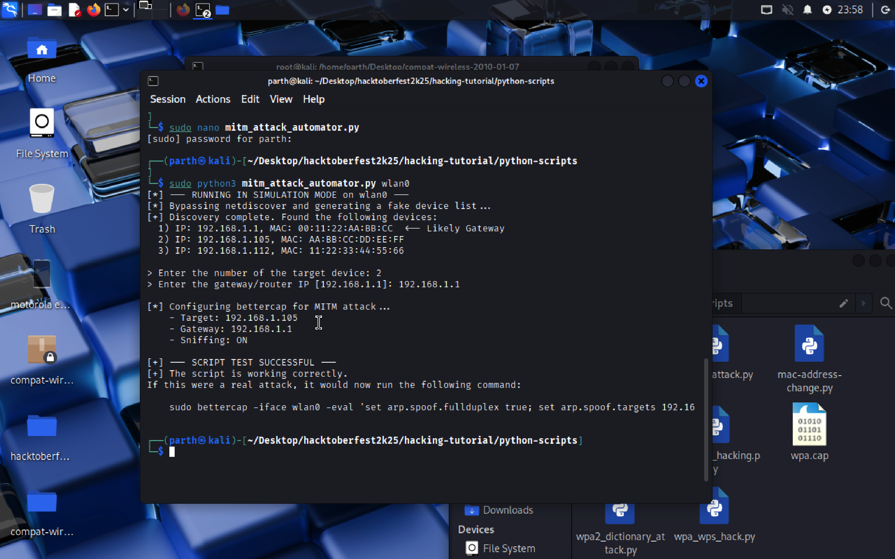

## mitm_attack_automator.py

### Usage Scenario

This script is an automation tool designed to simplify the launch of a **Man-in-the-Middle (MITM)** attack using **ARP Spoofing**, leveraging the powerful external utilities **`netdiscover`** and **`bettercap`**.

* **What problem does it solve?** It automates the cumbersome initial steps of a classic MITM attack: **device discovery** and the precise **configuration** of the attack tool (`bettercap`). It eliminates the need for manual IP scans and complex multi-line command constructions, making the attack setup seamless and faster. This is vital for security testing where time is critical.
* **Who would benefit from using it?** **Beginners** in network security gain a structured, step-by-step workflow to execute an ARP Spoofing attack, ensuring proper input validation. **Penetration Testers** benefit from a rapid deployment mechanism to quickly set up a sniffing session on a target network during an authorized audit.

---

### What the Script Does

The Python script acts as a **guided sequencer** that prepares and launches an ARP Spoofing attack using external tools. Its goal is to handle discovery and configuration before initiating the sniffing phase.

The execution flow is:

1.  **Input:** It requires the **network interface name** (e.g., `eth0` or `wlan0`) as a mandatory command-line argument.
2.  **Discovery (`netdiscover`):** It runs `netdiscover` on the specified interface to scan the local network, extract all active **IP and MAC addresses**, and attempts to guess the **Gateway IP** (router).
3.  **Selection (User Interaction):** It presents the discovered list to the user and asks for the **Target IP** (client device) via a numerical choice. It also prompts the user to confirm or enter the correct **Gateway IP**.
4.  **Attack Launch (`bettercap`):** It constructs a series of `bettercap` commands to enable **full-duplex ARP spoofing** (spoofing both the target and the gateway) and activate **network sniffing**. It then executes `bettercap` with these commands.
5.  **Output/Side Effects:** The script prints status updates, discovered devices, and error messages (e.g., permission denied). The main effect is the **execution of the external `bettercap` tool**, which takes over the terminal and begins the active MITM attack, printing captured data until manually stopped by the user (`Ctrl+C`).

---

### Code Explanation

#### Imported Libraries

| Library | Purpose |
| :--- | :--- |
| `subprocess` | **Crucial.** Used to execute and manage external system commands, specifically running `netdiscover` (with piping/timeout) and `bettercap` (with argument passing). |
| `sys` | Used for handling **command-line arguments** (`sys.argv`) and controlling the script's exit flow (`sys.exit`) in case of errors (e.g., missing interface, permissions). |
| `time` | Imported but **not used** in the final logic (a commented line was present). |
| `re` | Used for **Regular Expressions** to effectively parse the raw text output from the `netdiscover` utility and extract structured data (IP and MAC addresses). |

#### Main Functions

| Function | Parameters | Returns | Purpose |
| :--- | :--- | :--- | :--- |
| `discover_devices` | `interface` (str) | `(devices, gateway_ip)` (tuple) | Executes `netdiscover` with a 60s timeout, handles permission/installation errors, uses regex to parse IPs and MACs, and attempts to identify the router's IP address. |
| `run_mitm_attack` | `interface` (str), `target_ip` (str), `gateway_ip` (str) | None | Constructs the `bettercap` evaluation string (`arp.spoof.fullduplex true; set arp.spoof.targets <target>; arp.spoof on; net.sniff on;`) and executes the `bettercap` process, which blocks the script until the user stops it. |

#### Execution Logic

The script's primary control flow is managed within the `if __name__ == "__main__":` block.

1.  **Initial Validation:** It checks if at least one command-line argument (the interface name) is provided. If not, it displays the `Usage` and exits.
2.  **Step 1: Discovery:** The `discover_devices()` function is called. The script waits up to 60 seconds for network scan results. If no devices or permissions errors occur, the script exits early.
3.  **Step 2: Input Collection:** The user is prompted to select a **Target Device** by number. The script validates the input and uses the discovered IP. The user is then asked to confirm the **Gateway IP** (the guessed value is presented as a default).
4.  **Step 3: Attack Execution:** With all three necessary parameters (`interface`, `client_ip`, `router_ip`) validated, the `run_mitm_attack()` function is called, which immediately launches the configured `bettercap` command.
5.  **Attack Phase:** The script remains blocked while `bettercap` is running. It handles the `KeyboardInterrupt` (`Ctrl+C`) when the user decides to stop the attack.
          
---

### Screenshots



---

### Sequence Diagram

```mermaid
sequenceDiagram
    participant User
    participant Script as Python Script
    participant OS as Operating System
    participant Netdiscover
    participant Bettercap

    User->>Script: Execute Script with interface (e.g., `sudo python3 script.py eth0`)
    Script->>Script: Checks for interface argument
    Script->>Script: Calls `discover_devices(interface)`
    Script->>OS: Execute `netdiscover -i <interface> -P -L` (with timeout)
    OS->>Netdiscover: Start network scan
    Netdiscover-->>OS: Raw IP/MAC data
    OS-->>Script: Return stdout/stderr
    Script->>Script: Parse data (Regex) & Guess Gateway
    Script->>User: Display discovered devices list
    User->>Script: Select target number & provide/confirm Gateway IP
    Script->>Script: Validate inputs
    Script->>Script: Calls `run_mitm_attack(interface, target_ip, gateway_ip)`
    Script->>OS: Execute: `bettercap -iface <interface> -eval "..."`
    OS->>Bettercap: Start ARP Spoofing and Network Sniffing
    Bettercap-->>OS: Continuous Sniffing Output
    OS-->>Script: bettercap output to console
    Script->>User: Display bettercap output
    User->>Bettercap: Manual Termination (Ctrl+C)
    Bettercap-->>OS: Process Exit
    OS->>Script: Return from subprocess.run()
    Script->>User: Display "[+] Attack stopped by user. Exiting."
    Script->>OS: Exit