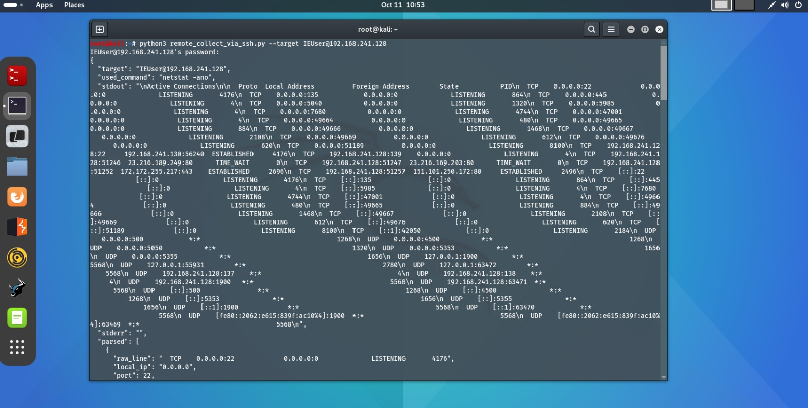
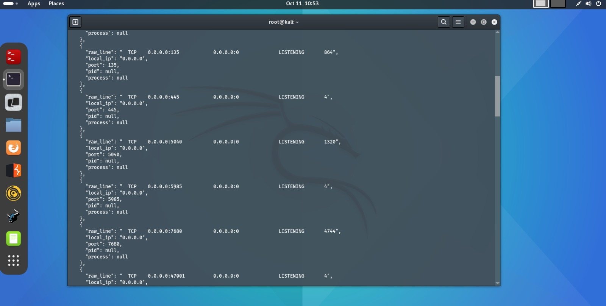
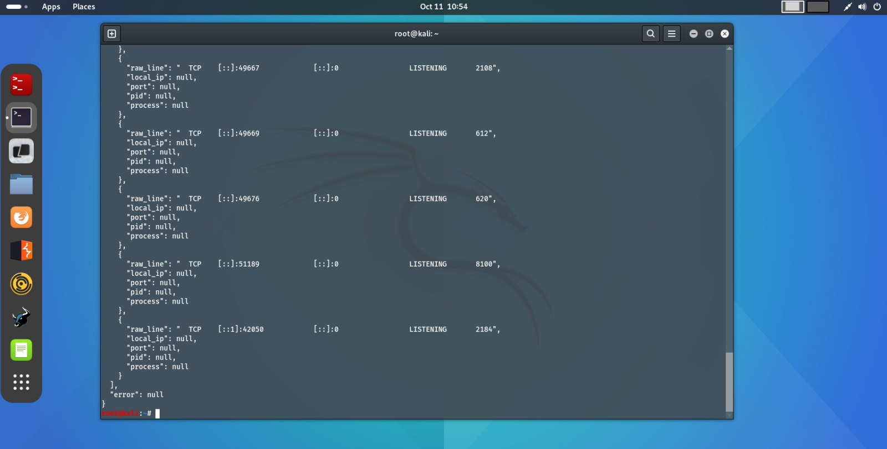

## remote_collect_via_ssh.py

### Usage Scenario

This script is a crucial component in the **network reconnaissance** phase of an assessment, providing **authoritative, host-internal data** about exposed services. It is designed to complement external network scanning by verifying and enriching the information gathered.

---

**What problem does it solve?**

* **Incomplete Process Attribution:** While external scans (e.g., Nmap) can find open ports, they cannot definitively identify the **PID (Process ID)** and **program name** listening on that port. This script executes commands *inside* the target host via **SSH** to retrieve this exact information directly from the operating system's kernel, providing a **ground truth** of running services.
* **Service Verification:** It confirms that the service inferred by external observation is indeed what is running, a critical step for tailored vulnerability research.

**Who would benefit from using it?**

* **Ethical Hacking Teams (Red Teams):** To rapidly and precisely map internal attack surfaces after gaining initial access to a machine.
* **Security Engineers (Blue Teams):** For auditing internal machines, ensuring that only expected and authorized processes are running and listening on the network.
* **Students and Learners:** To understand the difference between external (network) and internal (host-based) service enumeration techniques.

---

### What the Script Does

The `remote_collect_via_ssh.py` script securely connects to a remote Linux/Unix host using the local system's **`ssh` client**, executes a command to list all listening **TCP sockets** and their associated processes, and outputs the collected data in a **structured JSON format**.

The execution flow is:

1.  **Input:** It requires the **SSH target** (`user@host` or `host`) and an optional connection **timeout** (default: 20 seconds).
2.  **Process:**
    * It first attempts to run the modern command: **`ss -tlnp`** on the remote host.
    * If `ss` fails (e.g., command not found or permission error), it **falls back** to running: **`netstat -tulpen`**.
    * The raw output from the successful command is then processed by a **heuristic parser** using Regular Expressions (`re`) to extract the local IP, port, PID, and process name for each listening socket.
3.  **Output/Side Effects:** The script's primary output is a single, structured **JSON object** printed to standard output. This JSON includes the full raw outputs (`stdout`, `stderr`), the command used, and a clean list of dictionaries (`parsed`) detailing each listening service. The only side effect is the execution of a system command on the remote host via SSH.

---

### Code Explanation

#### Imported Libraries

| Library | Purpose |
| :--- | :--- |
| `argparse` | Used to handle the **command-line interface (CLI)**, specifically for parsing the required `--target` host and the optional `--timeout` argument. |
| `subprocess` | **Core functionality.** Executes the external `ssh` command and captures the output streams (`stdout`, `stderr`) and the exit status code. |
| `json` | Used to serialize the final Python dictionary of results into a standardized **JSON string** for output. |
| `re` | **Essential for parsing.** Provides the Regular Expression engine used to match and extract meaningful fields (like IP:Port and PID/Process) from the raw, inconsistent textual outputs of `ss` and `netstat`. |
| `sys` | Manages the **script exit behavior**, allowing the script to return different exit codes based on success or failure, and for printing critical errors to `stderr`. |
| `shutil.which` | Used in the `main` function for a **pre-flight check** to confirm that the `ssh` client binary exists on the local execution system. |

#### Main Functions

| Function | Parameters | Returns | Purpose |
| :--- | :--- | :--- | :--- |
| `run_ssh_command` | `target` (str), `cmd` (str), `timeout` (int=20) | `Dict[str, str]` | Executes the `ssh target cmd` command via `subprocess.run()`. It ensures safety by building the command as a list. It returns the raw `stdout`, `stderr`, and `returncode`. |
| `parse_ss_output` | `stdout` (str) | `List[Dict]` | Parses the raw output from `ss -tlnp`. It iterates through lines, skips headers, and uses regexes (`ADDR_PORT_RE`, `PID_PROC_RE`) to extract service details into structured dictionaries. |
| `parse_netstat_output` | `stdout` (str) | `List[Dict]` | Parses the fallback output from `netstat -tulpen`. It uses a similar heuristic approach to structure the data, accounting for the slightly different output format of `netstat`. |
| `collect_listening_via_ssh` | `target` (str) | `Dict` | **The Orchestrator.** It attempts the `ss` command. If it fails, it retries with the `netstat` command. It calls the appropriate parser and constructs the final, comprehensive results dictionary, including any failure messages. |
| `main` | `argv` (Optional[List[str]]=None) | `int` (Exit code) | The entry point. It handles argument parsing, performs the local `ssh` existence check, calls the orchestrator function, prints the final JSON output, and determines the system exit code. |

#### Execution Logic

The script initiates execution through the `main()` function, called by the `if __name__ == "__main__":` block.

1.  **Preparation:** `main()` ensures the `ssh` utility is available locally using `shutil.which()`. If not found, it exits immediately with an error code of `2`.
2.  **Collection:** It calls the central function, **`collect_listening_via_ssh(args.target)`**.
3.  **Command Flow:** This orchestrator first executes `ss -tlnp` remotely via `run_ssh_command`.
    * If successful, it immediately calls `parse_ss_output` to process the results.
    * If `ss` returns an error or no output, it executes the fallback command `netstat -tulpen`.
    * If `netstat` is successful, it calls `parse_netstat_output`.
    * If both fail, it packages the error messages from both attempts into the final result dictionary.
4.  **Output:** The structured result dictionary is returned to `main()`.
5.  **Serialization:** `main()` uses `json.dumps(..., indent=2)` to print the final data structure in a human-readable JSON format to the user's console.
6.  **Exit:** The script exits with status **0** if the remote collection succeeded (no overall error), or **1** if the remote command/collection process failed.
              
---

### Screenshots







---

### Sequence Diagram

```mermaid
sequenceDiagram
    participant User
    participant LocalScript as Python Script (remote_collect_via_ssh.py)
    participant LocalOS as Local OS Shell (ssh client)
    participant RemoteHost as Remote Host OS (ss/netstat)

    User->>LocalScript: Execute with --target user@host
    LocalScript->>LocalScript: 1. Parse Args & Check Local 'ssh' (shutil.which)
    LocalScript->>LocalScript: 2. Call collect_listening_via_ssh(target)

    LocalScript->>LocalOS: 3. Run: subprocess.run(["ssh", target, "ss -tlnp"])
    LocalOS->>RemoteHost: 4. SSH Connection & Execute 'ss -tlnp'
    RemoteHost-->>LocalOS: 5. STDOUT/STDERR/RC from 'ss'
    LocalOS-->>LocalScript: 6. Return raw results (run_ssh_command)

    alt SS Fails (RC!=0 or Empty Output)
        LocalScript->>LocalScript: 7. Fallback: Prepare NETSTAT_CMD
        LocalScript->>LocalOS: 8. Run: subprocess.run(["ssh", target, "netstat -tulpen"])
        LocalOS->>RemoteHost: 9. SSH Connection & Execute 'netstat -tulpen'
        RemoteHost-->>LocalOS: 10. STDOUT/STDERR/RC from 'netstat'
        LocalOS-->>LocalScript: 11. Return raw results (run_ssh_command)

        alt Netstat Succeeds
            LocalScript->>LocalScript: 12. Call parse_netstat_output(stdout)
        else Both Fail
            LocalScript->>LocalScript: 12. Record failure message in 'error' field
        end
    else SS Succeeds
        LocalScript->>LocalScript: 7. Call parse_ss_output(stdout)
    end

    LocalScript->>LocalScript: 13. Aggregate full result (JSON Dict)
    LocalScript-->>User: 14. Print final result (JSON to stdout)
    LocalScript->>LocalOS: 15. Exit (Code 0 or 1)