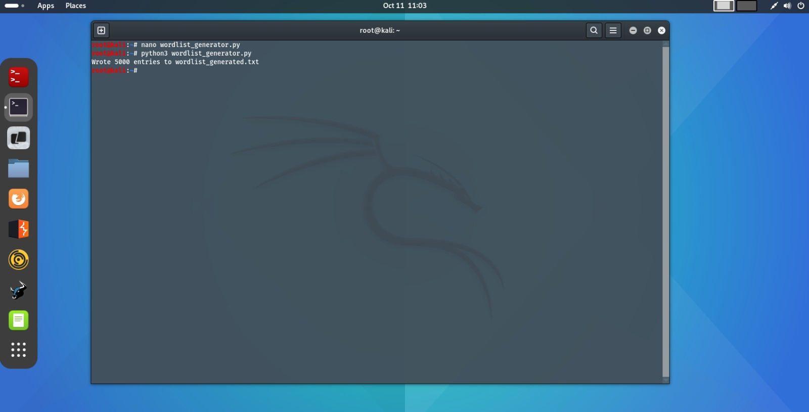

## wordlist_generator.py

### Usage Scenario

This script is designed to quickly generate small, focused **wordlists** for controlled, **local Ethical Hacking lab environments**. It addresses the common need in penetration testing training and local security auditing to have a list of likely passwords for cracking attempts against non-production targets (e.g., intentionally weak login pages, hash cracking practice).

* **What problem does it solves?** It solves the problem of needing a small, customized, yet diverse dictionary of potential passwords based on a set of known or assumed base words. It automatically applies common **mangling techniques** (leet-speak, case variations, year/digit suffixes) that mimic predictable human password patterns, saving the user time from manually generating these variants.
* **Who would benefit from using it?**
    * **Beginner Ethical Hackers/Penetration Testers** learning about brute-forcing and dictionary attacks in a safe, contained environment.
    * **Security Trainers** who need to quickly set up a target system with simple, crackable passwords for educational purposes.
    * **Developers/System Administrators** performing internal, local security checks against test environments.

---

### What the Script Does

The `wordlist_generator.py` script is a dedicated utility for creating a **customized wordlist file** by systematically mutating a list of base words.

At a high level, the script takes a list of **base words** (either from a file or a built-in default list) and applies several common password transformations:
1.  **Leet-speak Substitution:** Replacing common letters (like 'a', 'e', 's') with visually similar numbers or symbols (e.g., 'p4ssw0rd').
2.  **Case Variation:** Generating lowercase, uppercase, and capitalized versions.
3.  **Suffix/Prefix Mangling:** Appending and prepending a customizable range of years and short numerical digits.

The script then de-duplicates all generated candidates and writes the final, sorted list to an output file, respecting a user-defined maximum number of entries (`--limit`) to prevent the creation of excessively large files.

| Input (Inputs) | Output (Outputs) / Side Effects |
| :--- | :--- |
| Base words (from a file specified by `--bases` or built-in defaults). | A **new text file** (default: `wordlist_generated.txt`) containing the generated wordlist, with one potential password per line. |
| Configuration arguments (`--out`, `--bases`, `--years`, `--max-suffix`, `--limit`). | A **summary message** printed to the console indicating the number of entries written and the output file path. |

---

### Code Explanation

#### Imported Libraries

| Library | Purpose |
| :--- | :--- |
| `argparse` | **Essential** for defining and processing command-line arguments, allowing the user to configure the generation process (output file, limits, suffixes). |
| `itertools` | **Crucial** for the `leet_variants` function. It uses `itertools.product` to efficiently generate the **Cartesian product** of all possible leet-speak character substitutions. |
| `os` | Used within `main()` to check for the **existence of the base words file** (`os.path.exists`) provided via the `--bases` argument. |
| `sys` | Used for standard system operations, specifically calling `sys.exit(main())` to ensure the script terminates with the correct exit code. |
| `from __future__ import annotations` | Used to enable advanced **type hinting** features, improving code readability and static analysis. |

#### Main Functions

| Function | Parameters | Returns | Purpose |
| :--- | :--- | :--- | :--- |
| `leet_variants` | `word` (str), `max_variants` (int) | `list[str]` | Generates leet-speak permutations of the input `word` based on `LEET_MAP`. It includes a `max_variants` safety cap (default 50/100) to prevent combinatorial explosion. |
| `case_variants` | `word` (str) | `list[str]` | Generates the common case variations: lowercase, uppercase, and capitalized. |
| `generate` | `word` (str), `years` (`list[str]`), `max_suffix` (int) | `list[str]` | The **core mangling logic**. It applies leet-speak and case variations, and then combines these variants with years and simple numeric suffixes (as both prefix and suffix). |
| `write_wordlist` | `path` (str), `words` (`list[str]`) | `None` | Writes the final list of words to the specified file path, printing a summary to the console upon completion. |
| `parse_years` | `arg` (str) | `list[str]` | Utility function to interpret the `--years` argument, supporting single years, comma-separated lists, and a range (e.g., `'2018-2025'`). |

#### Execution Logic

The script's execution begins within the `if __name__ == "__main__":` block, which calls the main control function, `main()`.

1.  **Argument Parsing:** `main()` initializes `argparse` to process all configuration options provided by the user (e.g., `--out`, `--bases`, `--limit`).
2.  **Base Word Loading:** The script attempts to load base words from the file specified by `--bases`. If the file is not found, it falls back to the hardcoded `DEFAULT_BASES` list.
3.  **Suffix Preparation:** The `--years` argument is processed by `parse_years()` to produce a usable list of year strings.
4.  **Generation Loop:** The script iterates through every base word. For each base word, it calls the **`generate()`** function.
5.  **Variant Generation (`generate` flow):**
    * Adds base word variants (`leet_variants` and `case_variants`) to a temporary set (`results`).
    * Creates a small, bounded list of numerical and year suffixes (`small_suffixes`).
    * Iterates through the variants in `results` and the items in `small_suffixes`, generating both **`base+suffix`** and **`suffix+base`** combinations.
    * Returns a sorted list of all generated candidates for that base word.
6.  **Finalization:** All generated variants from all base words are combined into a single list (`words`).
7.  **De-duplication and Limiting:** The final list is de-duplicated using `list(dict.fromkeys(words))` to preserve order, and then truncated using array slicing (`[: args.limit]`) to enforce the user's size limit (default 5000).
8.  **Output:** The final, limited list is written to the output file using `write_wordlist()`, and the script exits.
                  
---

### Screenshots




---

### Sequence Diagram

```mermaid
sequenceDiagram
    participant User
    participant OS as Operating System
    participant Script as wordlist_generator.py
    participant ArgParse as argparse
    participant FS as File System
    participant Gener as generate()
    participant Leet as leet_variants()

    User->>OS: Execute: python wordlist_generator.py --out mylist.txt --bases bases.txt
    OS->>Script: Start execution (main())
    Script->>ArgParse: parse_args() (Reads CLI arguments)
    ArgParse-->>Script: args (out, bases, years, limit, max_suffix)

    Script->>Script: parse_years(args.years) (e.g. '2018-2025' -> ['2018', '2019', ...])

    alt Base file provided and exists
        Script->>FS: Check and Read args.bases (bases.txt)
        FS-->>Script: List of base words
    else No base file or not found
        Script->>Script: Use DEFAULT_BASES
    end

    loop For each base word 'b' in bases
        Script->>Gener: generate(b, years, max_suffix)
        Gener->>Leet: leet_variants(b)
        Leet-->>Gener: Leet variants
        Gener->>Gener: Create Case Variants (Upper, Capital) for all variants

        Gener->>Gener: Combine with Suffixes (Years and Digits) as Base+Suffix & Suffix+Base
        Gener-->>Script: List of mangled variants
        Script->>Script: words.extend(mangled_variants)
    end

    Script->>Script: De-duplicate list and apply args.limit (5000)
    Script->>FS: write_wordlist(args.out, final_list)
    FS-->>Script: File successfully written
    Script->>User: Wrote X entries to mylist.txt
    Script->>OS: Exit with code 0 (Success)