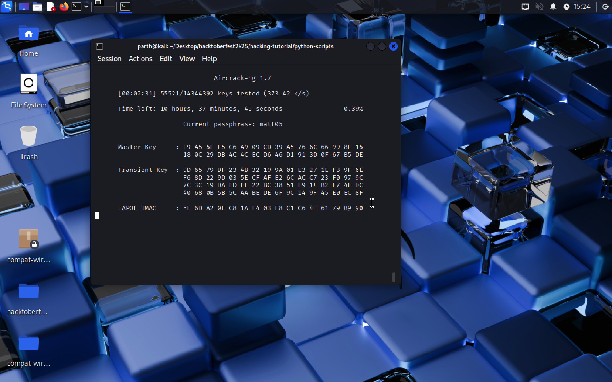

## wpa2_dictionary_attack.py

### Usage Scenario

This script is an **automation tool** designed for **security auditing** and **penetration testing** of WPA/WPA2-protected Wi-Fi networks in authorized environments. It streamlines the complex, multi-step process required for an offline dictionary attack.

| Problem Solved | Beneficiary |
| :--- | :--- |
| **Automates the complete WPA/WPA2 cracking workflow**, from setting the adapter to monitor mode to initiating the dictionary attack, including the optional deauthentication step to speed up handshake capture. | **Ethical Hackers**, **Security Analysts**, and **Cybersecurity Students** who need an efficient and educational tool to test the strength of Wi-Fi passwords and understand the sequence of a WPA/WPA2 attack. |

---

### What the Script Does

The Python script acts as an **orchestrator** for the **Aircrack-ng suite** utilities (`airmon-ng`, `airodump-ng`, `aireplay-ng`, `aircrack-ng`). It manages the entire process of capturing a WPA/WPA2 4-way handshake and attempting to crack the password.

1.  **Inputs:** It requires the **wireless interface name**, **target BSSID** (AP MAC), **target channel**, and the **path to a wordlist** file. An optional **client MAC address** is required for the deauthentication step.
2.  **Process:**
    * It sets the network interface to **monitor mode**.
    * It starts **packet capture** (`airodump-ng`) in a **separate thread** to search for the WPA handshake.
    * It allows the user to optionally execute a **deauthentication attack** (`aireplay-ng`) in the main thread to force a handshake capture.
    * The main thread pauses, waiting for the user to confirm the handshake capture is complete.
    * Once stopped, it initiates the **dictionary attack** (`aircrack-ng`) against the captured `.cap` file using the provided wordlist.
3.  **Output/Side Effects:**
    * **Modifies the wireless interface mode** (to monitor mode).
    * Creates the packet capture file named **`wpa_handshake_capture-01.cap`** in the execution directory.
    * Prints the results of the cracking attempt, showing the discovered password if successful.

---

### Code Explanation

#### Imported Libraries

| Library | Purpose |
| :--- | :--- |
| **`subprocess`** | **Essential.** Used to execute all external system commands and Aircrack-ng utilities (e.g., `airodump-ng`, `aircrack-ng`). This is the bridge between Python and the command-line hacking tools. |
| **`os`** | Used to interact with the operating system, specifically to check for the **existence of files** (`os.path.exists`) like the captured handshake file and the user's wordlist. |
| **`time`** | Used to introduce short **pauses** (`time.sleep(5)`) to ensure external processes, like `airodump-ng`, have adequate time to start up before proceeding. |
| **`threading`** | **Crucial.** Used to run the time-consuming `capture_handshake` function in a **separate, non-blocking thread**. This allows the main script to continue, prompting the user for deauthentication or waiting for the "stop" signal while the capture runs concurrently. |

#### Main Functions

| Function | Parameters | Returns | Purpose |
| :--- | :--- | :--- | :--- |
| `setup_monitor_mode` | `interface` (str) | None | Takes the interface down, kills potentially conflicting processes (`airmon-ng check kill`), and sets the interface mode to **monitor** using `iwconfig` and `ifconfig`. |
| `capture_handshake` | `interface`, `bssid`, `channel`, `stop_event` (threading.Event) | str (path to .cap file) | Starts `airodump-ng` as a subprocess to capture the WPA handshake. It runs in the background thread, stopping the capture when the main thread signals the `stop_event`. |
| `deauth_client` | `interface`, `bssid`, `client_mac` | None | Executes the `aireplay-ng` command to send a limited number of deauthentication packets (10) to a client to force a quick re-association, triggering the handshake. |
| `crack_password` | `cap_file`, `wordlist` | None | Executes the core **`aircrack-ng`** command, passing the captured handshake file and the wordlist to perform the dictionary attack. |

#### Execution Logic

The script's primary control flow is managed within the `if __name__ == "__main__":` block.

1.  **Initialization and Input:** The script first gathers the necessary inputs (`interface`, `bssid`, `channel`) from the user.
2.  **Preparation:** `setup_monitor_mode` is called to prepare the wireless adapter for capturing.
3.  **Concurrent Capture:**
    * A **`threading.Event`** (`stop_event`) is created as a signal mechanism.
    * A new **`threading.Thread`** (`capture_thread`) is initialized and started, running `capture_handshake` in the background.
4.  **Optional Acceleration:** After a brief pause, the user is prompted for the deauthentication attack. If confirmed, `deauth_client` is executed using the provided client MAC.
5.  **Synchronization Point:** The script waits for the user to press **Enter**. This is the critical moment where the user confirms the WPA handshake has appeared in the `airodump-ng` terminal output.
6.  **Stop Capture:** The user's input triggers **`stop_event.set()`**, signaling the background thread to stop the `airodump-ng` process. The main thread then calls **`capture_thread.join()`**, blocking until the capture thread has gracefully terminated.
7.  **Cracking:** The script verifies the existence of the captured file (`wpa_handshake_capture-01.cap`). If found, it prompts for the wordlist path and calls `crack_password` to initiate the final attack phase.
                      
---

### Screenshots



---

### Sequence Diagram

```mermaid
sequenceDiagram
    participant User
    participant MainScript as Python Main Thread
    participant CapThread as Capture Thread
    participant OS as OS / Aircrack-ng Tools

    User->>MainScript: Execute Script
    MainScript->>User: Request Interface, BSSID, Channel
    User->>MainScript: Provide Inputs
    
    MainScript->>MainScript: setup_monitor_mode(interface)
    MainScript->>OS: ifconfig down, airmon-ng check kill, iwconfig monitor
    OS-->>MainScript: Interface Ready
    
    MainScript->>MainScript: stop_event = threading.Event()
    MainScript->>CapThread: Start Thread: capture_handshake(...)
    CapThread->>OS: Run: sudo airodump-ng --bssid ... -w wpa_handshake_capture
    
    Note over CapThread,OS: Capture runs in background, checking for .cap file.
    
    MainScript->>MainScript: time.sleep(5)
    MainScript->>User: Request Deauth (y/n)?
    
    alt User chooses 'y'
        User->>MainScript: Provide Client MAC
        MainScript->>OS: Run: sudo aireplay-ng --deauth 10 ...
    end
    
    MainScript->>User: Press Enter to stop capture (Handshake seen)
    User->>MainScript: Press Enter
    
    MainScript->>MainScript: stop_event.set()
    MainScript->>CapThread: join() (Wait for thread exit)
    CapThread->>OS: Terminate airodump-ng process
    OS-->>CapThread: Process exit
    CapThread-->>MainScript: Thread exit
    
    MainScript->>MainScript: Check wpa_handshake_capture-01.cap
    
    alt Capture File Exists
        MainScript->>User: Request Wordlist Path
        User->>MainScript: Provide Path
        MainScript->>MainScript: crack_password(cap_file, wordlist)
        MainScript->>OS: Run: aircrack-ng cap_file -w wordlist
        OS-->>MainScript: Cracking results displayed
    else Capture File NOT Found
        MainScript->>User: Display Error Message
    end
    
    MainScript->>OS: Exit