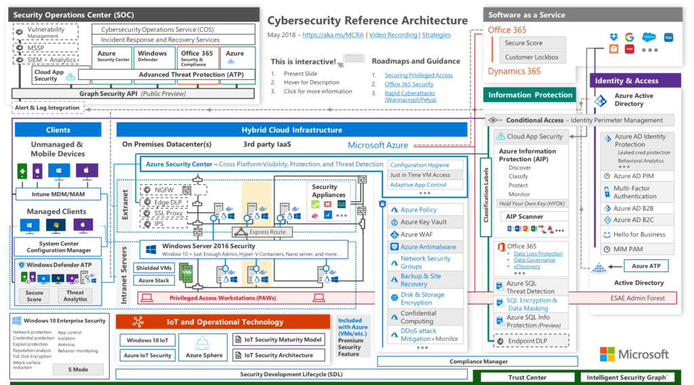
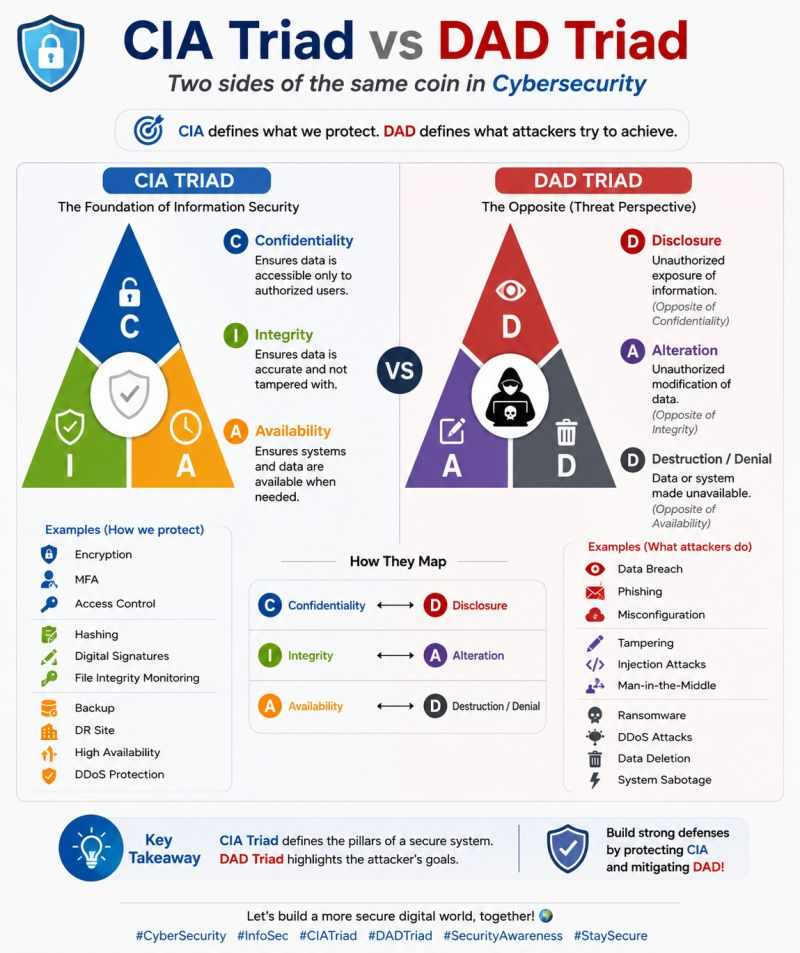

# Introduction to Cybersecurity Architecture

## Table of Contents

- [Introduction to Cybersecurity Architecture](#introduction-to-cybersecurity-architecture)
  - [Table of Contents](#table-of-contents)
  - [What is Triangle of CIA??](#what-is-triangle-of-cia)
  - [What is Anti CIA Triad?](#what-is-anti-cia-triad)
  - [The Problem with Cybersecurity today](#the-problem-with-cybersecurity-today)
    - [Why so??](#why-so)

---

- In this course, we will explore the fundamentals of cybersecurity architecture, its importance in protecting digital assets, and the key components that make up a robust security framework. We will also be doing a case study of a real-world cybersecurity architecture to understand how these concepts are applied in practice.

## What is Triangle of CIA??

- CIA in this context stands for Confidentiality, Integrity, and Availability. These three principles form the foundation of cybersecurity and are often referred to as the "CIA Triad." 

  - **Confidentiality**: Ensures that sensitive information is accessed only by authorized individuals and is protected from unauthorized access. Examples include encryption, biometrics, 2FA, access controls, and authentication mechanisms.
  
  - **Integrity**: Ensures that data remains accurate and unaltered during storage, transmission, and processing. It protects against unauthorized modifications. Example: Hashing and Checksums
  
  - **Availability**: Ensures that information and resources are accessible to authorized users when needed, preventing disruptions in service. Example: Network/Data/Service Accessibility, Redundancy, and Failover Mechanisms

## What is Anti CIA Triad?

  

- The Anti-CIA Triad is also known as `DAD` or `DAD Triad`, which stands for Disclosure, Alteration, and Denial. It represents the opposite of the CIA Triad and highlights the potential threats to cybersecurity.

  - **Disclosure**: Refers to unauthorized access or exposure of sensitive information, leading to breaches of confidentiality. Example: Data Breaches, Phishing Attacks. Example: Trojans, Brute Force Attacks, Social Engineering
  
  - **Alteration**: Involves unauthorized changes or modifications to data, compromising its integrity. Example: Data Tampering, Malware Infections. Example: Malware, Viruses, Worms, Logic Bombs, Backdoors, Rootkits, SQL Injection, Cross-Site Scripting (XSS), Man-in-the-Middle (MITM) Attacks
  
  - **Denial**: Refers to the disruption of access to information or services, affecting availability. Example: Denial-of-Service (DoS) Attacks, Ransomware. Example: Denial-of-Service (DoS) Attacks, Distributed Denial-of-Service (DDoS) Attacks, Ransomware, Botnets

## The Problem with Cybersecurity today

- Security can be deployed both tactically and strategically. Now, you understand what that means is basically where you apply security with a strategy in your mind. But, when we talk about deploying security tactically, we talk about applying very specific security solutions and tools to solve a very specific security issue.

- Strategically, is more like a laid back approach, where you see the bigger picture and you come up with a plan to counter these security issues.

- Tactically is when we are laser focused on one specific issue. But, it is important to note that the tactical deployments are way inferior compared to strategic deployments. Because, when you deploy security tactically, you are only solving one specific issue, but when you deploy security strategically, you are solving multiple issues at once.

- Now, the problem here is many organisations will deploy solutions tactically without the consideration for compatibility and interoperability with other security solutions. This can lead to a fragmented security architecture, where different tools and systems may not work well together, creating gaps in security coverage.

- For classic example, a company buys one firewall to protect the data or network for one particular department and, than another firewall from another vendor to protect the data and network of another department. Now, when they want to exchange data between these two departments, they will have to go through two different firewalls, which may not be compatible with each other. This can lead to delays, errors, and even security vulnerabilities.

- Cost Effectiveness is another issue. When organisations deploy security solutions tactically, they may end up spending more money on multiple tools and systems that do not work well together. This can lead to increased costs for maintenance, training, and support.

- User Experience is also affected.  Sometimes, companies deploy these security solutions without the User review from the employees by doing testings with certain employees. This can lead to frustration and decreased productivity, as employees may have to navigate multiple security systems and tools that are not user-friendly or intuitive. Or, the IT staff has even been trained to use one security solution, but the other security solution is completely different and they have to learn how to use it. This can lead to confusion and errors, as employees may not know how to properly use the security tools and systems.

- Support for other non-security business requirements is also a problem. When organisations deploy security solutions tactically, they may not consider how these solutions will impact other business requirements, such as compliance, regulatory requirements, or business processes. This can lead to conflicts and challenges in meeting these requirements.

### Why so??

- If they might be aware of these things why they would opt for tactical deployments instead of strategic deployments? The answer is simple:
  
  - Company Culture: Some organisations may have a culture that prioritizes short-term gains over long-term planning. They may focus on immediate security issues without considering the broader implications of their decisions.

  - Security Objectives are not aligned with business objectives: In some cases, security objectives may not be aligned with the overall business objectives of the organisation. This can lead to a lack of coordination and communication between security teams and other departments, resulting in tactical deployments that do not support the broader goals of the organisation.

  - Security is not a priority: In some organisations, security may not be a top priority, and resources may be allocated to other areas of the business. This can lead to a reactive approach to security, where solutions are deployed in response to specific incidents rather than as part of a comprehensive strategy.

  - Neglecting Security requirments to deliver business requirements: In some cases, organisations may neglect security requirements in order to deliver business requirements quickly. This can lead to a lack of consideration for security implications and the deployment of solutions that do not adequately address security risks.

>[!IMPORTANT]
>- Securrity requirements are not defined by Business Requirements. Security is a business enabler, not a business requirement. Security requirements should be defined by business requirements, not the other way around. Security should be a part of the business strategy, not a separate entity that is only considered when there is a security incident.
>  Understand what the business is develop the security requirements based on the business requirements. Security should be a part of the business strategy, not a separate entity that is only considered when there is a security incident.  
>- Not all data is equal. Some data is more sensitive than others, and security measures should be tailored accordingly. For example, financial data may require more stringent security controls than marketing data. By understanding the sensitivity of different types of data, organisations can deploy security solutions that are appropriate for each type of data. For example, you might want to secure data of the HR Department more than the data of the Marketing Department. Because, HR data is more sensitive than Marketing data. So, you might want to deploy more security solutions for HR data than Marketing data. This is where the concept of Data Classification comes into play.   Data Classification is the process of categorizing data based on its sensitivity and importance to the organisation. By classifying data, organisations can apply appropriate security controls and measures to protect it.