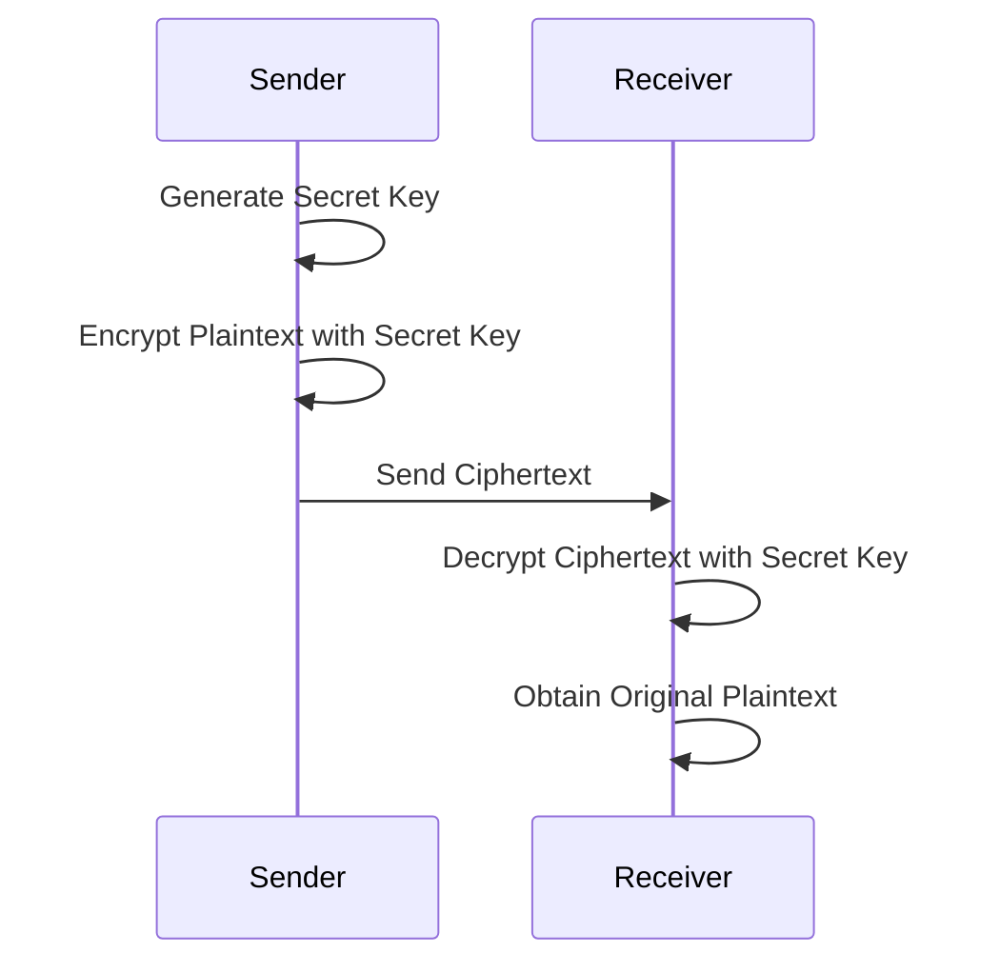
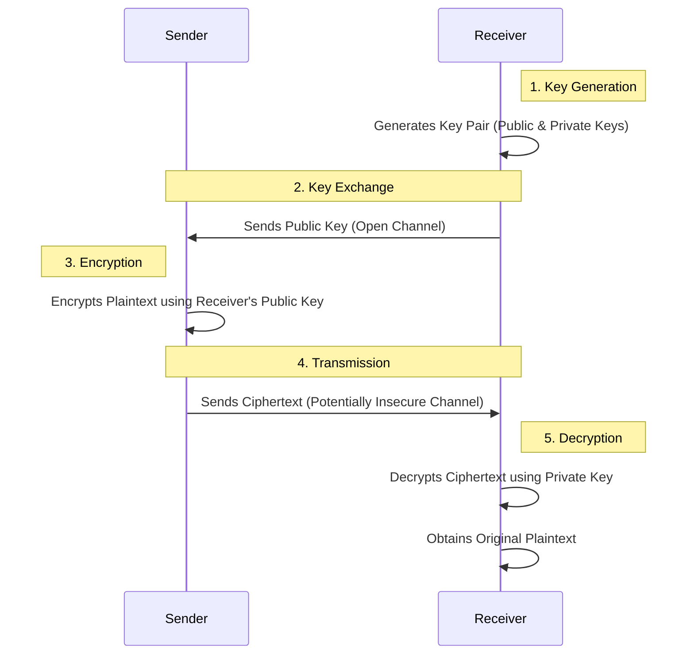
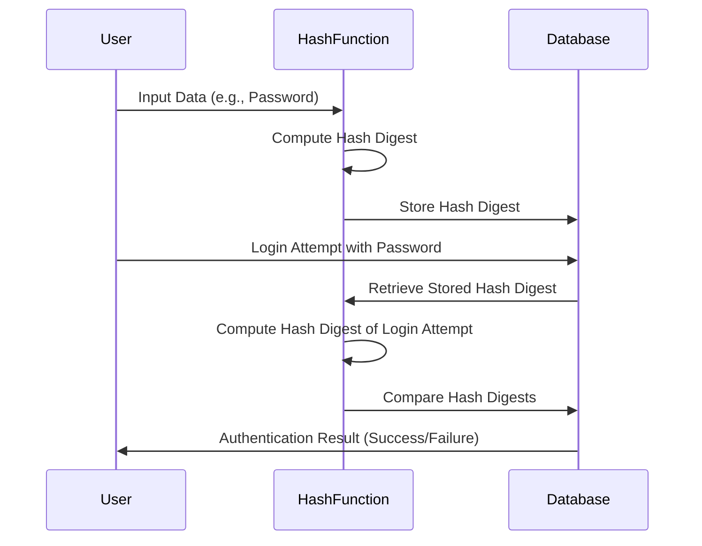
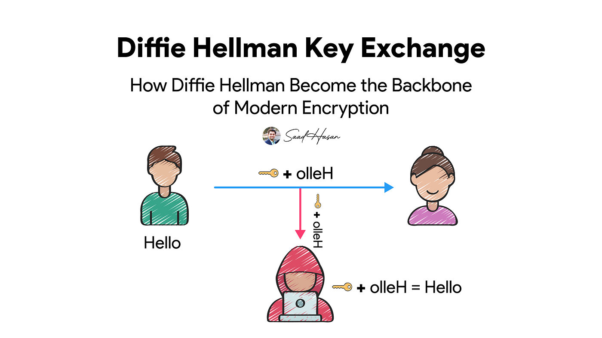
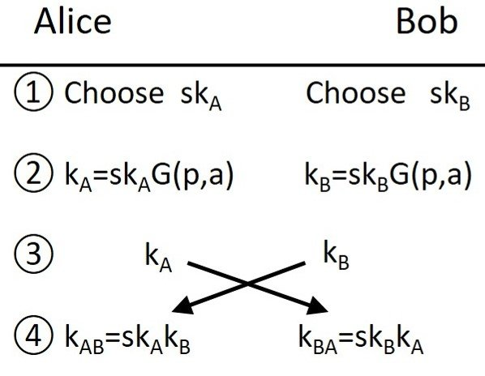

# Encryption Crash Course

- [Encryption Crash Course](#encryption-crash-course)
  - [Symmetric Encryption (AES)](#symmetric-encryption-aes)
  - [Asymmetric Encryption (RSA)](#asymmetric-encryption-rsa)
    - [Advantages of Asymmetric Encryption:](#advantages-of-asymmetric-encryption)
  - [Hash Functions](#hash-functions)
  - [Digital Signatures](#digital-signatures)
  - [SSL(Secure Sockets Layer) \& TLS(Transport Layer Security)](#sslsecure-sockets-layer--tlstransport-layer-security)


>[!NOTE]
>Encryption is the process of converting plaintext into ciphertext to protect sensitive information from unauthorized access. It is a fundamental aspect of cybersecurity and is used to secure data in transit and at rest.

- There are 2 main components of encryption: the encryption algorithm and the encryption key.
  - The algorithm is a mathematical function that takes the plaintext and the key as input and produces the ciphertext as output.
  - The key is a secret value that is used to control the encryption and decryption process.

- The algorithm and the key combination determines how the plain text will be modified or jumbled up, which is a process of substitution and transposition of the characters. If the algorithm and Key are weak encryption will also be weak.

- There are two main types of encryption: symmetric and asymmetric. Symmetric encryption uses the same key for both encryption and decryption, while asymmetric encryption uses a pair of keys (public and private) for encryption and decryption.

<table>
  <tr>
    <th>Symmetric Encryption</th>
    <th>Asymmetric Encryption</th>
  </tr>
  <tr>
    <td>
      - Uses a single key for both encryption and decryption.
      - Faster than asymmetric encryption.
      - Examples: AES, DES, RC4.
    </td>
    <td>
      - Uses a pair of keys (public and private) for encryption and decryption.
      - Slower than symmetric encryption.
      - Examples: RSA, ECC, DSA.
    </td>
  </tr>
  <tr>
    <td>
      - Key distribution can be a challenge since the same key must be shared securely between parties.
      - Suitable for encrypting large amounts of data.
    </td>
    <td>
      - Key distribution is easier since the public key can be shared openly, while the private key remains secure.
      - Often used for encrypting small amounts of data, such as digital signatures and key exchange.
    </td>
  </tr>
  <tr>
    <td>
      - Commonly used for encrypting files, databases, and communication channels.
    </td>
    <td>
      - Commonly used for secure communication, digital signatures, and key exchange.
    </td>
  </tr>
  <tr>
    <td>
      - Examples of symmetric encryption algorithms include AES (Advanced Encryption Standard), DES (Data Encryption Standard), and RC4.
    </td>
    <td>
      - Examples of asymmetric encryption algorithms include RSA (Rivest-Shamir-Adleman), ECC (Elliptic Curve Cryptography), and DSA (Digital Signature Algorithm).
    </td>
  </tr>
  <tr>
    <td>
      - Symmetric encryption is generally faster than asymmetric encryption, making it suitable for encrypting large amounts of data.
    </td>
    <td>
      - Asymmetric encryption is generally slower than symmetric encryption, making it more suitable for encrypting small amounts of data, such as digital signatures and key exchange.
    </td>
  </tr>
</table>


## Symmetric Encryption (AES)

- Symmetric encryption is a type of encryption where the same key is used for both encryption and decryption. This means that both the sender and the receiver must have access to the same key in order to communicate securely.



Symmetric encryption involves the following steps:

1. **Key Generation**: A secret key is generated. This key must be kept confidential between the communicating parties.
2. **Encryption**: The sender uses the secret key and an encryption algorithm (such as AES or DES) to convert the plaintext into ciphertext.
3. **Transmission**: The ciphertext is sent to the receiver over the communication channel.
4. **Decryption**: The receiver, who also possesses the same secret key, uses it with the decryption algorithm to convert the ciphertext back into the original plaintext.

> **Note:** The security of symmetric encryption relies entirely on keeping the key secret. If the key is intercepted or leaked, the encrypted data can be easily decrypted.

- Example of Symmetric Encryption:

  - We open 2 teerminals one is the sender terminal, and the other is the receiver terminal. We will use AES encryption for this example.
  - The sender terminal will ask us for a essage we want to send. The sender terminal will generate the secret, and the use the encryption algorithm to encrypt the message and send it to the receiver terminal.
  - The receiver terminal will ask us for the secret key, and then it will use the decryption algorithm to decrypt the message and display it.

  - Here's the `SHELL` code for the sender terminal:

    ```bash
    #!/bin/sh
    echo "Enter the message you want to send:"
    read -r message
    # Generate a random secret key
    secret_key=$(openssl rand -hex 16)
    # Encrypt the message using AES encryption
    ciphertext=$(echo "$message" | openssl enc -aes-256-cbc -a -salt -pass pass:"$secret_key")
    # Save the secret key and ciphertext to files to simulate sending
    echo "$secret_key" > secret.key
    echo "Secret key generated and saved to secret.key: $secret_key"
    echo "$ciphertext" > message.enc
    echo "Ciphertext generated and saved to message.enc: $ciphertext"
    echo "Message encrypted and sent."
    ```

  - Here's the `SHELL` code for the receiver terminal:

    ```bash
    #!/bin/sh
    echo "Waiting for message (timeout 5 minutes)..."
    timeout=300
    elapsed=0

    while [ $elapsed -lt $timeout ]; do
        if [ -f "secret.key" ] && [ -f "message.enc" ]; then
            # Read the secret key and ciphertext from files
            secret_key=$(cat secret.key)
            echo "Secret Key: $secret_key"
            ciphertext=$(cat message.enc)
            echo "Ciphertext: $ciphertext"
            # Decrypt the message using AES decryption
            plaintext=$(echo "$ciphertext" | openssl enc -aes-256-cbc -a -d -salt -pass pass:"$secret_key")
            echo "Decrypted Message: $plaintext"
            # Clean up the temporary files
            rm secret.key message.enc
            exit 0
        fi
        sleep 1
        elapsed=$((elapsed + 1))
    done

    echo "Timeout reached. No message received."
    ```

- Here's what it looks like when we run the sender terminal:

  
  
  dsd

- Some of the mainly used symmetric encryption algorithms include:
  - AES (Advanced Encryption Standard): A widely used encryption algorithm that is considered secure and efficient. It supports key sizes of 128, 192, and 256 bits.
  - DES (Data Encryption Standard): An older encryption algorithm that is now considered weak due to its short key length (56 bits). It has been largely replaced by AES.
  - RC4: A stream cipher that was widely used in the past but is now considered insecure due to vulnerabilities discovered in its design.
  - Triple DES (3DES): An enhancement of DES that applies the DES algorithm three times cgbto increase secdsadasdsadurity. It is still considered secure but is slower than AES and is being phased out in favor of AES.
  - Blowfish: A symmetric encryption algorithm that is designed to be fast and secure. It supports key sizes of up to 448 bits and is often used in applications where speed is a concern.
  - RC5: A symmetric encryption algorithm that is designed to be simple and efficient. It supports variable block sizes and key sizes, making it flexible for different applications.
  - RC6: An improvement over RC5, designed to be more secure and efficient. It supports block sizes of 128 bits and key sizes of up to 256 bits.

- Some of the latest implementations of Symmetric Encryption in real-world applications include:
  - AES-GCM (Galois/Counter Mode): A mode of AES that provides both confidentiality and integrity. It is widely used in secure communication protocols such as TLS (Transport Layer Security) and is considered one of the most secure modes of operation for AES.
  - AES-CCM (Counter with CBC-MAC): Another mode of AES that provides both confidentiality and integrity. It is commonly used in wireless communication protocols such as IEEE 802.15.4 and is also considered secure.
  - ChaCha20-Poly1305: A modern symmetric encryption algorithm that combines the ChaCha20 stream cipher with the Poly1305 message authentication code. It is designed to be fast and secure, and is used in applications such as TLS 1.3 and Google's QUIC protocol.

## Asymmetric Encryption (RSA)

>[!NOTE]
>Asymmetric encryption, also known as public-key cryptography, is a type of encryption that uses a pair of keys: a public key for encryption and a private key for decryption. This allows for secure communication without the need for the sender and receiver to share a secret key beforehand.



- Asymmetric encryption uses 2 keys: a public key and a private key. The public key is used for encryption, while the private key is used for decryption. The sender encrypts the plaintext using the receiver's public key, and the receiver decrypts the ciphertext using their private key.

- Asymmetric encryption involves the following steps:

  - Key Generation: The receiver generates a pair of keys, a public key and a private key. The public key can be shared openly, while the private key must be kept secret.
  - Key Exchange: The receiver sends the public key to the sender over an open channel.
  - Encryption: The sender uses the receiver's public key to encrypt the plaintext message.
  - Transmission: The sender sends the ciphertext to the receiver over a potentially insecure channel.
  - Decryption: The receiver uses their private key to decrypt the ciphertext and obtain the original plaintext message.

>[!IMPORTANT] 
>**Note:** The security of asymmetric encryption relies on the difficulty of certain mathematical problems, such as factoring large integers (in the case of RSA) or solving the discrete logarithm problem (in the case of ECC). As long as these problems remain computationally infeasible to solve, asymmetric encryption can provide strong security.

- Some of the mainly used asymmetric encryption algorithms include:
  - RSA (Rivest-Shamir-Adleman): One of the most widely used asymmetric encryption algorithms. It is based on the difficulty of factoring large integers and is commonly used for secure communication, digital signatures, and key exchange.
  - ECC (Elliptic Curve Cryptography): An asymmetric encryption algorithm that uses elliptic curves to provide strong security with smaller key sizes compared to RSA. It is often used in mobile devices and other resource-constrained environments.
  - DSA (Digital Signature Algorithm): An asymmetric encryption algorithm specifically designed for digital signatures. It is based on the discrete logarithm problem and is commonly used for signing documents and verifying the authenticity of messages.
  - DH (Diffie-Hellman): An asymmetric encryption algorithm used for secure key exchange. It allows two parties to establish a shared secret key over an insecure channel without the need for a pre-shared key.

>[!IMPORTANT]
>
> - If you encrypt with the public key, you can only decrypt with the private key. This means confidentiality is what matters the most. This is called Open Message Confidentiality (OMC). It is used to ensure that only the intended recipient can read the message. If the sender encrypts the message with the receiver's public key, only the receiver can decrypt it with their private key, thus ensuring confidentiality.
> - If you encrypt with the private key, you can only decrypt with the public key. This means authentication is what matters the most. This is called Open Message Authentication (OMA). It is used to verify the authenticity of the sender. If the sender encrypts the message with their private key, anyone can decrypt it with the sender's public key, but only the sender could have encrypted it in the first place, thus verifying their identity.

- Why Emails don't use Asymmetric Encryption?

  - Asymmetric encryption is computationally intensive and slower than symmetric encryption. Encrypting large email messages with asymmetric encryption would result in significant performance issues.
  - Instead, emails typically use PGP (Pretty Good Privacy) or S/MIME (Secure/Multipurpose Internet Mail Extensions), which combine asymmetric encryption for key exchange and symmetric encryption for the actual message content. This allows for secure email communication while maintaining performance.

### Advantages of Asymmetric Encryption:

- Better Key Distribution: Asymmetric encryption allows for easier key distribution since the public key can be shared openly, while the private key remains secure. This eliminates the need for secure channels to exchange keys, which is a major challenge in symmetric encryption.
- Scalability: Asymmetric encryption is more scalable than symmetric encryption, as it does not require the sender and receiver to share a secret key beforehand. This makes it suitable for large-scale applications such as secure communication over the internet.
- Authentication and nonrepudiation: Asymmetric encryption can provide authentication and nonrepudiation, as the sender can sign the message with their private key, and the receiver can verify the signature with the sender's public key. This ensures that the message has not been tampered with and that the sender cannot deny sending the message.
- Slower than Symmetric Encryption: Asymmetric encryption is generally slower than symmetric encryption due to the mathematical complexity of the algorithms involved. This makes it less suitable for encrypting large amounts of data, but it is often used for encrypting small amounts of data, such as digital signatures and key exchange.
- Mathematically Complex: Asymmetric encryption relies on complex mathematical problems, such as factoring large integers or solving the discrete logarithm problem. This makes it more secure against brute-force attacks, but it also means that it requires more computational resources compared to symmetric encryption.

## Hash Functions

>[!NOTE]
>A hash function is a mathematical function that takes an input (or "message") and produces a fixed-size string of bytes, typically a digest that is unique to the input. Hash functions are commonly used in cryptography for various purposes, including data integrity verification, password hashing, and digital signatures.

- Hash functions have several important properties:
  - Deterministic: The same input will always produce the same output.
  - Fast to compute: Hash functions should be efficient to compute for any given input.
  - Pre-image resistance: It should be computationally infeasible to reverse-engineer the original input from its hash output.
  - Collision resistance: It should be computationally infeasible to find two different inputs that produce the same hash output.



- Let's see this with an example:

  - We will create a simple password hashing system using the SHA-256 hash function. The user will input a password, which will be hashed and stored in a database (simulated with a file). When the user attempts to log in, they will input their password again, and the system will hash it and compare it to the stored hash to verify their identity.

  - Here's the `SHELL` code for the password hashing system:

    ```bash
    #!/bin/sh
    echo "Enter your password:"
    read -r password
    # Hash the password using SHA-256
    hashed_password=$(echo -n "$password" | openssl dgst -sha256)
    # Store the hashed password in a file (simulating a database)
    echo "$hashed_password" > password.hash
    echo "Password hashed and stored."

    echo "Login attempt. Enter your password:"
    read -r login_password
    # Hash the login attempt password
    hashed_login_password=$(echo -n "$login_password" | openssl dgst -sha256)
    # Retrieve the stored hashed password
    stored_hashed_password=$(cat password.hash)

    if [ "$hashed_login_password" = "$stored_hashed_password" ]; then
        echo "Authentication successful!"
    else
        echo "Authentication failed!"
    fi
    ```

- This is how it works:
  - The user is prompted to enter a password, which is then hashed using the SHA-256 algorithm and stored in a file called `password.hash`.
  - When the user attempts to log in, they are prompted to enter their password again. The system hashes this input and compares it to the stored hash.
  - If the hashes match, authentication is successful; otherwise, it fails.

  

- There are many hash functions available, each with its own characteristics and use cases. Some of the most commonly used hash functions include:
  - MD5 (Message Digest Algorithm 5): An older hash function that produces a 128-bit hash value. It is now considered weak due to vulnerabilities that allow for collision attacks.
  - SHA-1 (Secure Hash Algorithm 1): A hash function that produces a 160-bit hash value. It is also considered weak due to vulnerabilities that allow for collision attacks.
  - SHA-256 (Secure Hash Algorithm 256): A widely used hash function that produces a 256-bit hash value. It is currently considered secure and is commonly used in various applications, including password hashing and digital signatures.
  - SHA-3 (Secure Hash Algorithm 3): The latest member of the SHA family, designed to provide improved security and performance. It supports variable output sizes and is based on the Keccak algorithm.
  - HAVAL: A hash function that allows for variable output sizes (128, 160, 192, 224, or 256 bits) and is designed to be fast and secure.

- Crypto systems today use SHA-256 or abovw for hashing, and MD5 and SHA-1 are considered weak and should be avoided for secure applications.

- Hash functions are used for various purposes in cryptography, including:
  - Data integrity verification: Hash functions can be used to verify that data has not been tampered with. By comparing the hash of the original data with the hash of the received data, you can determine if the data has been altered.
  - Password hashing: Hash functions are commonly used to securely store passwords. Instead of storing the plaintext password, systems store the hash of the password. When a user attempts to log in, their input is hashed and compared to the stored hash for authentication.
  - Digital signatures: Hash functions are used in digital signature algorithms to create a unique representation of a message. The sender hashes the message and then encrypts the hash with their private key to create a digital signature. The receiver can verify the signature by decrypting it with the sender's public key and comparing it to their own hash of the message.

- Let's take an example where we downloaded a ISO file from the internet, and we want to verify its integrity. We can use a hash function to compute the hash of the downloaded file and compare it to the hash provided by the source. If the hashes match, we can be confident that the file has not been tampered with during the download process.

## Digital Signatures


>[!IMPORTANT]
>Digital signatures are a cryptographic mechanism used to verify the authenticity and integrity of digital messages or documents. They provide a way to ensure that a message has not been altered and that it was indeed sent by the claimed sender.

- The Digital Signatures are created when the sender generates a hash of the message and then encrypts that hash with their private key. The resulting encrypted hash is the digital signature, which is sent along with the original message.

- The hash of the message is created using a hash function, which produces a fixed-size output that is unique to the input message. This hash serves as a fingerprint of the message, allowing the receiver to verify that the message has not been altered.

- Let's try to understand this through an example. We have a sender shell script that generates a digital signature for a message and a receiver shell script that verifies the digital signature.

- Here's the `SHELL` code for the sender terminal:

  ```bash
  #!/bin/sh
  echo "Enter the message you want to sign:"
  read -r message
  # Generate a hash of the message
  message_hash=$(echo -n "$message" | openssl dgst -sha256)
  # Generate Private and Public Key Pair (if not already generated)
  if [ ! -f sender_private.key ]; then
      openssl genpkey -algorithm RSA -out sender_private.key -pkeyopt rsa_keygen_bits:2048
      openssl rsa -pubout -in sender_private.key -out sender_public.key
  fi
  # Encrypt the hash with the senders private key to create the digital signature
  digital_signature=$(echo -n "$message_hash" | openssl rsautl -sign -inkey sender_private.key)
  # Save the message and digital signature to files to simulate sending
  echo "$message" > message.txt
  echo "$digital_signature" > signature.bin
  echo "Message signed and sent."
  ```

- Here's the `SHELL` code for the receiver terminal:

  ```bash
  #!/bin/sh
  echo "Waiting for message and signature (timeout 5 minutes)..."
  timeout=300
  elapsed=0
  echo "Verifying public key exists..."
  while [ $elapsed -lt $timeout ]; do
      if [ -f "sender_public.key" ] && [ -f "message.txt" ] && [ -f "signature.bin" ]; then
          # Read the message and digital signature from files
          message=$(cat message.txt)
          digital_signature=$(cat signature.bin)
          # Generate a hash of the received message
          message_hash=$(echo -n "$message" | openssl dgst -sha256)
          # Decrypt the digital signature using the sender's public key to retrieve the original hash
          decrypted_hash=$(echo -n "$digital_signature" | openssl rsautl -verify -inkey sender_public.key -pubin)
          # Compare the decrypted hash with the hash of the received message
          if [ "$decrypted_hash" = "$message_hash" ]; then
              echo "Digital signature is valid. Message is authentic and has not been altered."
          else
              echo "Digital signature is invalid. Message may have been tampered with or sender's identity cannot be verified."
          fi
          echo "Received Message: $message"
          # Clean up the temporary files
          rm sender_public.key message.txt signature.bin
          exit 0
      fi
      sleep 1
      elapsed=$((elapsed + 1))
  done  
  echo "Timeout reached. No message received."
  ```
- Both of the terminals were running simultaneously, and the sender terminal was used to input a message, which was then hashed and signed with the sender's private key. The receiver terminal waited for the message and signature, then verified the signature using the sender's public key and compared the hash of the received message with the decrypted hash from the signature to confirm authenticity.

  
  

## SSL(Secure Sockets Layer) & TLS(Transport Layer Security)

>[!IMPORTANT]
>SSL stands for Secure Sockets Layer, and TLS stands for Transport Layer Security. Both SSL and TLS are cryptographic protocols designed to provide secure communication over a computer network. TLS is the successor to SSL and is more secure and efficient than its predecessor.

- `TLS v1.3` is the latest version of the TLS protocol, which was finalized in 2018. It offers improved security and performance compared to previous versions of TLS and SSL. TLS v1.3 removes support for older, less secure cryptographic algorithms and introduces new features to enhance security and reduce latency.

- TLS is the most important protocol for securing communication on the internet. It not only encrypts the data but also ensures data integrity and authentication. TLS is an End to End encryption protocol, which means that the data is encrypted from the sender to the receiver, and only the intended recipient can decrypt it. This makes it an essential component of secure communication on the internet, especially for sensitive transactions such as online banking, e-commerce, and secure email communication.

- TLS supports functionality of Confedentiality, privacy, authentication & integrity. 
  - The connection is private because a symmetric algorithm such as AES is used to encrpt the data transmitted. 
  - The keys for this symmetric encryption are uniquely generated for each connection or session based on the needs of the application, based on a secret negotiated at the start of the connection. 
  - The server and client negotiate the details of which encryption algorithm, and cryptographic keys to use before even a single byte of data is transmitted.
  - The negotiation of a shared secret cannot be read by eavsdroppers, even by an attacker who places himself in the middle of the connection.
  - The connection is also reliable in that no attacker can modify the communication during the negotiation without being detected. The identity of the communicating parties can be authenticated using publuc key cryptography, certificates and digital signatures.
  - This authentication can be made optional, but is generally required for at least one of the parties usually the server.
  - The connection is reliable because each message transmitted includes a message integrity check. Using a Message Authentication Code (MAC), to prevent undected loss or alteration of the data during transmission. If any message is modified, the connection is immediately terminated.

- TLS supports many different methods for exchanging keys, encrypting data and authenticating message integrity. As, a result secure configuration of TLS requires many configurable parameters, and not all choices provide the security services of privacy authentication and integrity.

>[!NOTE]
> The best Authentication & Key Exchanging Algorithm to use are ECDHE (Elliptic Curve Diffie-Hellman Ephemeral) for key exchange and ECDSA (Elliptic Curve Digital Signature Algorithm) for authentication. These algorithms provide strong security while also being efficient in terms of performance. ECDHE allows for perfect forward secrecy, which means that even if the server's private key is compromised in the future, past communications remain secure. ECDSA provides a secure method for verifying the identity of the communicating parties without the need for a trusted third party.



>[!WARNING]
> But the problem is you don't always get the choice. A server will support only certain authentication * key exchange algorithms only.

- The reason thatt the ones mentioned are the preffered options is because of the fact that they use Diffie-Hellman key exchange, which can ensure property of privacy called Perfect Forward Secrecy (PFS). This means that even if the server's private key is compromised in the future, past communications remain secure because the session keys used for encryption are not derived from the server's private key. This provides an additional layer of security and protects against future attacks on the server's private key. Additionally, ECDHE and ECDSA are based on elliptic curve cryptography, which offers strong security with smaller key sizes compared to traditional algorithms like RSA, making them more efficient and suitable for modern applications.



- Now, this property ensures that your session keys are not compromised even if the server's private key is compromised in the future. This is because the session keys are generated using a key exchange algorithm that does not rely on the server's private key, such as Diffie-Hellman. 

- As a result, even if an attacker gains access to the server's private key, they would not be able to decrypt past communications that were encrypted with session keys generated through a secure key exchange process. This provides an additional layer of security and helps protect against future attacks on the server's private key.

- Even if compromise of a single session key will not affect any data other than that exchange in that specific session protected by that particular key. PFS represents a big step forward in protecting data on the transport layer. 