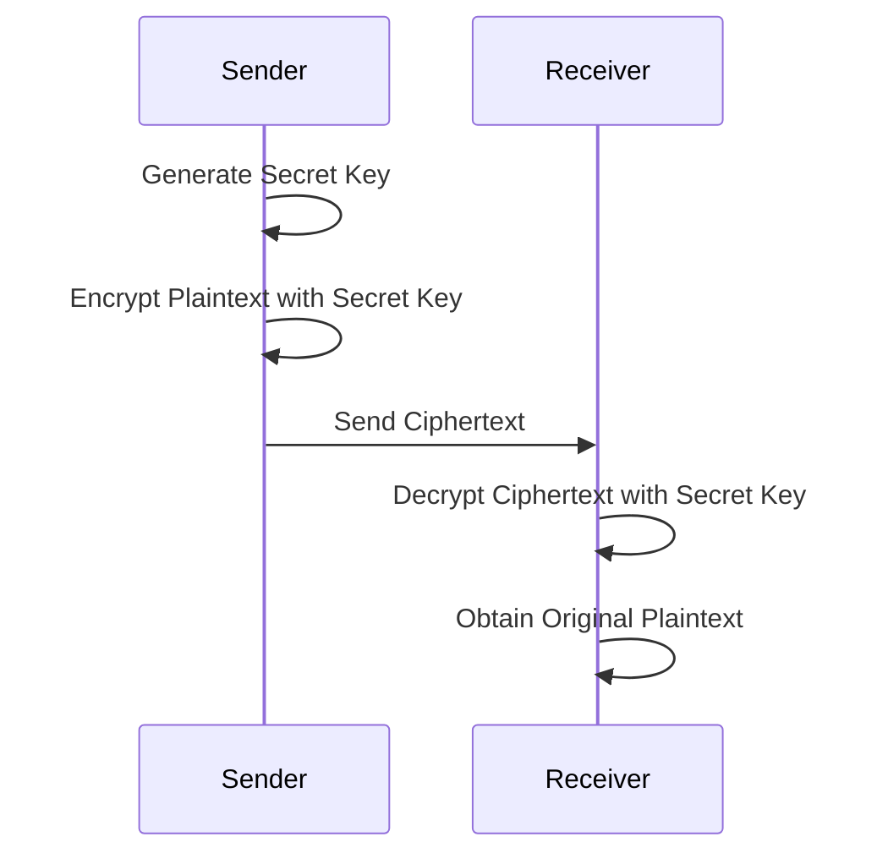

# Encryption Crash Course

- [Encryption Crash Course](#encryption-crash-course)
  - [Symmetric Encryption (AES)](#symmetric-encryption-aes)
  - [Asymmetric Encryption (RSA)](#asymmetric-encryption-rsa)


[!NOTE]
> - Encryption is the process of converting plaintext into ciphertext to protect sensitive information from unauthorized access. It is a fundamental aspect of cybersecurity and is used to secure data in transit and at rest.

- There are 2 main components of encryption: the encryption algorithm and the encryption key. 
  - The algorithm is a mathematical function that takes the plaintext and the key as input and produces the ciphertext as output. 
  - The key is a secret value that is used to control the encryption and decryption process.

- The algorithm and the key combination determines how the plain text will be modified or jumbled up, which is a process of substitution and transposition of the characters. If the algorithm and Key are weak encryption will also be weak.

- There are two main types of encryption: symmetric and asymmetric. Symmetric encryption uses the same key for both encryption and decryption, while asymmetric encryption uses a pair of keys (public and private) for encryption and decryption.

<table>
  <tr>
    <th>Symmetric Encryption</th>
    <th>Asymmetric Encryption</th>
  </tr>
  <tr>
    <td>
      - Uses a single key for both encryption and decryption.
      - Faster than asymmetric encryption.
      - Examples: AES, DES, RC4.
    </td>
    <td>
      - Uses a pair of keys (public and private) for encryption and decryption.
      - Slower than symmetric encryption.
      - Examples: RSA, ECC, DSA.
    </td>
  </tr>
  <tr>
    <td>
      - Key distribution can be a challenge since the same key must be shared securely between parties.
      - Suitable for encrypting large amounts of data.
    </td>
    <td>
      - Key distribution is easier since the public key can be shared openly, while the private key remains secure.
      - Often used for encrypting small amounts of data, such as digital signatures and key exchange.
    </td>
  </tr>
  <tr>
    <td>
      - Commonly used for encrypting files, databases, and communication channels.
    </td>
    <td>
      - Commonly used for secure communication, digital signatures, and key exchange.
    </td>
  </tr>
  <tr>
    <td>
      - Examples of symmetric encryption algorithms include AES (Advanced Encryption Standard), DES (Data Encryption Standard), and RC4.
    </td>
    <td>
      - Examples of asymmetric encryption algorithms include RSA (Rivest-Shamir-Adleman), ECC (Elliptic Curve Cryptography), and DSA (Digital Signature Algorithm).
    </td>
  </tr>
  <tr>
    <td>
      - Symmetric encryption is generally faster than asymmetric encryption, making it suitable for encrypting large amounts of data.
    </td>
    <td>
      - Asymmetric encryption is generally slower than symmetric encryption, making it more suitable for encrypting small amounts of data, such as digital signatures and key exchange.
    </td>
  </tr>
</table>

## Symmetric Encryption (AES)

- Symmetric encryption is a type of encryption where the same key is used for both encryption and decryption. This means that both the sender and the receiver must have access to the same key in order to communicate securely.



Symmetric encryption involves the following steps:

1. **Key Generation**: A secret key is generated. This key must be kept confidential between the communicating parties.
2. **Encryption**: The sender uses the secret key and an encryption algorithm (such as AES or DES) to convert the plaintext into ciphertext.
3. **Transmission**: The ciphertext is sent to the receiver over the communication channel.
4. **Decryption**: The receiver, who also possesses the same secret key, uses it with the decryption algorithm to convert the ciphertext back into the original plaintext.

> **Note:** The security of symmetric encryption relies entirely on keeping the key secret. If the key is intercepted or leaked, the encrypted data can be easily decrypted.

- Example of Symmetric Encryption:

  - We open 2 teerminals one is the sender terminal, and the other is the receiver terminal. We will use AES encryption for this example.
  -  The sender terminal will ask us for a essage we want to send. The sender terminal will generate the secret, and the use the encryption algorithm to encrypt the message and send it to the receiver terminal. 
  -  The receiver terminal will ask us for the secret key, and then it will use the decryption algorithm to decrypt the message and display it.

  - Here's the `SHELL` code for the sender terminal:

    ```bash
    #!/bin/sh
    echo "Enter the message you want to send:"
    read -r message
    # Generate a random secret key
    secret_key=$(openssl rand -hex 16)
    # Encrypt the message using AES encryption
    ciphertext=$(echo "$message" | openssl enc -aes-256-cbc -a -salt -pass pass:"$secret_key")
    # Save the secret key and ciphertext to files to simulate sending
    echo "$secret_key" > secret.key
    echo "Secret key generated and saved to secret.key: $secret_key"
    echo "$ciphertext" > message.enc
    echo "Ciphertext generated and saved to message.enc: $ciphertext"
    echo "Message encrypted and sent."
    ```

  - Here's the `SHELL` code for the receiver terminal:

    ```bash
    #!/bin/sh
    echo "Waiting for message (timeout 5 minutes)..."
    timeout=300
    elapsed=0

    while [ $elapsed -lt $timeout ]; do
        if [ -f "secret.key" ] && [ -f "message.enc" ]; then
            # Read the secret key and ciphertext from files
            secret_key=$(cat secret.key)
            echo "Secret Key: $secret_key"
            ciphertext=$(cat message.enc)
            echo "Ciphertext: $ciphertext"
            # Decrypt the message using AES decryption
            plaintext=$(echo "$ciphertext" | openssl enc -aes-256-cbc -a -d -salt -pass pass:"$secret_key")
            echo "Decrypted Message: $plaintext"
            # Clean up the temporary files
            rm secret.key message.enc
            exit 0
        fi
        sleep 1
        elapsed=$((elapsed + 1))
    done

    echo "Timeout reached. No message received."
    ```

- Here's what it looks like when we run the sender terminal:

  
  
  

- Some of the mainly used symmetric encryption algorithms include:
  - AES (Advanced Encryption Standard): A widely used encryption algorithm that is considered secure and efficient. It supports key sizes of 128, 192, and 256 bits.
  - DES (Data Encryption Standard): An older encryption algorithm that is now considered weak due to its short key length (56 bits). It has been largely replaced by AES.
  - RC4: A stream cipher that was widely used in the past but is now considered insecure due to vulnerabilities discovered in its design.
  - Triple DES (3DES): An enhancement of DES that applies the DES algorithm three times to increase security. It is still considered secure but is slower than AES and is being phased out in favor of AES.
  - Blowfish: A symmetric encryption algorithm that is designed to be fast and secure. It supports key sizes of up to 448 bits and is often used in applications where speed is a concern.
  - RC5: A symmetric encryption algorithm that is designed to be simple and efficient. It supports variable block sizes and key sizes, making it flexible for different applications.
  - RC6: An improvement over RC5, designed to be more secure and efficient. It supports block sizes of 128 bits and key sizes of up to 256 bits.

- Some of the latest implementations of Symmetric Encryption in real-world applications include:
  - AES-GCM (Galois/Counter Mode): A mode of AES that provides both confidentiality and integrity. It is widely used in secure communication protocols such as TLS (Transport Layer Security) and is considered one of the most secure modes of operation for AES.
  - AES-CCM (Counter with CBC-MAC): Another mode of AES that provides both confidentiality and integrity. It is commonly used in wireless communication protocols such as IEEE 802.15.4 and is also considered secure.
  - ChaCha20-Poly1305: A modern symmetric encryption algorithm that combines the ChaCha20 stream cipher with the Poly1305 message authentication code. It is designed to be fast and secure, and is used in applications such as TLS 1.3 and Google's QUIC protocol.

## Asymmetric Encryption (RSA)

