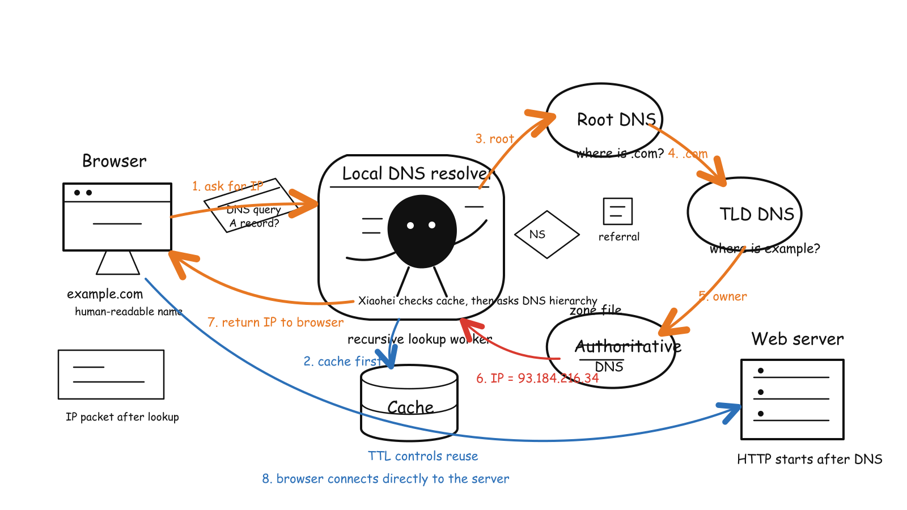

# DNS (Domain Name System)



---

- [DNS (Domain Name System)](#dns-domain-name-system)
  - [How DNS works??](#how-dns-works)
      - [How is resolve.conf and /etc/hosts file related to DNS? And, how they function differently?](#how-is-resolveconf-and-etchosts-file-related-to-dns-and-how-they-function-differently)
  - [4 DNS Servers](#4-dns-servers)
  - [What are types of DNS Queries?](#what-are-types-of-dns-queries)
  - [What is DNS Caching??](#what-is-dns-caching)
  - [What is DNS Cache Poisoning?](#what-is-dns-cache-poisoning)

---

>[!IMPORTANT]
>
> - DNS stands for Domain Name System.
> It is a hierarchical and decentralized naming system for computers, services, or other resources connected to the Internet or a private network.
> It translates human-readable domain names (like <www.example.com>) into IP addresses (like 192.0.2.1).

## How DNS works??

- When you type a domain name into your web browser, the browser sends a request to a DNS resolver, which is typically provided by your Internet Service Provider (ISP). The resolver then queries a series of DNS servers to find the IP address associated with the domain name. Once the IP address is found, it is returned to the browser, which can then connect to the web server hosting the website.

- The process involves several types of DNS servers, including recursive resolvers, root name servers, TLD (Top-Level Domain) name servers, and authoritative name servers. Each server plays a specific role in resolving the domain name to an IP address.

- The User basically makes a request for `example.com` on the browser, the request goes to the `ISP` which is the `DNS Resolver`, then it goes to the `Root Name Server`, then to the `TLD Name Server`, and finally to the `Authoritative Name Server` which has the actual IP address for `example.com`. The IP address is then sent back through the chain to the user, allowing their browser to connect to the website.

- In places like organisations, there are internal DNS servers that resolve internal domain names, so when a request is made for an internal resource, the internal DNS server can resolve it without needing to go out to the public internet.

- When a request for something external is made, the internal DNS server will forward the request to the public DNS servers to resolve the domain name.

- For example, let's understand this with in-depth example with linux. Let's say we have a domain name `example.com` pointing to the `hostname -I | awk '{print $1}'` of the server. Now, when a user makes a request for `example.com`, the request goes to the internal DNS server, which checks its records and finds that it does have an entry for `example.com` in the internal DNS records. The internal DNS server then forwards the request to the internal DNS server, which checks its records and finds that it does have an entry for `example.com` in the internal DNS records. The internal DNS server then forwards the request to the public DNS servers to resolve the domain name. The public DNS servers will then return the IP address associated with `example.com`, which is the `hostname -I | awk '{print $1}'` of the server. This IP address is then sent back through the chain to the user, allowing their browser to connect to the website.

- We can also use the `dig` command to check the DNS records for a domain name. For example, we can use the following command to check the DNS records for `example.com`:

```bash
dig example.com
```

- we can also create a custom DNS server by editing the `/etc/hosts` file on a linux machine. For example, we can add the following entry to the `/etc/hosts` file:

```bash
sudo vi /etc/hosts
# Add the following line to the file
192.0.2.1 example.com
# Save and exit the file
# Now, when a user makes a request for `example.com`, the request will be resolved to the IP address.
```

#### How is resolve.conf and /etc/hosts file related to DNS? And, how they function differently?

- The `/etc/resolv.conf` file is used to configure the DNS resolver on a Linux system. It contains information about the DNS servers that the system should use to resolve domain names. The file typically includes one or more `nameserver` entries, which specify the IP addresses of the DNS servers to be used for name resolution.

- The `/etc/hosts` file, on the other hand, is a local file that maps hostnames to IP addresses. It is used for local name resolution and can be used to override DNS resolution for specific hostnames. When a hostname is requested, the system first checks the `/etc/hosts` file before querying the DNS servers specified in `/etc/resolv.conf`.

- For example:

  ```bash
  # /etc/resolv.conf
  nameserver 8.8.8.8
  ```
  
  ```bash
  # /etc/hosts
  127.0.0.1 localhost
  192.0.2.1 example.com
  ```

- DNS works by translating human-readable domain names into IP addresses, allowing users to access websites and services using easy-to-remember names instead of numerical IP addresses. The `/etc/resolv.conf` file specifies which DNS servers to use for this translation, while the `/etc/hosts` file provides a local mapping of hostnames to IP addresses, allowing for quick resolution without querying external DNS servers.

- In places like organisations, there are internal DNS servers that resolve internal domain names, so when a request is made for an internal resource, the internal DNS server can resolve it without needing to go out to the public internet.

  

  In such a scenario, the internal DNS server will first check its records for the requested domain name. If it finds a match, it will return the corresponding IP address to the user. If it does not find a match, it will forward the request to the public DNS servers to resolve the domain name.

  Mainly, such a Internal DNS Server sits behind a firewall or a VPN, and it is only accessible to users within the organization. This setup helps to improve security and performance by reducing the number of external DNS queries and providing faster resolution for internal resources. <br/>
  
- But, if in case someone has the certificate of the internal DNS server, then they can use it to resolve internal domain names from outside the organization. This could potentially allow an attacker to gain access to internal resources that are not meant to be accessible from the public internet. Therefore, it is important to properly secure internal DNS servers and limit access to authorized users only.

## 4 DNS Servers

- In order to resolve a domain name to an IP address, the DNS system uses a hierarchical structure of servers. There are four main types of DNS servers involved in the resolution process:

  1. **DNS Recursor**: The DNS recursor is the first point of contact for a user's DNS query. It receives the query from the user's device and is responsible for finding the IP address associated with the requested domain name. The recursor may have cached responses from previous queries, which can speed up the resolution process.

  2. **Root Name Server**: The root name server is the highest level of the DNS hierarchy. It does not contain information about specific domain names, but it can direct the recursor to the appropriate Top-Level Domain (TLD) name server based on the domain extension (e.g., .com, .org, .net). It is more of a bookkeeper of the DNS system, maintaining a list of TLD name servers and their corresponding IP addresses.

  3. **TLD Name Server**: The TLD name server is responsible for managing the domain names within a specific top-level domain. It directs the recursor to the authoritative name server for the requested domain. This is the rack of books in the library, where each book represents a specific domain name within the TLD.

  4. **Authoritative Name Server**: The authoritative name server is the final authority for a specific domain. It contains the actual DNS records for the domain, such as A, MX, and CNAME records. When the recursor reaches the authoritative name server, it can obtain the definitive IP address for the requested domain, completing the resolution process.

- All the 4 DNS Server are part of DNS Resolver, which is responsible for resolving domain names to IP addresses. The resolver queries each of these servers in sequence until it obtains the necessary information to complete the resolution process.

## What are types of DNS Queries?

- There are 3 main types of DNS queries:

  1. **Recursive Query**: The DNS recursor resolver does all the work. It asks other DNS servers for you and returns one final answer, based on the availability of the records. If it cannot find the answer, it returns an error message to the user.

  2. **Iterative Query**: The DNS recursor resolver gives the best answer it has. If needed, it tells you which DNS server to ask next, and you continue the lookup.

  3. **Non-Recursive Query**: The DNS recursor resolver answers immediately from its own cache or records, without asking any other DNS server.
  
## What is DNS Caching??

- DNS caching is a mechanism that stores the results of DNS queries for a certain period of time, allowing subsequent requests for the same domain name to be resolved more quickly. When a DNS resolver receives a query, it checks its cache to see if it has a recent response for that domain name. If it does, it returns the cached result instead of querying the DNS servers again.

- Browser DNS caching is a feature that allows web browsers to store the results of DNS queries for a certain period of time. This means that when a user visits a website, the browser can quickly resolve the domain name to an IP address without having to query the DNS servers again. This can improve the performance of web browsing by reducing the time it takes to load websites. The Browser DNS Cache is the first place the browser looks for a cached DNS record before making a new DNS query. If the record is found in the cache and is still valid, the browser can use it to resolve the domain name without having to query the DNS servers again.

- OS DNS caching is a feature that allows the operating system to store the results of DNS queries for a certain period of time. This is the last local stop of the DNS query before it goes out to the internet. When a user makes a DNS query, the operating system checks its cache to see if it has a recent response for that domain name. If it does, it returns the cached result instead of querying the DNS servers again. This can improve the performance of network applications by reducing the time it takes to resolve domain names.

## What is DNS Cache Poisoning?

- DNS cache poisoning, also known as DNS spoofing, is a type of cyber attack that exploits vulnerabilities in the DNS system to redirect users to malicious websites. In this attack, an attacker injects false information into the DNS cache of a resolver or server, causing it to return incorrect IP addresses for domain names. As a result, users attempting to visit legitimate websites may be redirected to fraudulent or malicious sites without their knowledge. It is a great example of MITM (Man-in-the-Middle) attack, where the attacker intercepts and manipulates the communication between the user and the intended website.