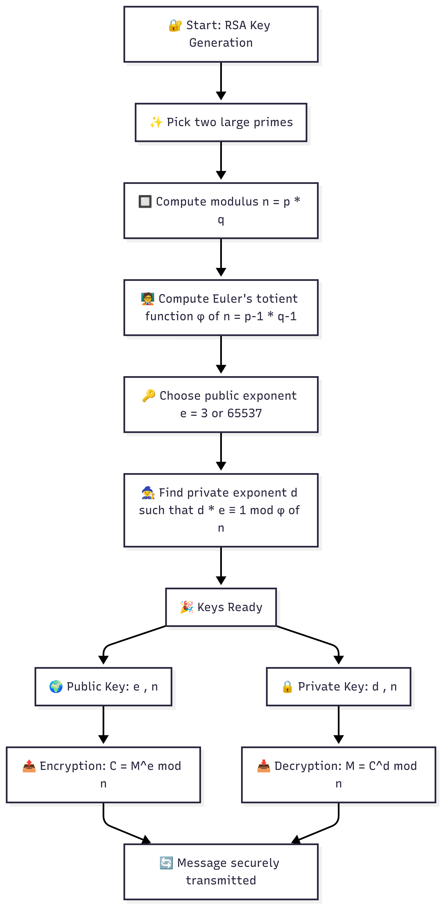

# 🔐 RSA Encryption

## 📌 What is RSA?

RSA (named after its inventors: **Rivest, Shamir, and Adleman**) is one of the most famous **public-key cryptosystems** in the world.  

It is used for:
* 📨 **Encryption:** Send secret messages that only the right person can read.  
* ✍️ **Digital Signatures:** Prove a message really came from you.  
* 🔑 **Key Exchange:** Share keys safely for other ciphers (like AES).  

👉 Unlike **symmetric encryption** (same key for both sides), RSA uses **two keys**:
* **Public key:** (share with the world 🌍). Used to encrypt.  
* **Private key:** (keep locked away 🔒). Used to decrypt.  

---

## 🧮 The Math Behind RSA (Step by Step)

RSA’s strength comes from the fact that it’s **easy to multiply big primes** but **hard to factor them back**. Let’s see how the keys are built:

### Step 1: Pick Two Large Primes ✨
Choose two secret primes:  
\[
p, \ q
\]  
> In the real world, these are HUGE (hundreds of digits long).

---

### Step 2: Build the Modulus 🔲
\[
n = p \times q
\]  
This number \( n \) is part of both the public and private keys.

---

### Step 3: Euler Joins the Party 🧑‍🏫
Compute **Euler’s totient**:
\[
\varphi(n) = (p-1)(q-1)
\]  
This is how many numbers less than \( n \) are “coprime” with it.

---

### Step 4: Pick the Public Exponent 🔑
Choose \( e \), such that:
\[
gcd(e, \varphi(n)) = 1
\]  
In other words, \( e \) and \( \varphi(n) \) don’t share factors.  
Popular choices: \( e = 3 \) or \( e = 65537 \) (fast and secure).

---

### Step 5: Find the Secret Ingredient 🧙
Compute the **private exponent** \( d \) by solving:
\[
d \times e \equiv 1 \ (\text{mod } \varphi(n))
\]  
This means \( d \) is the **modular inverse** of \( e \).  
Finding \( d \) is easy if you know \( \varphi(n) \), but impossible without factoring \( n \)!

---

### Step 6: Keys Ready 🎉
* **Public Key:** \((e, n)\) → “lock” (anyone can use it).  
* **Private Key:** \((d, n)\) → “key” (only you can unlock).  

---

### Step 7: Encryption & Decryption 🔐
* **Encryption (lock it):**
\[
C = M^e \ \text{mod } n
\]  

* **Decryption (unlock it):**
\[
M = C^d \ \text{mod } n
\]  

Magic: thanks to modular arithmetic, this always works!

---

## Toy Example (Small Numbers)

⚠️ Don’t try this at home with real secrets — small numbers are too easy to crack. This is just a classroom demo.  

1. Pick primes:  
   \( p = 5, q = 11 \)  

2. Compute modulus:  
   \( n = 5 \times 11 = 55 \)  

3. Compute totient:  
   \( \varphi(55) = (5-1)(11-1) = 4 \times 10 = 40 \)  

4. Choose \( e = 3 \) (coprime with 40).  

5. Find \( d \): solve \( 3 \times d \equiv 1 \ (\text{mod } 40) \).  
   ✨ \( d = 27 \) works because \( 3 \times 27 = 81 \equiv 1 \ (\text{mod } 40) \).  

**Keys:**
* Public = \((3, 55)\)  
* Private = \((27, 55)\)  

---

**Let’s Encrypt a Message!**  
Say our message is \( M = 9 \).  

- **Encrypt:**  
  \[
  C = 9^3 \ \text{mod } 55 = 729 \ \text{mod } 55 = 14
  \]  
  🔒 Ciphertext = **14**

- **Decrypt:**  
  \[
  M = 14^{27} \ \text{mod } 55 = 9
  \]  
  ✅ Original message recovered!  

---

## 🚨 When Does RSA Fail?

RSA is strong in theory, but weak in practice if misused:

* ⚡ **Small Primes:** Easy to factor → instant break.  
* 🤝 **Shared Primes:** If two people accidentally share a prime, both are broken.  
* 🔢 **Small Exponent Attack:** If \( e = 3 \) and no padding, small messages leak.  
* 🎲 **No Random Padding:** Textbook RSA is predictable. Modern fix = **OAEP**.  
* 🎰 **Weak Randomness:** Bad RNG → predictable primes.  
* 🕵️ **Side-Channel Attacks:** Timing/power leaks can reveal secrets.  

---

## 📚 Further Reading
* 🎥 [RSA Explained – Khan Academy](https://www.khanacademy.org/computing/computer-science/cryptography/modern-crypt/v/rsa-encryption-part-1)  
* 📝 [RSA in Practice – Practical Cryptography](http://practicalcryptography.com/asymmetric-key-cryptography/rsa/)  
* 📖 [Wikipedia: RSA Cryptosystem](https://en.wikipedia.org/wiki/RSA_(cryptosystem))  

---

## 🎯 Key Takeaways
* RSA = multiplication is easy, factoring is hard.  
* Public key = open lock, Private key = secret unlock.  
* Used for secure messages and signatures.  
* Needs **padding + randomness** to be safe in the real world.  