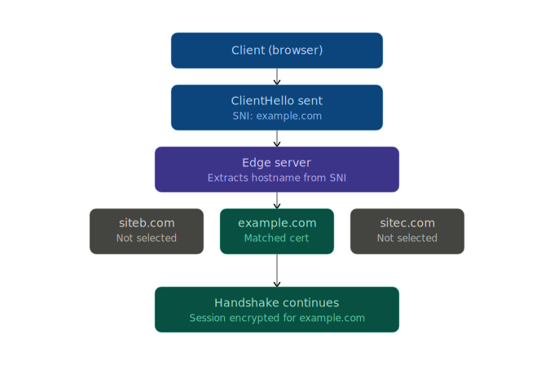

# SNI (Server Name Indication)

---

- [SNI (Server Name Indication)](#sni-server-name-indication)
  - [What is SNI (Server Name Indication)?](#what-is-sni-server-name-indication)

---

## What is SNI (Server Name Indication)?

>[!IMPORTANT]
> SNI (Server Name Indication) is an extension to the TLS (Transport Layer Security) protocol that allows a client to indicate the hostname it is trying to connect to at the start of the handshake process. This is particularly useful when multiple SSL/TLS certificates are hosted on the same IP address, allowing the server to present the correct certificate based on the requested hostname. 

- SNI is widely used in modern web servers and browsers to enable secure connections to multiple domains on a single server without requiring multiple IP addresses. It helps improve the efficiency of SSL/TLS connections and allows for better resource utilization on servers hosting multiple websites.

