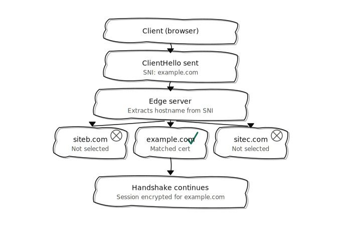

# SNI (Server Name Indication)

---

- [SNI (Server Name Indication)](#sni-server-name-indication)
  - [What is SNI (Server Name Indication)?](#what-is-sni-server-name-indication)
  - [Why is SNI is important for Security?](#why-is-sni-is-important-for-security)
  - [Types of SNI related attacks](#types-of-sni-related-attacks)

---

## What is SNI (Server Name Indication)?

>[!IMPORTANT]
> SNI (Server Name Indication) is an extension to the TLS (Transport Layer Security) protocol that allows a client to indicate the hostname it is trying to connect to at the start of the handshake process. This is particularly useful when multiple SSL/TLS certificates are hosted on the same IP address, allowing the server to present the correct certificate based on the requested hostname. 

- SNI is widely used in modern web servers and browsers to enable secure connections to multiple domains on a single server without requiring multiple IP addresses. It helps improve the efficiency of SSL/TLS connections and allows for better resource utilization on servers hosting multiple websites.

- Let's say we have a 3 web pages abcd.com/home, efg.com/home, and xyz.com/home hosted on the same server with the same IP address.

- When a client wants to connect to one of these websites, it sends a request to the server with the hostname included in the SNI extension. The server then uses this information to determine which SSL/TLS certificate to present for the connection.

## Why is SNI is important for Security?

- SNI is important for security because it allows for the proper handling of SSL/TLS certificates in multi-domain environments. Without SNI, a server would not know which certificate to present during the handshake, potentially leading to certificate mismatches and security warnings for users.

- But, SNI for routing is different from SNI for security. SNI for routing is used to determine which virtual host to route the request to based on the hostname provided in the SNI extension. This is important for load balancing and routing traffic to the correct backend server.

  While SNI for security is used to determine which SSL/TLS certificate to present during the handshake process, ensuring that the client receives the correct certificate for the requested hostname. This is important for establishing a secure connection and preventing man-in-the-middle attacks.

## Types of SNI related attacks

- **SNI-based attacks**: Attackers can exploit the SNI extension to perform attacks such as SNI-based filtering, where they can block or allow traffic based on the hostname provided in the SNI extension. This can be used to bypass security controls or restrict access to certain websites.

- **SNI-based fingerprinting**: Attackers can use the SNI extension to fingerprint the server and gather information about the hosted domains. By analyzing the SNI values, attackers can identify which websites are hosted on a server and potentially target specific domains for attacks.

- **SNI-based denial of service (DoS) attacks**: Attackers can send a large number of requests with different SNI values to overwhelm the server and cause a denial of service. This can lead to resource exhaustion and disrupt the availability of the hosted websites.