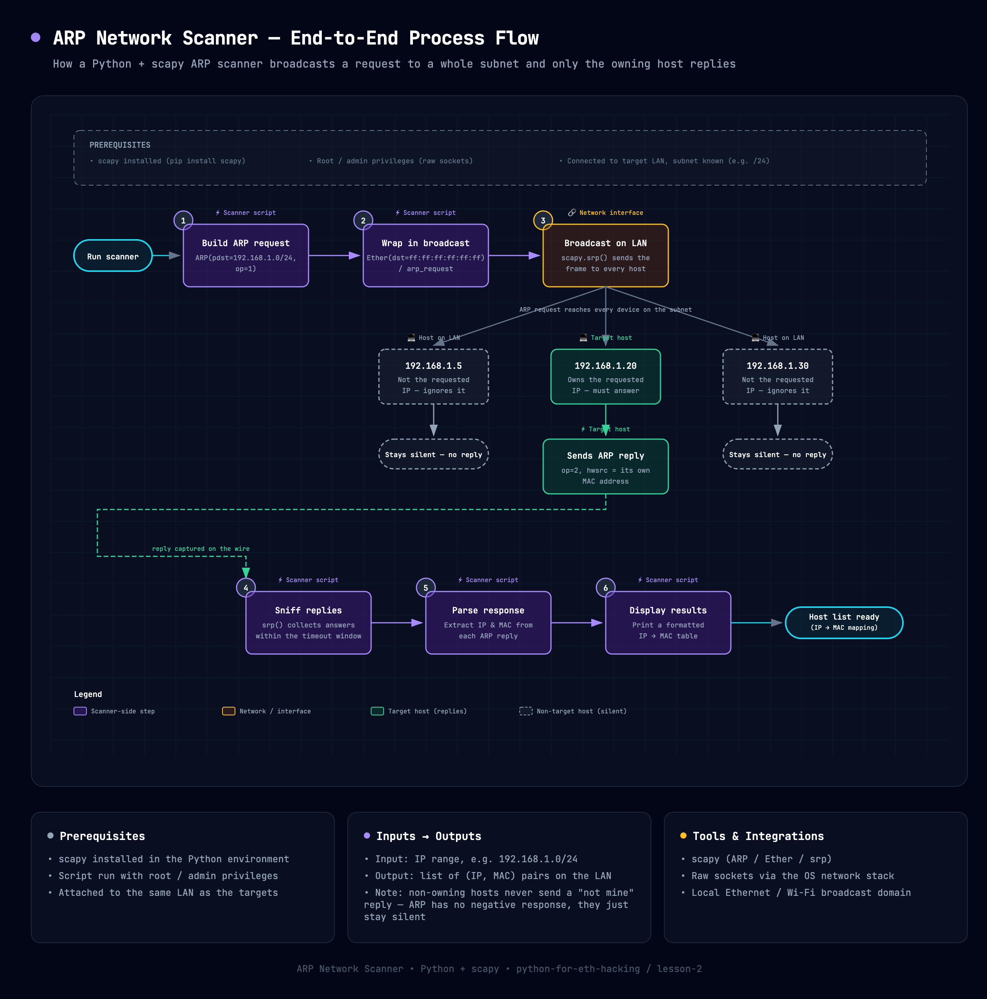

# Writing a Network Scanner in Python



---
- [Writing a Network Scanner in Python](#writing-a-network-scanner-in-python)
  - [Introduction to ARP (Address Resolution Protocol)](#introduction-to-arp-address-resolution-protocol)
  - [Algorithm to discover clients on the same network](#algorithm-to-discover-clients-on-the-same-network)
    - [Step 1: Create ARP Request directed to broadcast MAC asking for IP](#step-1-create-arp-request-directed-to-broadcast-mac-asking-for-ip)

---

- Information gathering is a crucial step in the ethical hacking process. It involves collecting data about the target system or network to identify potential vulnerabilities and attack vectors. One common tool used for information gathering is a network scanner, which can help you discover active hosts, open ports, and services running on a network.

- Let's say we are connected to a network and want to find out which devices are connected to it. We can use a network scanner to send out requests to all the IP addresses in the network range and see which ones respond. This can help us identify potential targets for further testing.

- Mainly, people don't write their own network scanners because there are already many powerful and well-established tools available, such as Nmap, netdiscover, and Angry IP Scanner. These tools have been developed and refined over many years, and they offer a wide range of features and capabilities that can be difficult to replicate in a custom-built scanner.

- This will help you understand how network scanner works so that we have a deeper understanding on how networks work in general.

## Introduction to ARP (Address Resolution Protocol)

>[!IMPORTANT]
> ARP (Address Resolution Protocol) is a network protocol used to map an IP address to a physical MAC address on a local area network (LAN). It allows devices to communicate with each other by translating IP addresses into MAC addresses, which are necessary for data transmission on a LAN.
> <br>
> When a device wants to communicate with another device on the same LAN, it sends an ARP request to the network, asking for the MAC address associated with the target IP address. The device that owns the target IP address responds with an ARP reply, providing its MAC address. This process allows the sender to establish a connection and transmit data to the correct destination on the network.

```python
import scapy.all as scapy

def scan(ip):
    arp_request = scapy.arping(ip)


if __name__ == "__main__":
    ip = input("Enter the IP to scan: ")
    # For scanning a range of IP addresses, you can use: XX.XX.XX.XX/24
    scan(ip)
```

The output of the above code will be:

```shell
Enter the IP to scan:
XX.XX.XX.XX/24
Begin emission:
Finished to send 1 packets.
*
Received X packets, got X answers, remaining X packets
  XX:XX:XX:XX:XX:XX XX.XX.XX.XX
```

- So, far the script we have made so far is really cool, it can list all the clients on the same network as ours with their IP and MAC addresses, using `scapy` function from `arping`.

## Algorithm to discover clients on the same network

- So, for designing a network scanner, we need to have some steps in mind. Let's go through the steps we need to take to design a network scanner:

  - Create ARP Request directed to broadcast MAC asking for IP.
  - Send Packet and receive response.
  - Parse the response and extract IP and MAC addresses.
  - Display the results in a user-friendly format.

### Step 1: Create ARP Request directed to broadcast MAC asking for IP

- This has 2 main parts:

  - Use ARP to ask who has target IP.
  - Set destination MAC to broadcast MAC.

- For this we will be using `scapy` library again, with which we will create a ARP Request. We will this time create a object.
- `scapy.ARP().summary()` allows us to print the summary of the current object, that we just created.
- So, when we set ip=dest inside the ARP object, it will set the destination IP address to the target IP address we want to scan. 
- When we set op=1, it indicates that this is an ARP request, which means we are asking for the MAC address associated with the target IP address. Finally, when we set pdst=dest, it specifies the destination IP address that we want to send the ARP request to.

```python
import scapy.all as scapy

def scan(ip):
    # Create ARP Request/Object
    arp_request = scapy.ARP(pdst=ip, op=1)
    print(arp_request.summary())

input_ip = input("Enter the IP to scan: ")
# Append /24 to the IP address to scan the entire subnet
input_ip = input_ip + "/24"
scan(input_ip)
```

- Putting the full algorithm together end-to-end — broadcast, per-host response (or silence), and how the scanner collects the answers — looks like this:


[Open the interactive version](../imgs/network_scanner_process_flow.html) — has a copy/PNG/PDF export toolbar.

