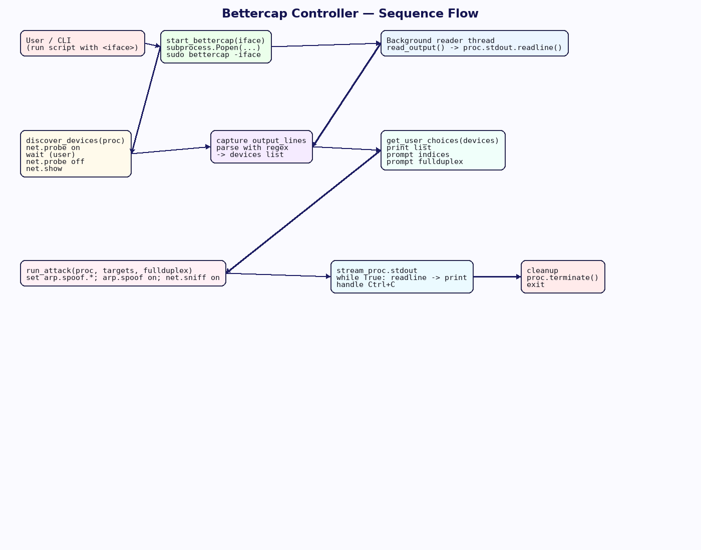

# Python Security Tools Collection

A comprehensive collection of educational network security tools built in Python, featuring automated port scanning and network analysis capabilities. These tools are designed for authorized security testing, network inventory, and cybersecurity education.

> **⚠️ Security Notice:** These tools are designed for authorized security testing and educational purposes only. Use only on networks you own or have explicit permission to test.

---

## Tools Overview

### 1. Asynchronous Port Scanner
A high-performance, educational port scanner demonstrating asynchronous networking, banner grabbing, and service fingerprinting.

### 2. Bettercap Controller
A professional Python automation script for controlling Bettercap operations, including device discovery and ARP spoofing workflows.

---

## 🔍 Asynchronous Port Scanner

A small, educational port scanner written in Python that demonstrates:

- **Asynchronous networking** using `asyncio` (no external dependencies).
- **Banner grabbing**: reading the short messages services often send when you connect.
- **Basic service fingerprinting**: using simple pattern matches to guess common services (HTTP, SSH, SMTP, MySQL, etc.).

### Architecture and Flow

The diagram below shows the end-to-end sequence: CLI parsing, host collection, async scheduling with a semaphore, banner grabbing, fingerprinting, and result collection/output.


### Key Features
- Uses `async`/`await` and an event loop to run many connections concurrently without threads
- `asyncio.Semaphore` limits concurrent tasks to avoid exhausting system resources
- Matches banners against simple regexes for common services
- Falls back to a port-to-service map if no banner match is found

### Usage

```bash
python port_scanner.py --hosts 127.0.0.1 --ports 22,80,443
```

### Example Output


Representative raw JSON:

```json
[
  {
    "host": "127.0.0.1",
    "port": 9001,
    "open": true,
    "banner": "HTTP/1.1 200 OK\\r\\nServer: DummyHTTP/1.0\\r\\nContent-Length: 2\\r\\n\\r\\nOK",
    "services": ["HTTP"],
    "timestamp": "2025-10-04T06:54:27.150511Z"
  },
  {
    "host": "127.0.0.1",
    "port": 9002,
    "open": true,
    "banner": "SSH-2.0-OpenSSH_8.0p1 Demo\\r\\n",
    "services": ["SSH"],
    "timestamp": "2025-10-04T06:54:27.150940Z"
  },
  {
    "host": "127.0.0.1",
    "port": 9003,
    "open": true,
    "banner": "220 localhost ESMTP DemoPostfix\\r\\n",
    "services": ["SMTP"],
    "timestamp": "2025-10-04T06:54:27.151161Z"
  },
  {
    "host": "127.0.0.1",
    "port": 9004,
    "open": true,
    "banner": "\\n5.7.33\\u0000\\u0000\\u0000\\u0000mysql_native_password",
    "services": ["MySQL"],
    "timestamp": "2025-10-04T06:54:27.151332Z"
  }
]
```

Summary output:

```
=== Summary (open ports) ===
- 127.0.0.1:9001 -> services=['HTTP'] banner='HTTP/1.1 200 OK\r\nServer: DummyHTTP/1.0\r\nContent-Length: 2\r\n\r\nOK'
- 127.0.0.1:9002 -> services=['SSH'] banner='SSH-2.0-OpenSSH_8.0p1 Demo\r\n'
- 127.0.0.1:9003 -> services=['SMTP'] banner='220 localhost ESMTP DemoPostfix\r\n'
- 127.0.0.1:9004 -> services=['MySQL'] banner='\n5.7.33\x00\x00\x00\x00mysql_native_password'
```

---

## 🛡️ Bettercap Controller

A professional Python automation script for controlling **Bettercap** operations, including device discovery, target selection, and ARP spoofing workflows.

### Features

- **Automated Bettercap Management**: Launches and controls Bettercap as a subprocess
- **Interactive Device Discovery**: Uses `net.probe` to discover network devices automatically
- **User-Friendly Target Selection**: Intuitive interface for selecting attack targets
- **Flexible Attack Configuration**: Supports both simplex and full-duplex ARP spoofing
- **Real-time Output Streaming**: Live display of Bettercap operations and captured data
- **Professional Error Handling**: Comprehensive error management and graceful cleanup

### System Architecture

The script follows a structured workflow with clear separation of concerns and professional error handling.



### Execution Flow

1. **Initialization**: Validates arguments and launches Bettercap subprocess
2. **Device Discovery**: Executes `net.probe` to scan the local network
3. **Target Selection**: Parses discovered devices and presents selection interface  
4. **Attack Configuration**: Configures ARP spoofing parameters based on user input
5. **Operation Execution**: Launches coordinated ARP spoofing and packet sniffing
6. **Real-time Monitoring**: Streams live output with proper cleanup handling

### Usage

```bash
# Standard Ethernet interface
python bettercap_controller.py eth0

# Wireless interface  
python bettercap_controller.py wlan0
```

### Live Demonstration

Below is a screenshot from an actual test session showing the script in operation:


The demonstration shows:
- **Device Discovery Phase**: Automatic network scanning and device enumeration
- **Interactive Selection**: User-friendly target selection interface
- **Real-time Operations**: Live ARP spoofing and packet capture output
- **Professional Logging**: Structured output with timestamps and status indicators

---

## 📋 System Requirements

### Common Requirements
- **Python 3.x** with standard libraries
- **Linux/Unix environment** (recommended)
- **Administrative privileges** for network operations

### Tool-Specific Requirements

**Port Scanner:**
- No external dependencies (uses built-in `asyncio`)
- Network access to target hosts

**Bettercap Controller:**
- Bettercap installed and accessible via `$PATH`
- Sudo access for network interface operations
- Valid network interface for packet capture

---

## 📁 Repository Structure

```
python-security-tools/
├── README.md
├── port_scanner.py
├── bettercap_controller.py
└── images/
    ├── async_port_scanner_flow_edges.jpg
    ├── async2.jpg
    ├── async.jpg
    ├── bettercap_controller_flow_professional.png
    └── bettercap_arp_op.jpg
```

---

## 🎓 Educational Applications

### Network Security Training
- Demonstrates real-world attack vectors in controlled environments
- Illustrates the importance of network segmentation and monitoring
- Shows practical implementation of asynchronous programming
- Provides hands-on experience with professional security tools

### Defensive Security
- Enables testing of network security monitoring capabilities
- Validates effectiveness of port scanning detection systems
- Demonstrates the importance of encrypted protocol usage
- Supports security awareness training programs

---

## 🔧 Core Functionality

### Asynchronous Port Scanner

#### How it Works
- **asyncio**: Uses `async`/`await` and an event loop to run many connections concurrently without threads
- **Banner Grabbing**: After connect, reads up to N bytes with a timeout; for HTTP, sends a `HEAD /` probe
- **Service Fingerprinting**: Matches banners against simple regexes for common services (HTTP, SSH, SMTP, MySQL)

#### Technical Implementation
- `asyncio.Semaphore` limits concurrent tasks to avoid exhausting system resources
- `asyncio.gather` schedules many scan tasks together
- Falls back to a port-to-service map if no banner match is found

### Bettercap Controller

#### Device Discovery Module
```python
def discover_devices(proc):
    """
    Orchestrates network device discovery using Bettercap's net.probe functionality.
    Implements threaded output reading for non-blocking operation.
    """
```

#### Attack Execution Engine
```python
def run_attack(proc, targets, fullduplex):
    """
    Constructs and executes the coordinated attack command sequence.
    Manages real-time output streaming and graceful termination.
    """
```

#### Bettercap Command Integration
- **`net.probe`**: Active network reconnaissance and device enumeration
- **`net.show`**: Device list parsing and metadata extraction  
- **`arp.spoof`**: ARP spoofing attack coordination with configurable parameters
- **`net.sniff`**: Packet capture and real-time traffic analysis

---

## ⚖️ Legal and Ethical Guidelines

### Professional Use Only

These tools are designed for authorized security professionals, educators, and students working in controlled environments. Users must:

- ✅ **Obtain explicit written authorization** before any testing
- ✅ **Use only in isolated laboratory environments** for unauthorized testing
- ✅ **Maintain detailed logs and documentation** of all activities
- ✅ **Follow applicable local, state, and federal laws** regarding network security testing
- ✅ **Respect privacy and confidentiality** of any intercepted data

### Recommended Testing Environment

- Virtual machine networks (VMware, VirtualBox)
- Isolated physical test networks
- Dedicated cybersecurity training laboratories
- Home networks with proper consent from all users

### Security Considerations

#### Authorization Requirements
- **Authorized Networks Only**: Only use on networks you own or have explicit permission to test
- **Laboratory Environment**: Ideal for isolated testing environments and educational labs
- **Documentation**: Maintain proper documentation and approval records

#### Detection and Countermeasures
- **ARP Table Monitoring**: Network administrators can detect ARP spoofing through table analysis
- **Dynamic ARP Inspection**: Enterprise switches can validate ARP traffic automatically
- **Static ARP Entries**: Manual ARP table configuration prevents spoofing attacks
- **Network Monitoring**: Tools like `arpwatch` can identify suspicious ARP behavior

---

## 🚀 Getting Started

### Quick Setup

1. **Clone the repository**
   ```bash
   git clone <repository-url>
   cd python-security-tools
   ```

2. **Install dependencies** (if required)
   ```bash
   # For Bettercap Controller only
   sudo apt-get install bettercap  # or equivalent for your OS
   ```

3. **Set up directory structure**
   ```bash
   mkdir images
   # Place all image files in the images/ directory
   ```

4. **Run tools with appropriate permissions**
   ```bash
   # Port Scanner (no sudo required)
   python port_scanner.py --hosts 192.168.1.0/24 --ports 22,80,443
   
   # Bettercap Controller (requires sudo)
   sudo python bettercap_controller.py eth0
   ```

---

## 📚 Documentation

Each tool includes comprehensive inline documentation and error handling:

- **Port Scanner**: See function docstrings and `--help` flag
- **Bettercap Controller**: Review the interactive prompts and command structure
- **Professional Examples**: Both tools include real-world usage demonstrations

---

## 🤝 Contributing

Contributions are welcome! Please ensure all contributions:

- Maintain the educational focus and include appropriate security warnings
- Include comprehensive documentation and error handling
- Follow ethical guidelines and legal compliance standards
- Provide clear usage examples and safety instructions

---

## 📄 License

MIT License - See LICENSE file for details

---

**Note**: These tools prioritize education and authorized testing. Always ensure compliance with applicable laws and organizational policies before use. The visual documentation and professional architecture diagrams help users understand both the technical implementation and the ethical considerations involved in network security testing.