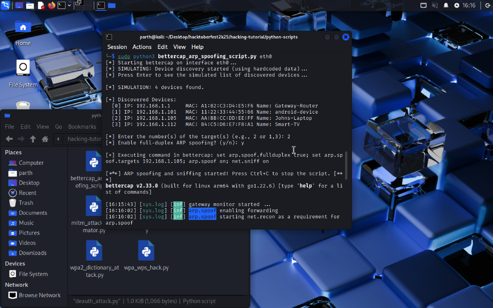
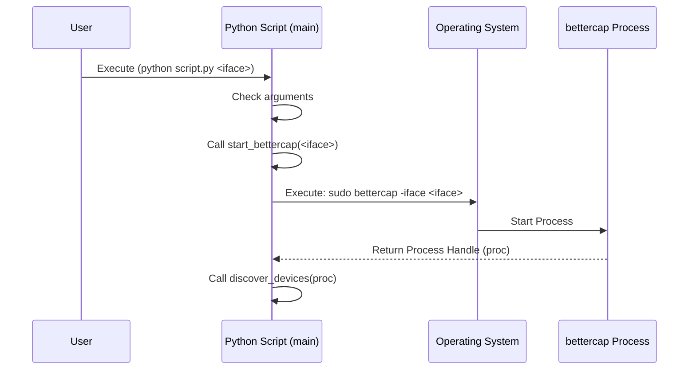

## bettercap_arp_spoofing_script.py

### Usage Scenario

This script is a tool designed for **network security assessments** and **penetration testing** in a controlled, authorized environment.

* **What problem does it solve?** It automates the process of setting up an **ARP Spoofing** attack using the powerful `bettercap` framework. This allows a security professional to test the network's resilience to **Man-in-the-Middle (MiTM)** attacks, specifically by intercepting network traffic between a target device and the network's gateway.
* **Who would benefit from using it?** **Ethical Hackers**, **Security Analysts**, and **Cybersecurity Students** would find this script valuable. It provides a quick, interactive way to practice and demonstrate MiTM techniques, network device discovery, and traffic sniffing.

---

### What the Script Does

The Python script acts as a **wrapper** and **orchestrator** for the `bettercap` tool. It provides a simplified, interactive command-line interface (CLI) to perform targeted **ARP Spoofing**.

The execution flow is:

1.  **Input:** It requires the network interface name (e.g., `eth0`, `wlan0`) as a command-line argument.
2.  **Process:** It starts `bettercap` as a background process, sends commands to discover network devices, presents the list to the user, and collects the user's choice for the **target IP(s)** and whether to enable **full-duplex spoofing**.
3.  **Output/Side Effects:** The main effect is the **execution of the `bettercap` tool**, which changes the ARP tables of the target device(s) and the gateway. The script's output is the live, streaming log of the `bettercap` session, including device discovery results and intercepted traffic logs (if any).

---

### Code Explanation

#### Imported Libraries

| Library | Purpose |
| :--- | :--- |
| `subprocess` | To start and manage external processes, specifically running the `bettercap` command. It allows the script to send input (`stdin`) and read output (`stdout`) from the tool. |
| `sys` | To handle system-specific parameters and functions, primarily for accessing command-line arguments (`sys.argv`) and exiting the script (`sys.exit`). |
| `time` | To introduce pauses (`time.sleep`) in the script's execution, giving `bettercap` time to initialize or execute a command before proceeding. |
| `threading` | To run the output reading of the `bettercap` process in a **separate thread**. This prevents the main script from blocking (freezing) while waiting for `bettercap`'s output, allowing for simultaneous input/command sending and output monitoring. |
| `re` | The regular expression module, used in the `discover_devices` function to **parse** the structured output of `bettercap`'s `net.show` command and extract device IP, MAC, and name. |

#### Main Functions

| Function | Parameters | Returns | Purpose |
| :--- | :--- | :--- | :--- |
| `start_bettercap` | `iface` (str): The network interface name. | `proc` (subprocess.Popen object) | Starts the `bettercap` process with `sudo` on the specified interface. Handles `FileNotFoundError` if `bettercap` is not installed. |
| `discover_devices` | `proc` (subprocess.Popen object) | `devices` (list of dicts) | Initiates network discovery (`net.probe on`). It reads and displays `bettercap`'s output concurrently using a thread. After user confirmation, it runs `net.show` and uses a regular expression to parse the output and return a list of discovered devices. |
| `get_user_choices` | `devices` (list of dicts) | `targets_str` (str), `fullduplex` (str) | Presents the discovered devices to the user and prompts them to select one or more targets (by index). It also asks whether to enable full-duplex ARP spoofing. Returns the selected target IPs as a comma-separated string and the boolean choice. |
| `run_attack` | `proc` (subprocess.Popen object), `targets` (str), `fullduplex` (str) | None | Constructs the final `bettercap` command (`set arp.spoof.fullduplex <val>; set arp.spoof.targets <ips>; arp.spoof on; net.sniff on`) and sends it to the running process. It then continuously reads and prints `bettercap`'s live output until the user presses `Ctrl+C`. |
| `main` | None | None | The entry point of the script. Manages the overall workflow by calling the other functions in sequence. |

#### Execution Logic

The script's execution is controlled by the `main()` function, which is called when the script is run (`if __name__ == "__main__":`).

1.  **Argument Check:** It first verifies if a network interface name was provided as a command-line argument (`sys.argv[1]`). If not, it prints the usage instructions and exits.
2.  **Start `bettercap`:** It calls `start_bettercap(iface)` to launch the tool and get the process object (`proc`). It exits if the tool fails to start.
3.  **Discover Devices:** It calls `discover_devices(proc)`. This is the interactive discovery phase where the script waits for the user to press Enter before listing the results. It exits if no devices are found.
4.  **Get User Input:** It calls `get_user_choices(devices)` to display the list of devices and prompt the user to select the target IP(s) and the ARP spoofing mode (full-duplex: `true`/`false`).
5.  **Execute Attack:** It calls `run_attack(proc, targets, fullduplex)` to send the final, constructed attack command to `bettercap`.
6.  **Monitor and Exit:** The `run_attack` function then enters an infinite loop, continuously displaying the attack's real-time output. The script only terminates when the user manually interrupts the process by pressing **`Ctrl+C`** (`KeyboardInterrupt`), which triggers the graceful termination of the `bettercap` process (`proc.terminate()`).

---

### Screenshots



---

### Sequence Diagram


## bettercap_arp_spoofing_script.py

### Summary

This README describes the actual behavior of `bettercap_arp_spoofing_script.py` (located at `python-scripts/bettercap_arp_spoofing_script.py`). The script is a small Python wrapper around the `bettercap` CLI that automates a few common commands (probe, show, set spoofing options, enable sniffing) and streams `bettercap`'s output to the console.

Important: the script is a helper for controlled security testing only. Do not use it on networks or devices you don't own or don't have explicit authorization to test.

---

### What the script actually does

- Accepts a single command-line argument: the network interface to use (for example `wlan0` or `eth0`).
- Launches `bettercap` as a subprocess: `bettercap -iface <iface>` (the script does not itself call `sudo`).
- Sends `net.probe on` and waits 30 seconds to allow discovery of hosts on the network.
- Sends `net.show` and streams the `bettercap` output to the terminal while the user inspects results.
- Prompts the user for two inputs:
    - `fullduplex` (enter `true` or `false`) to set `arp.spoof.fullduplex`.
    - `target_ip` — the IP address (or comma-separated IPs) to set for `arp.spoof.targets`.
- Sends the combined command to enable ARP spoofing and starts `net.sniff`:
    set arp.spoof.fullduplex <true|false>; set arp.spoof.targets <ips>; arp.spoof on
    net.sniff on
- Streams `bettercap`'s live output until the user interrupts with Ctrl+C; on KeyboardInterrupt the script terminates the `bettercap` process.

Notes on implementation: the script uses `subprocess.Popen` (with text mode and line-buffering) and a separate thread to print `bettercap` output while waiting for user input. It does not parse `net.show` output programmatically — discovery is left for the user to inspect and decide targets.

---

### Usage

1. Ensure `bettercap` is installed and available on your PATH. On many systems `bettercap` requires root privileges to access interfaces.
2. Run the script with Python 3 and pass the interface name:

```bash
python3 python-scripts/bettercap_arp_spoofing_script.py <network_interface>
```

Example:

```bash
python3 python-scripts/bettercap_arp_spoofing_script.py wlan0
```

When the script runs it will:

* start `bettercap`
* run `net.probe on` and wait ~30s
* run `net.show` and stream output; press Enter when you're done reviewing
* prompt for `fullduplex` and `target_ip`
* send the spoofing commands and show live logs until Ctrl+C

---

### Requirements

* Python 3 (script uses text=True and subprocess APIs available across modern Python 3 versions)
* `bettercap` installed and accessible on the PATH
* Appropriate privileges to run `bettercap` (often root)

The script does not require any third-party Python packages.

---

### Security and legal notice

This script automates network interception techniques. Use only on networks and devices for which you have explicit permission. Unauthorized ARP spoofing / MiTM attacks are illegal and unethical. The repository's materials are for education and authorized testing only.

---

### Limitations and suggested improvements

* The script does not run `bettercap` with `sudo` — if your environment requires root, run the script itself under sudo or with an appropriate capability set (for example using `sudo python3 ...`).
* The script does not parse the output of `net.show` programmatically. It prints the output and prompts the user to type the target IP(s). A future improvement is to parse `net.show` results, present a selectable list, and validate IP input.
* There is minimal error handling (e.g., if `bettercap` is not installed, the subprocess will fail). Adding explicit checks and clearer error messages would improve UX.
* Consider adding optional logging to a file, and safer shutdown/cleanup (ensure `arp.spoof` is disabled on exit).

---

### Quick checklist for running (macOS / Linux)

1. Install bettercap (follow official instructions) and confirm it's runnable:

```bash
bettercap -h
```

1. Run the script with an interface (use sudo if needed):

```bash
sudo python3 python-scripts/bettercap_arp_spoofing_script.py wlan0
```

1. Follow on-screen prompts and press Ctrl+C to stop the session.

---
