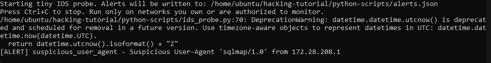
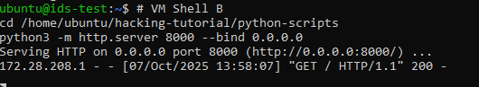
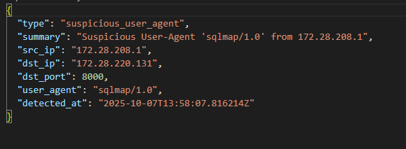

## ids_probe.py

### Usage Scenario

This script is a simplified, educational **Intrusion Detection System (IDS) probe** built with Scapy. It passively monitors network traffic to detect low-level reconnaissance activities, focusing on unauthorized port scanning and suspicious HTTP communication.

* **What problem does it solve?** It provides real-time, low-level **threat detection and visibility** into a network. It specifically addresses two critical, early-stage attack vectors: **1. Port Scanning** (identifying multiple connection attempts to different ports from a single source) and **2. Suspicious Tool Usage** (flagging User-Agents common in security/exploitation tools like `sqlmap` or `nikto` in unencrypted HTTP traffic).
* **Who would benefit from using it?** **Cybersecurity Students** and **Beginner Ethical Hackers** benefit by gaining hands-on insight into how signature-based network monitoring systems work. **Developers** can use it as a foundational template for creating more complex, custom packet analysis and alerting tools.

---

### What the Script Does

The Python script `ids_probe.py` is a **passive network sniffer** that operates in real-time, analyzing TCP/IP packets at the transport and application layers. It requires elevated privileges (`sudo` on Linux, Administrator on Windows with Npcap) to function.

The execution flow is:

1.  **Input:** The script takes network traffic from a specified wireless interface (e.g., `eth0` or Windows device GUID) and optional configuration via Command-Line Interface (CLI) arguments to set the detection thresholds (`--port-threshold`, `--window`) and an external reporting endpoint (`--webhook`).
2.  **Process:** It enters a continuous packet-sniffing loop. For every captured TCP packet, it performs two main checks:
    * **Port Scan Check:** If the packet is a **SYN-only** (initial connection request), it updates a sliding window of destination ports for the source IP. If too many unique ports are targeted within a short time window (default 12 ports in 10 seconds), an alert is triggered.
    * **User-Agent Check:** If the packet contains an application layer payload (Raw layer), it attempts to extract the `User-Agent` from unencrypted HTTP requests. If the header contains suspicious keywords, an alert is triggered.
3.  **Output/Side Effects:** Alerts are immediately **printed to the console**. They are also saved as **newline-separated JSON objects** to the `alerts.json` file in the same directory as the script. Optionally, alerts are **POSTed via HTTP** to the user-specified webhook URL.

---

### Code Explanation

#### Imported Libraries

| Library | Purpose |
| :--- | :--- |
| `scapy.all` (and sub-modules) | **Essential Core.** Provides the functionality to capture, read, and dissect network packets (layers `IP`, `TCP`, `Raw`, `IPv6`). |
| `collections` (`defaultdict`, `deque`) | **Data Structures.** `defaultdict` stores history keyed by source IP. `deque` (double-ended queue) is used to implement the **efficient sliding time window** required for port scan detection, allowing fast removal of old entries. |
| `time`, `datetime`, `json`, `threading` | **Utilities.** `time` for packet timestamping; `datetime` for ISO 8601 alert timestamps; `json` for alert serialization; `threading.Lock` ensures **thread-safe writing** to `alerts.json`. |
| `argparse` | **CLI Handler.** Used to define and parse command-line options for interface selection and threshold customization. |
| `requests` (Optional) | **External Communication.** Used to send alerts to an external HTTP/S endpoint (webhook) if the `--webhook` argument is provided. |

#### Principal Functions

| Function | Parameters | Returns | Purpose |
| :--- | :--- | :--- | :--- |
| `now_iso` | None | `str` | Returns the current time in UTC ISO 8601 format (e.g., `YYYY-MM-DDTHH:MM:SS.sssZ`) for alert timestamping. |
| `write_alert` | `alert` (`dict`) | None | The central function for outputting alerts. It timestamps the alert, prints a summary to the console, and then **safely appends** the JSON object to `alerts.json`. If a webhook is configured, it attempts to POST the alert. |
| `check_port_scan` | `pkt_time` (`float`), `src_ip` (`str`), `dst_port` (`int`) | None | **Detection Logic (Port Scan).** Implements the sliding window: tracks recent SYN packets from `src_ip`. If the count of distinct `dst_port` exceeds the configurable threshold within the window (default 10s), it generates a `port_scan` alert and resets the IP's history. |
| `extract_user_agent` | `payload_bytes` (`bytes`) | `str` or `None` | Decodes the raw payload and attempts a simple string search to isolate and return the value of the `User-Agent` HTTP header. |
| `check_http_user_agent` | `payload` (`bytes`), `src_ip` (`str`), `dst_ip` (`str`), `dst_port` (`int`) | None | **Detection Logic (Suspicious UA).** Calls `extract_user_agent` and checks the result against a hardcoded list of `SUSPICIOUS_UA_KEYWORDS` (e.g., "sqlmap", "nikto"). Triggers a `suspicious_user_agent` alert upon match. |
| `packet_handler` | `pkt` (Scapy packet object) | None | **Sniffing Callback.** This is the function called by Scapy for every captured packet. It processes both IPv4 and IPv6 traffic, identifies TCP SYN packets for port scan checks, and extracts application layer payloads (Raw) for HTTP User-Agent checks. |

#### Execution Logic

The script's execution is controlled by the `main()` function, which is the standard entry point invoked by `if __name__ == "__main__":`.

1.  **Argument Parsing:** The script starts by calling `parse_args()`, which processes any command-line options (`-i`, `--webhook`, etc.).
2.  **Configuration Update:** Global variables (`WEBHOOK`, `PORT_SCAN_PORT_THRESHOLD`, `PORT_SCAN_WINDOW`) are dynamically updated based on the parsed CLI arguments.
3.  **Startup:** A status message is printed, confirming the start and the location of the `alerts.json` file.
4.  **Main Sniffing Loop:** The script calls `scapy.sniff()` with the interface selected by the user.
5.  **Packet Processing:** The `sniff` function executes continuously, passing every captured packet object to the `packet_handler(pkt)` function.
6.  **Continuous Analysis:** The `packet_handler` routes the packet data to the relevant detection functions (`check_port_scan` and `check_http_user_agent`), which in turn call `write_alert()` if a threat is detected.
7.  **Termination:** The script continues to run indefinitely until the user manually terminates the process (usually via **`Ctrl+C`**), or an unexpected error occurs (like `PermissionError` if not run with sufficient privileges).
      
---

### Screenshots







---

### Sequence Diagram

```mermaid
sequenceDiagram
    participant User
    participant Script as Python Script (main)
    participant Scapy as Scapy Sniffer (sniff)
    participant PktHandler as packet_handler(pkt)
    participant Detections as Port Scan & UA Checks
    participant AlertSys as write_alert
    participant AlertFile as alerts.json

    User->>Script: Execute Script (python ids_probe.py -i eth0)
    Script->>Script: parse_args() & Set Global Config
    Script->>Script: Print Startup Message
    Script->>Scapy: Call sniff(iface, prn=PktHandler)
    
    loop Real-time Packet Monitoring
        Scapy-->>PktHandler: Captured Packet (Pkt)
        PktHandler->>PktHandler: Determine IP Version (v4/v6)
        
        alt TCP SYN Packet
            PktHandler->>Detections: check_port_scan(ts, src_ip, dst_port)
            alt Threshold Exceeded
                Detections->>AlertSys: Trigger Alert (type: port_scan)
            end
        end
        
        alt Raw Payload Present (HTTP)
            PktHandler->>Detections: check_http_user_agent(payload, src_ip, ...)
            alt Suspicious User-Agent Found
                Detections->>AlertSys: Trigger Alert (type: suspicious_user_agent)
            end
        end
        
        AlertSys->>AlertSys: Lock file_lock
        AlertSys->>AlertFile: Append JSON Alert
        AlertSys->>User: Print console summary
        alt Webhook Configured
            AlertSys->>AlertSys: requests.post(WEBHOOK)
        end
        AlertSys->>AlertSys: Release file_lock
    end
    
    User->>Script: Manual Termination (Ctrl+C)
    Script->>Script: Exit