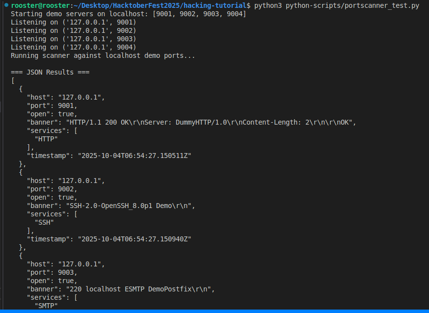

## portscanner_test.py

### Usage Scenario

The primary scenario for this script is **safe, local testing and demonstration of an asynchronous port scanner** and **banner grabbing capabilities**.

* **What problem does it solve?** It solves the problem of needing a **controlled and safe environment** to test the core functionality of a port scanner, specifically **banner grabbing** and **service identification**. Instead of relying on external, unpredictable, or protected systems, it provides four minimal, self-contained test services (HTTP, SSH-like, SMTP, and MySQL-like) that only run on the local machine (`127.0.0.1`).
* **Who would benefit from using it?** **Developers** working on the `AsyncPortScanner` module (as a proof-of-work test case). **Beginners in Ethical Hacking/Networking** who want to learn how port scanners identify open services and grab banners without risking external connections or needing elevated privileges (since it uses ports above 1024).

---

### What the Script Does

This script acts as a **self-contained demonstration and integration test** for the `AsyncPortScanner` class. Its core function is to emulate a real-world network environment locally, scan it, and report the findings.

The execution flow is:

1.  **Input:** **None** (The target host and ports are hardcoded: `127.0.0.1` and non-privileged ports `9001-9004`).
2.  **Process:** It uses `asyncio.start_server` to launch four distinct, lightweight TCP servers on `localhost` (simulating HTTP, SSH, SMTP, and MySQL). It then instantiates the `AsyncPortScanner` and executes a scan against these four specific local ports.
3.  **Output/Side Effects:** The script prints the server listening addresses. It reports the complete scan results in **JSON format** (useful for debugging) and provides a **concise, human-readable summary** of the open ports, their services, and the collected banners. Finally, it gracefully shuts down all four test servers.

---

### Code Explanation

#### Imported Libraries

| Library | Purpose |
| :--- | :--- |
| `asyncio` | **Essential.** The core library for writing **concurrent code**. It is used to start and manage the non-blocking test servers (`asyncio.start_server`) and to run the main asynchronous coroutine (`asyncio.run`). |
| `json` | Used to **format the final scan results** into a standardized, readable JSON string (`json.dumps`) before printing them to the terminal. |
| `typing` (Dict, List) | Used for **type hinting**, enhancing code clarity and maintainability by explicitly defining the expected types for function parameters and return values. |
| `async_port_scanner` | **The external module under test.** Imports the core `AsyncPortScanner` class, which handles the non-blocking network connection and banner-grabbing logic. |

#### Main Functions

| Function | Parameters | Returns | Purpose |
| :--- | :--- | :--- | :--- |
| `[service]_server` | `reader`, `writer` (async streams) | None | Four distinct functions (`http_server`, `ssh_server`, etc.) that act as minimal TCP handlers. Each is designed to send a specific, protocol-mimicking banner or response upon connection, allowing the scanner to grab it. |
| `start_servers` | `port_map`: `Dict[int, callable]` | `List[asyncio.AbstractServer]` | A utility function that iterates through the provided port-to-handler map, binding and launching the asynchronous TCP servers on `127.0.0.1`. It returns the server objects for later cleanup. |
| `run_demo` | None | None | The **main asynchronous coroutine** that manages the entire demonstration flow: server startup, scanner instantiation, scan execution, result reporting, and graceful server shutdown. |

#### Execution Logic

The script's execution is initialized by the standard Python entry point, which sets up the asynchronous environment:

1.  **Event Loop Setup:** The `if __name__ == "__main__":` block executes, calling `asyncio.run(run_demo())`. This creates the event loop necessary for all `async` operations.
2.  **Server Initialization:** The `run_demo` function defines the hardcoded ports (`9001-9004`) and maps them to their respective server handler functions (`port_map`). It calls `await start_servers(port_map)`, starting the four test services on `127.0.0.1`.
3.  **Scanner Execution:** An instance of `AsyncPortScanner` is created with fast local settings (e.g., `timeout=1.0`). The `await scanner.scan_multiple(...)` method is called, which runs the concurrent scan against the local ports. The script pauses here until all network probes complete.
4.  **Reporting:** The script prints the complete scan results (`results`) in a formatted JSON structure. It then iterates over the results, filtering only the **open ports** to display a concise summary of the discovered service and banner for each.
5.  **Cleanup:** A loop executes `s.close()` and `await s.wait_closed()` for every running server. This ensures all network resources are released cleanly before the script exits, completing the demonstration.
          
---

### Screenshots




---

### Sequence Diagram

```mermaid
sequenceDiagram
    autonumber
    participant Main as __main__
    participant Demo as run_demo()
    participant ServerSetup as start_servers()
    participant HTTP as http_server()
    participant SSH as ssh_server()
    participant SMTP as smtp_server()
    participant MySQL as mysql_like_server()
    participant Scanner as AsyncPortScanner
    participant Scan as scan_multiple()

    Main->>Demo: asyncio.run(run_demo())
    Demo->>ServerSetup: start_servers(port_map)
    ServerSetup-->>Demo: retorna lista de servidores

    loop Para cada servidor
        Demo->>HTTP: Inicia servidor em 9001
        Demo->>SSH: Inicia servidor em 9002
        Demo->>SMTP: Inicia servidor em 9003
        Demo->>MySQL: Inicia servidor em 9004
    end

    Demo->>Scanner: Instancia AsyncPortScanner(timeout, concurrency, read_bytes)

    Demo->>Scan: scan_multiple(["127.0.0.1"], ports)
    Scan-->>Demo: Retorna resultados JSON

    Demo->>Demo: Exibe resultados JSON e resumo

    loop Encerramento dos servidores
        Demo->>ServerSetup: s.close()
        Demo->>ServerSetup: await s.wait_closed()
    end

    Main-->>Main: Fim da execução